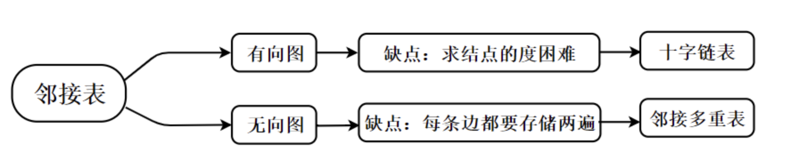
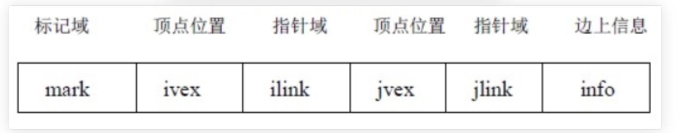
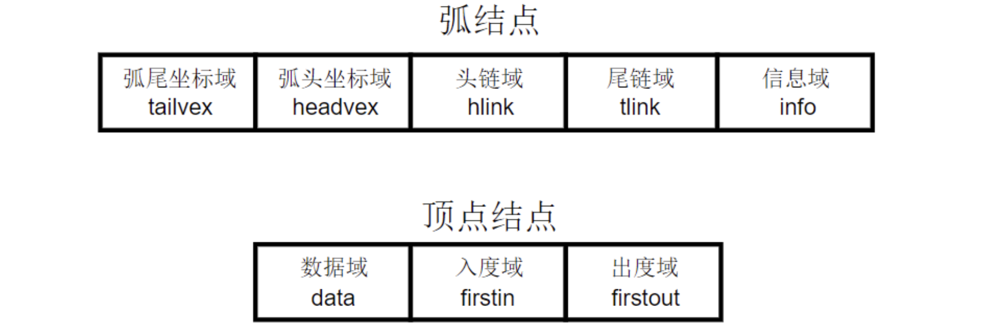
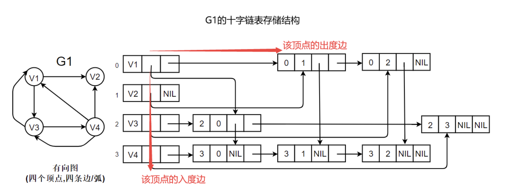
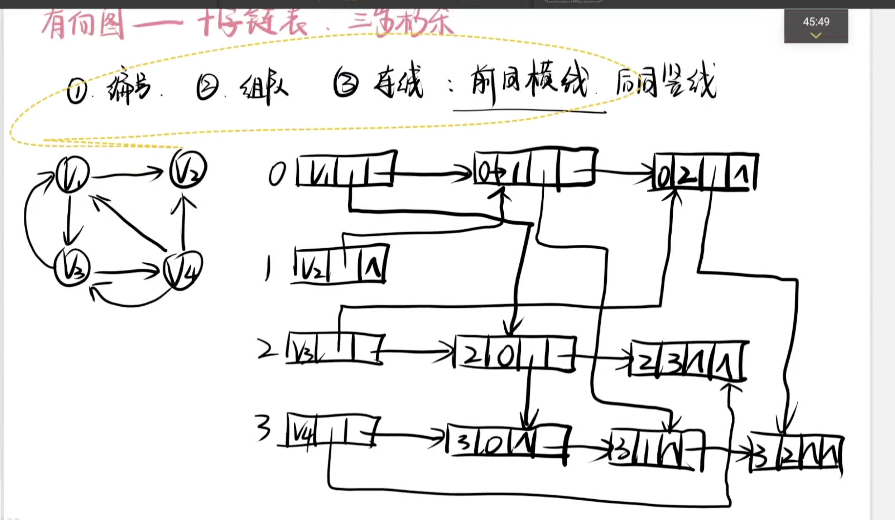

# 邻接多重表

邻接多重表(Adjacency Multilist)主要用于存储无向图

其中，顶点表由两个域组成，vertex 域存储和该顶点相关的信息firstedge 域指示第一条依附于该顶点的边；边表结点由六个域组成，mark 为标记域，可用以标记该条边是否被搜索过；ivex 和jvex 为该边依附的两个顶点在图中的位置；ilink 指向下一条依附于顶点ivex的边;jlink 指向下一条依附于顶点jvex 的边，info 为指向和边相关的各种信息的指针域。

> 参考blog
>
> https://noobdream.com/Major/article/218/

# 十字链表

十字链表(Orthogonal List)是有向图的另一种链式存储结构，可以看成是将有向图的邻接表和逆邻接表结合起来得到的一种链表，在十字链表中，有向图中每一条弧对应十字链表中的弧结点，而每一个顶点对应十字链表中的表头结点，如下所示：

在弧结点中有五个域，其解释分别如下：

- 弧尾坐标域(tailvex)：指示弧尾顶点在图中的位置
- 弧头坐标域(headvex)：指示弧头顶点在图中的位置
- 头链域(hlink)：指向弧头相同的下一条弧**(即入度边)**
- 尾链域(tlink)：指向弧尾相同的下一条弧**(即出度边)**
- 信息域(info)：该弧的相关信息

弧头相同的弧在同一链表上，弧尾相同的弧也在同一链表上，它们的头结点即为**顶点结点**，它由3个域组成：

- 数据域(data)：存储和顶点相关的信息，如顶点名称等
- 头链(入度)域(firstin)：指向以该顶点为弧头的第一个弧结点
- 尾链(出度)域(firsout)：指向以该顶点为弧尾的第一个弧结点

如下图所示：

