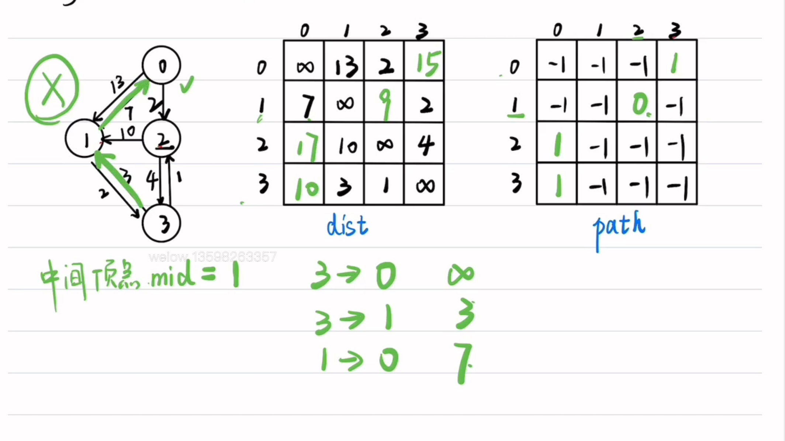

# 算法思想

#### **一、Kruskal 算法（克鲁斯卡尔算法）**

**核心思想**：基于贪心策略，按边权从小到大选择边，用并查集（Union-Find）避免环，最终生成最小生成树（MST）。

##### **算法步骤**：

1. **排序边**：将图中所有边按权值从小到大排序。
2. **初始化并查集**：每个顶点初始时自成一个集合（父节点指向自身）。
3. **选边构建 MST**：依次遍历排序后的边，若边的两个顶点不在同一集合中（即连接后不形成环），则选中该边，并将两个顶点的集合合并。
4. **终止条件**：当选中的边数达到顶点数 - 1 时，算法结束，此时所选边构成 MST。

##### **关键性质**：

- **贪心策略**：每次选当前最小权边，确保局部最优。
- **防环机制**：并查集用于检测顶点连通性，避免环的形成。
- **适用场景**：适合边数较少的图（因排序时间为主要开销，边少则效率高）。

#### **二、Prim 算法（普里姆算法）**

**核心思想**：从任意顶点出发，逐步扩展生成树，每次选择连接当前树与外部顶点的最小权边，直到包含所有顶点。

##### **算法步骤**：

1. **初始化**：任选一个顶点加入生成树集合（如顶点 A），其余顶点标记为 “未访问”。
2. **扩展生成树**：每次在生成树集合与外部顶点之间，选择权值最小的边，将对应的外部顶点加入集合。
3. **更新最小边**：每次加入新顶点后，更新该顶点与其他未访问顶点的边权，维护当前最小边。
4. **终止条件**：当所有顶点都加入生成树集合时，算法结束。

##### **关键实现方式**：

- 数据结构

  ：

  - 传统实现：用邻接矩阵，时间复杂度为 *O*(*V*2)（*V* 为顶点数）。
  - 优化实现：用优先队列（最小堆）和邻接表，时间复杂度为 *O*(*E*log*V*)（*E* 为边数）。

- **贪心策略**：每次选 “当前最小边” 扩展树，确保每一步都向 MST 靠近。

- **适用场景**：适合边数较多的图（因无需排序所有边，邻接表 + 堆优化效率更高）


# 图基础

## 结构体

邻接表

```c
typedef struct ANode{
    int adjvex; //边所指向结点的位置
    struct ANode *nextarc;
} ANode, *Node; //边结点结构体

typedef struct{
    int data;
    ANode *firstarc;
} Vnode; //顶点结构体

typedef struct{
    int numver, numedg;
    Vnode adjlist[maxsize];
} Graph;
```

邻接矩阵

```c
typedef struct{
    int numver, numedg;
    int verticle[maxsize];
    int Edge[maxsize][maxsize];
} mGraph;
```

## 基础1

**分别使用邻接表和邻接矩阵创建一个图**

```c
void create(Graph *G) {
    for (int i = 0; i < G->numver; i++)
        G->adjlist[i].firstarc = NULL;
    for (int i = 0; i < G->numedg; i++) {
        int v1, v2;
        scanf("%d%d", &v1, &v2);
        Node p = (Node)malloc(sizeof(ANode));
        p->adjvex = v2;
        p->nextarc = G->adjlist[v1].firstarc;
        G->adjlist[v1].firstarc = p;
        Node q = (Node)malloc(sizeof(ANode));
        q->adjvex = v1;
        q->nextarc = G->adjlist[v2].firstarc;
        G->adjlist[v2].firstarc = q;
    }
} // 邻接表创建无向图（去除下划线为有向图）

void create(MGraph *G) {
    for (int i = 0; i < G->numver; i++)
        for (int j = 0; j < G->numver; j++)
            G->Edge[i][j] = 0;
    for (int i = 0; i < G->numedg; i++) {
        int v1, v2;
        scanf("%d%d", &v1, &v2);
        G->Edge[v1][v2] = 1;
        G->Edge[v2][v1] = 1;
    }
} // 邻接矩阵创建无向图（去除下划线为有向图）
```


## 基础2

**邻接表实现图的广度优先遍历（BFS）**

```c
void BFS(Graph G, int v){
    int visit[maxsize] = {0};
    int que[maxsize];
    int front = 0, rear = 0;
    visit[v] = 1;
    que[++rear] = v;
    while (front != rear){
        v = que[++front];
        printf("%d", v);
        Node p = G.adjlist[v].firstarc;
        for (; p != NULL; p = p->nextarc)
            if (visit[p->adjvex] == 0){
                visit[p->adjvex] = 1;
                que[++rear] = p->adjvex;
            }
    } //p 的初始化最好写到 for 循环里面
} //时空复杂度分别为 O(V+E) 和 O(V)
```

1. **初始化**：为实现图的广度优先搜索，定义 `visit` 整型数组，初始化为 0，用于标记顶点是否被访问；同时创建数组 `que` 模拟队列。将起始顶点 `v` 标记为已访问，并加入队列。
2. **循环遍历逻辑**：从队列取出队首顶点 `v` 并访问（打印顶点编号）。遍历顶点 `v` 的邻接表，对未访问的邻接顶点 `p->adjvex`，先标记为已访问，再将其入队。
3. **终止条件**：当队列为空，表示图中所有可达顶点均已访问，BFS 结束。


## 基础3

**邻接矩阵实现图的广度优先遍历（BFS）**

```c
void BFS(MGraph G, int v){
    int visit[maxsize] = {0};
    int que[maxsize];
    int front = 0, rear = 0;
    que[++rear] = v;
    visit[v] = 1; //本句写在入队前或入队后都可
    while (front != rear){
        v = que[++front];
        printf("%d", v);
        for (int i=0; i<G.numver; i++){
            if (G.Edge[v][i] == 1 && visit[i] == 0){
                que[++rear] = i;
                visit[i] = 1;
            }
        }
    }
} //时空复杂度分别为 O(V^2) 和 O(V)
```

**核心思想：**

1. **初始化**：同邻接表。
2. **循环遍历逻辑**：从队列中取出队首顶点 `v` 并进行访问（打印顶点编号）。遍历图中所有顶点，对于与顶点 `v` 有边相连（即 `G.Edge[v][i] == 1`）且未被访问过（即 `visit[i] == 0`）的顶点 `i`，先将其标记为已访问，再将其入队。
3. **终止条件**：当队列为空，表示图中所有可达顶点均已访问，BFS 结束。


## 基础4

**设计算法，求无向连通图距顶点 v 最远的一个结点（即路径长度最大）**

````c
int BFS(Graph G, int v){
    int visit[maxsize] = {0};
    int que[maxsize];
    int front = 0, rear = 0;
    visit[v] = 1;
    que[++rear] = v;
    while (front != rear){
        v = que[++front];
        Node p = G.adjlist[v].firstarc;
        for( ; p != NULL; p = p->nextarc)
            if (visit[p->adjvex] == 0){
                visit[p->adjvex] = 1;
                que[++rear] = p->adjvex;
            }
    }
    return v;
} //时空复杂度分别为 O(V+E) 和 O(V)
````

**核心思想：**

参考第二题，即从 v 顶点开始广度优先遍历，最后遍历到的结点一定是距离 v 最远的一个结点。


## 基础5

**邻接表实现图的深度优先遍历（DFS）**

```c
void DFS(Graph G, int v, int visit[]) {
    printf("%d", v);
    visit[v] = 1;
    Node p = G.adjlist[v].firstarc;
    for (; p != NULL; p = p->nextarc)
        if (visit[p->adjvex] == 0)
            DFS(G, p->adjvex, visit);
} //时空复杂度分别为 O(V+E) 和 O(V)
```


## 基础6

**邻接矩阵实现图的深度优先遍历（DFS）**

```c
void DFS(MGraph G, int v, int visit[]) {
    printf("%d", v);
    visit[v] = 1;
    for (int i = 0; i < G.numver; i++)
        if (G.Edge[v][i] == 1 && visit[i] == 0)
            DFS(G, i, visit);
} //时空复杂度分别为 O(V^2) 和 O(V)
```

1. **访问与标记**：先访问顶点 v 并打印其值，然后将 `visit[v]` 置为 1，标记该顶点已访问。
2. **邻接顶点遍历**：获取顶点 v 的邻接表，用指针 p 遍历。若邻接顶点未被访问，则递归调用 DFS 继续搜索。
3. **终止条件**：当一个顶点的所有邻接顶点都已访问，或无邻接顶点时，递归逐层返回，直至遍历完所有可达顶点。

## 基础7

**有向图采用邻接表存储，设计算法判断顶点 Vi 和顶点 Vj 之间是否存在路径**

DFS转一圈

```c
void f1(Graph G, int i, int j, int visit[], int* res) {
    if (i == j)
        *res = 1;
    visit[i] = 1;
    Node p = G.adjlist[i].firstarc;
    for (; p != NULL; p = p->nextarc)
        if (visit[p->adjvex] == 0)
            f1(G, p->adjvex, j, visit, res);
} // 法一：DFS
```

1. **目标与初始判断**：
   - 此函数 `f1` 旨在利用 DFS 判断图 G 中顶点 i 到顶点 j 是否存在路径。
   - 进入函数后，首先检查 i 是否等于 j。若相等，说明已找到目标路径，将 `*res` 设为 `true`。
2. **标记当前顶点**：
   - 将当前顶点 i 标记为已访问，即把 `visit[i]` 置为 1，防止后续重复访问该顶点。
3. **邻接顶点遍历**：
   - 获取顶点 i 的邻接表，用指针 p 遍历。
   - 对于每个邻接顶点，若其未被访问，则递归调用 `f1` 函数，从该邻接顶点继续进行深度搜索，尝试寻找通向顶点 j 的路径。
4. **终止条件**：
   - 当一个顶点的所有邻接顶点都已被访问，递归调用会逐层返回，直至完成对所有可达顶点的搜索。
   - 最终 `*res` 的值表明顶点 i 到顶点 j 是否存在路径。

```c
int f2(Graph G, int i, int j) {
    int visit[maxsize] = {0};
    int que[maxsize];
    int front = 0, rear = 0;
    que[rear++] = i;
    visit[i] = 1;
    while (front != rear) {
        i = que[front++];
        if (i == j)
            return 1;
        Node p = G.adjlist[i].firstarc;
        for (; p != NULL; p = p->nextarc) {
            if (visit[p->adjvex] == 0) {
                que[rear++] = p->adjvex;
                visit[p->adjvex] = 1;
            }
        }
    }
    return 0;
} // 法二：BFS

1、初始化：创建 visit 数组，创建 que 数组模拟队列，将起始顶点 i 入队，同时标记为已访问。
2、队列遍历：每次从队列取出队首顶点，若该顶点为目标顶点 j，说明存在路径。
3、邻接顶点处理：获取当前顶点的邻接表，遍历邻接顶点。对于未访问的邻接顶点，将其入队并标记为已访问，以便后续搜索。
4、结果判定：若循环结束都未找到目标顶点 j，则返回 false，表示不存在顶点 i 到顶点 j 的路径。
```


## 基础8-

**在有向图中，如果顶点 r 到图中所有顶点都存在路径，则称 r 为图的根结点。编写代码输出有向图中所有根结点。**

```c
void func(Graph G) {
    for (int i = 0; i < G.numver; i++) {
        int visit[maxsize] = {0};
        int flag = 0;
        DFS(G, i, visit);
        for (int j = 0; j < G.numver; j++) {
            if (visit[j] == 0)
                flag = 1;
        }
        if (flag == 0)
            printf("%d", i);
    }
} // 时空复杂度分别为 O(V*(V+E)) 和 O(V)

核心思想：
1、遍历顶点：对图 G 中的每个顶点 i 进行遍历，为每个顶点执行可达性检查。
2、可达性检查：每次检查前，初始化 visit 数组和 flag 变量。调用 DFS 函数从顶点 i 开始搜索，之后遍历 visit 数组，若有未访问顶点，将 flag 置为 1。
3、输出结果：若 flag 为 0，意味着从顶点 i 出发能到达图中所有顶点，打印该顶点编号。
```

## 基础9

**求无向图的连通分量个数**

```c
int func(Graph G) {
    int visit[maxsize] = {0};
    int count = 0;
    for (int i = 0; i < G.numver; ++i)
        if (visit[i] == 0) {
            DFS(G, i, visit);
            count++;
        }
    return count;
}
//时空复杂度分别为 O(V*(V+E)) 和 O(V)
核心思想：

初始化访问标记数组：使用一个数组 visit[] 来标记每个顶点是否被访问过，初始时全部设为未访问（0），为后续遍历做准备。
遍历每个顶点，启动 DFS：遍历图中所有顶点 i，如果某个顶点尚未被访问，则从该顶点出发进行一次深度优先搜索（DFS），标记该连通块内所有可达节点。
统计连通分量数量：每当从一个未访问的顶点启动 DFS，就说明发现了一个新的连通分量，使用变量 count 累加连通分量的个数，最终返回
```

## 强化1

**已知无向连通图 G 由顶点集 V 和边集 E 组成，|E| > 0。当 G 中度为奇数的顶点个数为不大于 2 的偶数时，G 存在包含所有边且长度为 |E| 的路径（称为 EL 路径）。设图 G 采用邻接矩阵存储，设计算法判断图中是否存在 EL 路径，若存在返回 1，否则返回 0。（2021 年统考题）**

```c
int IsExistEL(MGraph G) {
    int count = 0;
    for (int i = 0; i < G.numver; i++) {
        int degree = 0;
        for (int j = 0; j < G.numver; j++)
            degree += G.Edge[i][j];
        if (degree % 2 != 0)
            count++;
    }
    if (count == 0 || count == 2)
        return 1;
    else
        return 0;
}
//时间复杂度为 O(V²)，其中 V 是顶点的数量。
//空间复杂度为 O(1)。
```

## 强化2

**有向图 G 采用邻接矩阵存储，将图中出度大于入度的顶点称为 K 顶点。要求输出 G 中所有的 K 顶点，并返回 K 顶点的个数。（2023 年统考题）**

```c
int func(MGraph G) {
    int count = 0;
    for (int i = 0; i < G.numver; i++) {
        int indegree = 0, outdegree = 0;
        for (int j = 0; j < G.numver; j++) {
            outdegree += G.Edge[i][j];
            indegree += G.Edge[j][i];
        }
        if (outdegree > indegree) {
            printf("%c", G.verticle[i]);
            count++;
        }
    }
    return count;
} // 时空复杂度分别为 O(V^2) 和 O(1)
```


## 强化3

**有向图采用邻接表存储，计算每个顶点的入度和出度，将其存储到两个数组中**

```c
void func(Graph G, int inres[], int outres[]) {
    for (int i = 0; i < G.numver; i++) {
        inres[i] = 0;
        outres[i] = 0;
    }
    for (int i = 0; i < G.numver; i++) {
        Node p = G.adjlist[i].firstarc;
        for (; p != NULL; p = p->nextarc) {
            outres[i]++;
            inres[p->adjvex]++;
        }
    }
} // 时空复杂度分别为 O(V+E) 和 O(V)
```


## +强化4

**邻接表转化成邻接矩阵**

```c
void invert(mGraph *G1, Graph G2) {
    G1->numver = G2.numver;
    G1->numedg = G2.numedg;
    Node p;
    for (int i = 0; i < G2.numver; i++) {
        G1->verticle[i] = G2.adjlist[i].data;
        p = G2.adjlist[i].firstarc;
        for (; p != NULL; p = p->nextarc)
            G1->Edge[i][p->adjvex] = 1;
    }
} //时空复杂度分别为 O(V+E) 和 O(V^2)
```

## +强化5&

**邻接矩阵转化成邻接表**

```c
void invert(mGraph G1, Graph *G2) {
    G2->numver = G1.numver;
    G2->numedg = G1.numedg;

    for (int i = 0; i < G2->numver; i++) {
        G2->adjlist[i].firstarc = NULL;
        G2->adjlist[i].data = G1.verticle[i];
    }

    for (int i = 0; i < G1.numver; i++)
        for (int j = 0; j < G1.numver; j++)
            if (G1.Edge[i][j] != 0) {
                Node p = (Node)malloc(sizeof(ANode));
                p->adjvex = j;
                p->nextarc = G2->adjlist[i].firstarc;
                G2->adjlist[i].firstarc = p;
            }
} // 时空复杂度分别为 O(V^2) 和 O(V^2)
```

## +强化6&

**写出深度优先遍历的非递归算法**

```c
void non_DFS(Graph G, int v) {
    int visit[maxsize] = {0};
    int stack[maxsize];
    int top = -1;
    printf("%d ", v);
    visit[v] = 1;
    stack[++top] = v;
    while (top != -1) {
        int k = stack[top];
        Node p = G.adjlist[k].firstarc;
        while (p && visit[p->adjvex] == 1)
            p = p->nextarc;
        if (p == NULL)
            --top;
        else {
            printf("%d", p->adjvex);
            visit[p->adjvex] = 1;
            stack[++top] = p->adjvex;
        }
    }
} //时空复杂度分别为 O(V+E) 和 O(V)
```

## 强化7

**设计算法判断无向图是否是一棵树**

```c
void DFS(Graph G, int v, int visit[], int *vn) {
    visit[v] = 1;
    ++(*vn);
    Node p = G.adjlist[v].firstarc;
    for (; p != NULL; p = p->nextarc) {
        if (visit[p->adjvex] == 0)
            DFS(G, p->adjvex, visit, vn);
    }
} //时空复杂度分别为 O(V+E) 和 O(V)

int func(Graph G) {
    int v = 0, vn = 0;
    int visit[maxsize] = {0};
    DFS(G, v, visit, &vn);
    if (vn == G.numver && (G.numver - G.numedg) == 1)
        return 1;
    else
        return 0;
}
```

**判断是否为树的主函数**：`IsTree` 函数用于判断给定的无向图 `G` 是否为一棵树。

- 初始化起始节点 `v` 为 `0`，访问节点计数器 `vn` 为 `0`，以及访问标记数组 `visit`。
- 调用 `DFS` 函数从起始节点开始遍历整个图。
- 判断条件：
  - 如果访问到的节点数量 `vn` 等于图中总的节点数 `G.numver`，说明图是连通的。
  - 如果节点数 `G.numver` 减去边数 `G.numedg` 等于 `1`，说明图中没有环。
- 若上述两个条件均满足，则返回 `true`，表示该无向图是一棵树；否则返回 `false`

## 强化8BIT真题

**输出有向图 Vi 顶点到 Vj 顶点所有简单路径**

```c
void DFS(Graph G, int i, int j, int visit[], int path[], int *top) {
    visit[i] = 1;
    path[++(*top)] = i;

    if (i == j) {
        for (int k = 0; k <= *top; k++)
            printf("%d ", path[k]);
        printf("\n");
    }

    Node p = G.adjlist[i].firstarc;
    for (; p != NULL; p = p->nextarc)
        if (visit[p->adjvex] == 0)
            DFS(G, p->adjvex, j, visit, path, top);

    --(*top);
    visit[i] = 0;
} //时空复杂度分别为 O(V+E) 和 O(V)c
```

这段代码实现了从顶点 `Vi` 到顶点 `Vj` 的所有简单路径的深度优先搜索（DFS）算法。

1. **初始化访问标记和路径记录**：将当前节点 `i` 标记为已访问，并将其加入路径数组 `path` 中。
2. **判断是否到达目标节点**：如果当前节点 `i` 等于目标节点 `j`，则输出当前路径。
3. **遍历邻接节点**：通过链表遍历当前节点的所有邻接节点，对于未访问过的邻接节点，递归调用 `DFS` 函数继续搜索。
4. **回溯处理**：在递归返回时，需要将当前节点从路径中移除，并恢复其访问标记，以便其他路径可以再次经过该节点。


## +拓展-简单路径

**输出 Vi 到 Vj 之间长度为 m 的简单路径**

```c
void DFS(Graph G, int i, int j, int visit[], int path[], int *top, int m) {
    visit[i] = 1;
    path[++(*top)] = i;

    if (i == j && (*top) == m) {
        for (int k = 0; k <= *top; k++)
            printf("%d ", path[k]);
        printf("\n");
    }

    Node p = G.adjlist[i].firstarc;
    for (; p != NULL; p = p->nextarc)
        if (visit[p->adjvex] == 0)
            DFS(G, p->adjvex, j, visit, path, top, m);

    --(*top);
    visit[i] = 0;
} //时空复杂度分别为 O(V+E) 和 O(V)c
```


## +强化9-

**求不带权的无/有向图中 v 顶点到其他顶点的最短路径（长度），存储到 dist 数组中。**

```c
void BFS(Graph G, int v, int dist[]) {
    int visit[maxsize] = {0};
    for (int i = 0; i < G.numver; i++)
        dist[i] = INT16_MAX;
    int que[maxsize];
    int front = 0, rear = 0;
    visit[v] = 1;
    dist[v] = 0;
    que[++rear] = v;
    while (front != rear) {
        v = que[++front];
        Node p = G.adjlist[v].firstarc;
        for (; p != NULL; p = p->nextarc)
            if (visit[p->adjvex] == 0) {
                visit[p->adjvex] = 1;
                que[++rear] = p->adjvex;
                dist[p->adjvex] = dist[v] + 1;
            }
    }
} //时空复杂度分别为 O(V+E) 和 O(V)
```


## +强化10

**Prim 算法求无向图的最小生成树**

算法思想：

1. 找一个起始顶点v，lowcost[v]=0

2. 2.1 找lowcost数组中最小元素对应的索引pos

   2.2 visit[pos]=1，更新lowcost，更新parent

```c
void prim(MGraph G, int v) {
    int visit[G.numver] = {0};
    int lowcost[G.numver], parent[G.numver];
    for (int i = 0; i < G.numver; i++) {
        lowcost[i] = INT16_MAX;
        parent[i] = -1;
    }
    lowcost[v] = 0;
    for (int i = 0; i < G.numver - 1; i++) {
        int pos, min_val = INT16_MAX;
        for (int j = 0; j < G.numver; j++)
            if (lowcost[j] < min_val && !visit[j]) {
                pos = j;
                min_val = lowcost[j];
            }
        visit[pos] = 1;
        for (int j = 0; j < G.numver; j++)
            if (lowcost[j] > G.Edge[pos][j] && !visit[j]) {
                lowcost[j] = G.Edge[pos][j];
                parent[j] = pos;
            }
    }
    for (int i = 0; i < G.numver; i++) {
        printf("%d_%d:%d", i, parent[i], lowcost[i]);
    } //时空复杂度分别为 O(V^2) 和 O(V)
}
```


## +强化11

**Kruskal 算法求无向图的最小生成树**

结构体

```c
typedef struct {
    int start, end;
    int weight;
} edge;

typedef struct {
    edge A[maxsize];
    int numver, numedge;
    int VNode[maxsize];
} EGraph;
```


```c
int find(int v, int parent[]) {
    while (parent[v] != v)
        v = parent[v];
    return v;
}

void Kruskal(EGraph G) {
    int parent[G.numver];
    for (int i = 0; i < G.numver; i++)
        parent[i] = i;

    for (int i = 2; i < G.numedg; i++) {
        G.A[0] = G.A[i];
        int j = i - 1;
        for (; G.A[0].weight < G.A[j].weight; j--)
            G.A[j + 1] = G.A[j];
        G.A[j + 1] = G.A[0];
    } // 直接插入排序

    for (int i = 1; i <= G.numedg; i++) {
        if (find(G.A[i].start, parent) != find(G.A[i].end, parent)) {
            printf("%d-%d:%d", G.A[i].start, G.A[i].end, G.A[i].weight);
            parent[find(G.A[i].start, parent)] = parent[find(G.A[i].end, parent)];
        }
    }
} // 时空复杂度分别为 O(E^2) 和 O(V)
```


## +强化12BIT真题

**Dijkstra 算法求有/无向图的最短路径**

代码思想：

找一个起始顶点v，lowcost[v] = 0

找lowcost数组中最小元素对应的索引pos

visit[pos] = 1，更新lowcost，更新parent


```c
void Dijkstra(MGraph G, int v) {
    int visit[maxsize] = {0}; 
    int lowcost[G.numver], parent[G.numver];
    for (int i = 0; i < G.numver; i++) {
        lowcost[i] = INT16_MAX;
        parent[i] = -1; //考试尽量两句话写到两行
    }
    lowcost[v] = 0;
    for (int i = 0; i < G.numver - 1; i++) {
        int pos, min_val = INT16_MAX;
        for (int j = 0; j < G.numver; j++)
            if (lowcost[j] < min_val && !visit[j]) {
                pos = j;
                min_val = lowcost[j];
            }
        visit[pos] = 1;
        for (int j = 0; j < G.numver; j++)
            if (lowcost[j] > G.edge[pos][j] + lowcost[pos] && !visit[j]) {
                lowcost[j] = G.edge[pos][j] + lowcost[pos];
                parent[j] = pos;
            }
    }
    for (int i = 0; i < G.numver; i++) {
        int st[G.numver], top = -1, j = i;
        while (parent[j] != -1) {
            st[++top] = j;
            j = parent[j];
        }
        printf("%d ", v);
        while (top != -1) printf("%d ", st[top--]);
        printf("%d ", lowcost[i]);
    }
} //时空复杂度分别为 O(V^2) 和 O(V)
```


## +强化13

**Floyed 求有/无向图的最短路径长度**



```c
void floyed(MGraph G, int dist[][maxsize], int path[][maxsize]) {
    for (int i = 0; i < G.numver; i++)
        for (int j = 0; j < G.numver; j++) {
            dist[i][j] = G.Edge[i][j];
            path[i][j] = -1;
        }
    for (int m = 0; m < G.numver; m++)
        for (int s = 0; s < G.numver; s++)
            for (int e = 0; e < G.numver; e++)
                if (dist[s][m] + dist[m][e] < dist[s][e]) {
                    dist[s][e] = dist[s][m] + dist[m][e];
                    path[s][e] = m;
                }
} //时空复杂度分别为 O(V^3) 和 O(V^2)

void printPath(int u, int v, int path[][maxsize]) {
    if (path[u][v] == -1) {
        printf("%d ", u);
        printf("%d ", v);
        return;
    }
    printPath(u, path[u][v], path);
    printPath(path[u][v], v, path);
}
```


## +强化14

**拓扑排序判断有/无向图是否有环（邻接表）**

拓扑排序算法思想：

1. 将入度为0的顶点入栈。
2. 出栈并输出，将与该顶点相邻的顶点的入度减一。

```c
int tpsort(Graph G) {
    int inres[maxsize] = {0};
    int st[maxsize], top = -1, n = 0;
    // 求所有顶点的入度
    for (int i = 0; i < G.numver; i++) {
        Node p = G.adjlist[i].firstarc;
        for (; p != NULL; p = p->nextarc)
            inres[p->adjvex]++;
    }
    // 入度为0的顶点入栈
    for (int i = 0; i < G.numver; i++)
        if (inres[i] == 0) // 无向图为 1
            st[++top] = i;
    // 出栈，并将其相邻顶点的入度减一并将新的入度为0的顶点加入栈中，并同时统计顶点数量
    while (top != -1) {
        int v = st[top--];
        n++;
        Node p = G.adjlist[v].firstarc;
        for (; p != NULL; p = p->nextarc)
            if (--inres[p->adjvex] == 0) // 无向图为 1
                st[++top] = p->adjvex;
    }
    // 若数量为G的顶点数量，则无环，反之有环
    if (n == G.numver)
        return 0; // 无环
    else
        return 1; // 有环
} // 时空复杂度分别为 O(V+E) 和 O(V)
```


## +强化15

**拓扑判断有/无向图是否有环（邻接矩阵）**

```c
int tpsort(MGraph G) {
    int inres[maxsize] = {0};
    int st[G.numver], top = -1, n = 0;
    for (int i = 0; i < G.numver; i++)
        for (int j = 0; j < G.numver; j++)
            if (G.Edge[j][i] != 0)
                inres[i]++;
    for (int i = 0; i < G.numver; ++i)
        if (inres[i] == 0)
            st[++top] = i;
    while (top != -1) {
        int v = st[top--];
        n++;
        for (int i = 0; i < G.numver; i++)
            if (G.Edge[v][i] != 0 && (--inres[i] == 0))
                st[++top] = i;
    }
    if (n == G.numver)
        return 0; // 无环
    else
        return 1; // 有环
} // 时空复杂度分别为 O(V^2) 和 O(V)
```


## +强化16

**判断邻接矩阵存储的有向图的拓扑排序是否唯一（2024 年统考题）**

```c
int tpsort(MGraph G) {
    int inres[G.numver] = {0};
    int st[G.numver], top = -1, n = 0;
    for (int i = 0; i < G.numver; i++)
        for (int j = 0; j < G.numver; j++)
            if (G.Edge[j][i] != 0)
                inres[i]++;
    for (int i = 0; i < G.numver; ++i)
        if (inres[i] == 0)
            st[++top] = i;
    if (top > 0)
        return 0;
    while (top != -1) {
        int v = st[top--];
        n++;
        for (int i = 0; i < G.numver; i++)
            if (G.Edge[v][i] != 0 && (--inres[i] == 0))
                st[++top] = i;
        if (top > 0)
            return 0;
    }
    if (n == G.numver)
        return 1; //无环且唯一
    else
        return 0; //有环
} //时空复杂度分别为 O(V^2) 和 O(V)
```

