# 数组

```c
#define SIZE 50

typedef struct {
    int arr[SIZE];
    int len;
} SeqList;
```

## 数组强化1

右移先整体后部分，左移先部分后整体

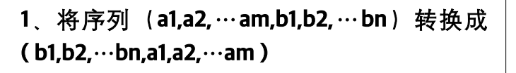

```c
// 反转数组中从 start 到 end 的部分
void reverse(SeqList* list, int start, int end) {
    while (start < end) {
        int temp = list->arr[start];
        list->arr[start] = list->arr[end];
        list->arr[end] = temp;
        start++;
        end--;
    }
}

// 将序列 (a1, a2, ..., am, b1, b2, ..., bn) 转换成 (b1, b2, ..., bn, a1, a2, ..., am)
void transform(SeqList* list, int m) {
    if (list->len == 0 || m <= 0 || m >= list->len) return; // 如果数组为空或 m 不合法，则无需转换

    int n = list->len - m;

    // 反转前 m 个元素
    reverse(list, 0, m - 1);
    // 反转后 n 个元素
    reverse(list, m, list->len - 1);
    // 反转整个数组
    reverse(list, 0, list->len - 1);
}

```

测试

```c
#include <stdio.h>

#define SIZE 50

typedef struct {
    int arr[SIZE];
    int len;
} SeqList;

// 反转数组中从 start 到 end 的部分
void reverse(SeqList* list, int start, int end) {
    while (start < end) {
        int temp = list->arr[start];
        list->arr[start] = list->arr[end];
        list->arr[end] = temp;
        start++;
        end--;
    }
}

// 将序列 (a1, a2, ..., am, b1, b2, ..., bn) 转换成 (b1, b2, ..., bn, a1, a2, ..., am)
void transform(SeqList* list, int m) {
    if (list->len == 0 || m <= 0 || m >= list->len) return; // 如果数组为空或 m 不合法，则无需转换

    int n = list->len - m;

    // 反转前 m 个元素
    reverse(list, 0, m - 1);
    // 反转后 n 个元素
    reverse(list, m, list->len - 1);
    // 反转整个数组
    reverse(list, 0, list->len - 1);
}

// 打印数组
void printArray(SeqList* list) {
    for (int i = 0; i < list->len; i++) {
        printf("%d ", list->arr[i]);
    }
    printf("\n");
}

// 主函数测试
int main() {
    SeqList list;
    list.len = 8;
    int data[] = {1, 2, 3, 4, 5, 6, 7, 8};
    for (int i = 0; i < list.len; i++) {
        list.arr[i] = data[i];
    }

    printf("原始序列: ");
    printArray(&list);

    int m = 4;
    transform(&list, m);

    printf("转换后的序列: ");
    printArray(&list);

    return 0;
}
//原始序列: 1 2 3 4 5 6 7 8 
//转换后的序列: 5 6 7 8 1 2 3 4 
```


## 数组强化2

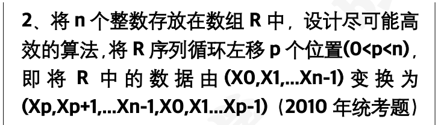

```c
// 反转数组中从 start 到 end 的部分
void reverse(SeqList* list, int start, int end) {
    while (start < end) {
        int temp = list->arr[start];
        list->arr[start] = list->arr[end];
        list->arr[end] = temp;
        start++;
        end--;
    }
}

// 将数组循环左移 p 个位置
void leftRotate(SeqList* list, int p) {
    if (list->len == 0 || p % list->len == 0) return; // 如果数组为空或 p 是数组长度的倍数，则无需移动

    p = p % list->len; // 处理 p 大于数组长度的情况

    // 反转前 p 个元素
    reverse(list, 0, p - 1);
    // 反转后 n-p 个元素
    reverse(list, p, list->len - 1);
    // 反转整个数组
    reverse(list, 0, list->len - 1);
}

```

测试

```c
#include <stdio.h>

#define SIZE 50

typedef struct {
    int arr[SIZE];
    int len;
} SeqList;

// 反转数组中从 start 到 end 的部分
void reverse(SeqList* list, int start, int end) {
    while (start < end) {
        int temp = list->arr[start];
        list->arr[start] = list->arr[end];
        list->arr[end] = temp;
        start++;
        end--;
    }
}

// 将数组循环左移 p 个位置
void leftRotate(SeqList* list, int p) {
    if (list->len == 0 || p % list->len == 0) return; // 如果数组为空或 p 是数组长度的倍数，则无需移动

    p = p % list->len; // 处理 p 大于数组长度的情况

    // 反转前 p 个元素
    reverse(list, 0, p - 1);
    // 反转后 n-p 个元素
    reverse(list, p, list->len - 1);
    // 反转整个数组
    reverse(list, 0, list->len - 1);
}

// 打印数组
void printArray(SeqList* list) {
    for (int i = 0; i < list->len; i++) {
        printf("%d ", list->arr[i]);
    }
    printf("\n");
}

// 主函数测试
int main() {
    SeqList list;
    list.len = 7;
    int data[] = {1, 2, 3, 4, 5, 6, 7};
    for (int i = 0; i < list.len; i++) {
        list.arr[i] = data[i];
    }

    printf("原始数组: ");
    printArray(&list);

    int p = 3;
    leftRotate(&list, p);

    printf("循环左移 %d 个位置后的数组: ", p);
    printArray(&list);

    return 0;
}
//原始数组: 1 2 3 4 5 6 7 
//循环左移 3 个位置后的数组: 4 5 6 7 1 2 3
```


## 数组强化3

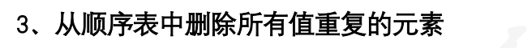

```c
//使用一个变量 k 记录不重复元素的位置，通过内层循环检查当前元素是否与前面的元素重复
void removeDuplicates(SeqList* list) {
    int k = 0;
    for (int i = 0; i < list->len; i++) {
        int j = 0;
        while (j < k && list->arr[i] != list->arr[j]) {
            j++;
        }
        if (j == k) {
            list->arr[k++] = list->arr[i];
        }
    }
    list->len = k;
}
```

测试

```c
#include <stdio.h>

#define SIZE 50

typedef struct {
    int arr[SIZE];
    int len;
} SeqList;

void removeDuplicates(SeqList* list) {
    int k = 0;
    for (int i = 0; i < list->len; i++) {
        int j = 0;
        while (j < k && list->arr[i] != list->arr[j]) {
            j++;
        }
        if (j == k) {
            list->arr[k++] = list->arr[i];
        }
    }
    list->len = k;
}

int main() {
    SeqList list = {{1, 2, 3, 2, 4, 3, 5}, 7};

    printf("原始数组: ");
    for (int i = 0; i < list.len; i++) {
        printf("%d ", list.arr[i]);
    }
    printf("\n");

    removeDuplicates(&list);

    printf("去重后数组: ");
    for (int i = 0; i < list.len; i++) {
        printf("%d ", list.arr[i]);
    }
    printf("\n");

    return 0;
}
```


## +数组强化4-

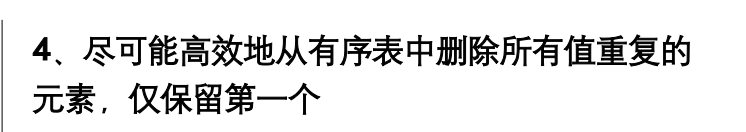

```c
void del(SqList *L){
    int i = 0;
    int k = i + 1;
    for (int j = i + 1; j < L->length; j++)
        if (L->data[j] != L->data[i]){
            L->data[k++] = L->data[j];
            i++;
        }
    L->length = k;
} //时空复杂度分别为 O(N) 和 O(1)
```

测试

```c
#include <stdio.h>

#define SIZE 50

typedef struct {
    int arr[SIZE];
    int len;
} SeqList;

// 上述函数实现...
// 简洁函数名：rmDup(SeqList *list)
void rmDup(SeqList *list) {
    if (list->len <= 1) return; // 如果列表长度小于等于1，无需处理

    int write = 1; // 写指针，初始位置为1
    for (int read = 1; read < list->len; ++read) {
        // 如果当前元素与前一个元素不同，则写入并移动写指针
        if (list->arr[read] != list->arr[read - 1]) {
            list->arr[write++] = list->arr[read];
        }
    }
    list->len = write; // 更新列表长度
}

void printList(SeqList *list) {
    for (int i = 0; i < list->len; ++i) {
        printf("%d ", list->arr[i]);
    }
    printf("\n");
}

int main() {
    SeqList list = {{1, 2, 2, 3, 4, 4, 5, 6, 6, 6}, 10};

    printf("原始列表: ");
    printList(&list);

    rmDup(&list);

    printf("去重后列表: ");
    printList(&list);

    return 0;
}
```


## +数组强化5

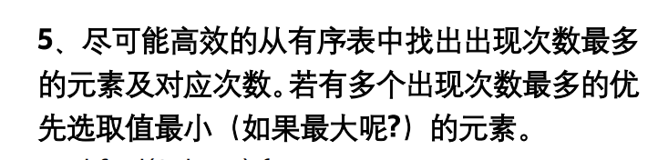

```c
void maxfreq(SqList *L, int min) {
    // 如果min为0优先选最大，min为非0优先选最小
    if (L->len == 0) return;

    int cval = L->arr[0], cnt = 1;// 当前值和重复数
    int mval = cval, max = cnt; //最大值和最大重复量

    for (int i = 1; i < L->len; i++) {
        if (L->arr[i] == cval)
            cnt++;
        else {
            if (cnt > max || (cnt == max && (min ? cval < mval : cval > mval))) {
                max = cnt;
                mval = cval;
            }
            cval = L->arr[i];
            cnt = 1;
        }
    }

    // 检查最后一个元素组
    if (cnt > max || (cnt == max && (min ? cval < mval : cval > mval)))
        mval = cval;

    printf("最大频次元素: %d\n", mval);
}
```

测试

```c
#include <stdio.h>

#define SIZE 50

typedef struct {
    int arr[SIZE];
    int len;
} SqList;

void maxfreq(SqList *L, int min);

int main() {
    SqList L = {{1, 2, 2, 3, 3, 3, 4, 4, 4}, 9};

    printf("优先取最小值:\n");
    maxfreq(&L, 1); // 输出应为 3

    printf("优先取最大值:\n");
    maxfreq(&L, 0); // 输出应为 4

    return 0;
}

// 简洁函数名：findMaxFrequencyElement(SeqList* list, int chooseMin)
void maxfreq(SqList *L, int min) {
    if (L->len == 0) {
        printf("空表\n");
        return;
    }

    int cval = L->arr[0], cnt = 1;
    int mval = cval, max = cnt;

    for (int i = 1; i < L->len; i++) {
        if (L->arr[i] == cval)
            cnt++;
        else {
            if (cnt > max || (cnt == max && (min ? cval < mval : cval > mval))) {
                max = cnt;
                mval = cval;
            }
            cval = L->arr[i];
            cnt = 1;
        }
    }

    // 检查最后一个元素组
    if (cnt > max || (cnt == max && (min ? cval < mval : cval > mval)))
        mval = cval;

    printf("最大频次元素: %d\n", mval);
}
// 函数定义在上方
优先取最小值:
最大频次元素: 3
优先取最大值:
最大频次元素: 4
```

- **时间复杂度**：O(n)，其中 n 是数组中的元素个数。每个元素仅被访问一次。
- **空间复杂度**：O(1)，只使用了常数级的额外空间


## +数组强化6

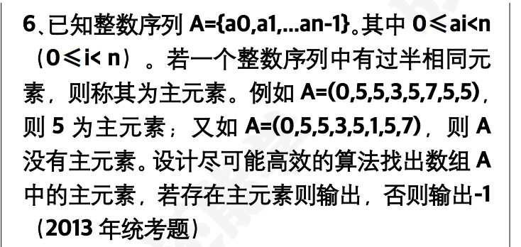

```c
//摩尔投票法
int findM(SeqList s) {
    int c = -1, cnt = 0;

    // 第一遍遍历，找到候选者
    for (int i = 0; i < s.len; ++i) {
        if (cnt == 0) {
            c = s.arr[i];
            cnt = 1;
        } else if (s.arr[i] == c) {
            cnt++;
        } else {
            cnt--;
        }
    }

    // 第二遍遍历，确认候选者是否为主元素
    cnt = 0;
    for (int i = 0; i < s.len; ++i) {
        if (s.arr[i] == c) {
            cnt++;
        }
    }

    if (cnt > s.len / 2)
        return c;
    else
        return -1;
}
```

测试

```c
#include <stdio.h>

#define SIZE 50

typedef struct {
    int arr[SIZE];
    int len;
} SeqList;

// 查找主元素函数：findM(SeqList s)
int findM(SeqList s);

int main() {
    SeqList s = {{3, 3, 4, 2, 4, 4, 2, 4, 4}, 9}; // 示例数据

    printf("主元素是：%d\n", findM(s)); // 应输出 4

    return 0;
}

// 函数定义在上方
int findM(SeqList s) {
    int c = -1, cnt = 0;

    // 第一遍遍历，找到候选者
    for (int i = 0; i < s.len; ++i) {
        if (cnt == 0) {
            c = s.arr[i];
            cnt = 1;
        } else if (s.arr[i] == c) {
            cnt++;
        } else {
            cnt--;
        }
    }

    // 第二遍遍历，确认候选者是否为主元素
    cnt = 0;
    for (int i = 0; i < s.len; ++i) {
        if (s.arr[i] == c) {
            cnt++;
        }
    }

    if (cnt > s.len / 2)
        return c;
    else
        return -1;
}
```

- **时间复杂度**：O(n)，其中 n 是序列的长度。需要两次遍历整个序列。
- **空间复杂度**：O(1)，只使用了固定数量的额外空间。

## 数组强化7

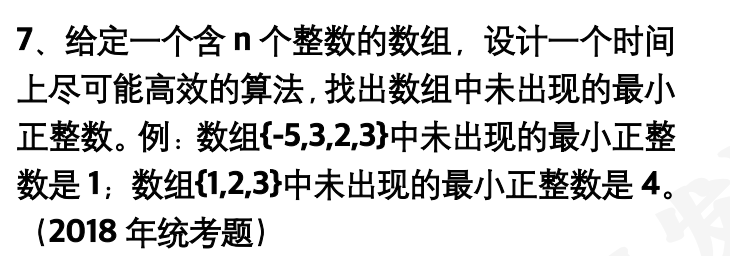

```c
int findMinAbsent(int arr[], int n) {
    if (n == 0) return 1;

    int max = n + 1;
    char present[max]; // 模拟布尔数组

    for (int i = 0; i < max; ++i)
        present[i] = 0;

    for (int i = 0; i < n; ++i) {
        if (arr[i] > 0 && arr[i] <= n)
            present[arr[i]] = 1;
    }

    for (int i = 1; i <= n + 1; ++i)
        if (!present[i]) return i;

    return -1; // 不可达
}
```

测试

```c
#include <stdio.h>

int findMinAbsent(int arr[], int n);

int main() {
    int arr1[] = {-5, 3, 2, 3};
    int n1 = sizeof(arr1) / sizeof(arr1[0]);
    printf("示例1: %d\n", findMinAbsent(arr1, n1)); // 输出 1

    int arr2[] = {1, 2, 3};
    int n2 = sizeof(arr2) / sizeof(arr2[0]);
    printf("示例2: %d\n", findMinAbsent(arr2, n2)); // 输出 4

    int arr3[] = {2, 1};
    int n3 = sizeof(arr3) / sizeof(arr3[0]);
    printf("示例3: %d\n", findMinAbsent(arr3, n3)); // 输出 3

    return 0;
}

int findMinAbsent(int arr[], int n) {
    if (n == 0) return 1;

    int max = n + 1;
    char present[max]; // 模拟布尔数组

    for (int i = 0; i < max; ++i)
        present[i] = 0;

    for (int i = 0; i < n; ++i) {
        if (arr[i] > 0 && arr[i] <= n)
            present[arr[i]] = 1;
    }

    for (int i = 1; i <= n + 1; ++i)
        if (!present[i]) return i;

    return -1; // 不可达
}
```

- **时间复杂度**：O(n)，两次线性遍历。
- **空间复杂度**：O(n)，辅助数组长度为 `n + 1`。


## 数组强化8

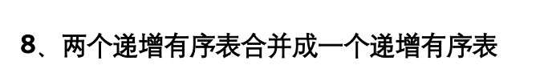

```c
// 合并两个升序顺序表为一个升序表
SeqList merge_asc(SeqList a, SeqList b) {
    SeqList c;
    c.len = 0;

    int i = 0, j = 0, k = 0;

    while (i < a.len && j < b.len) {
        if (a.arr[i] < b.arr[j]) {
            c.arr[k++] = a.arr[i++];
        } else {
            c.arr[k++] = b.arr[j++];
        }
    }

    while (i < a.len) c.arr[k++] = a.arr[i++];
    while (j < b.len) c.arr[k++] = b.arr[j++];

    c.len = k;
    return c;
}
```

测试

```c
#include <stdio.h>

#define SIZE 50

typedef struct {
    int arr[SIZE];
    int len;
} SeqList;

// 合并两个升序顺序表为一个升序表
SeqList merge_asc(SeqList a, SeqList b) {
    SeqList c;
    c.len = 0;

    int i = 0, j = 0, k = 0;

    while (i < a.len && j < b.len) {
        if (a.arr[i] < b.arr[j]) {
            c.arr[k++] = a.arr[i++];
        } else {
            c.arr[k++] = b.arr[j++];
        }
    }

    while (i < a.len) c.arr[k++] = a.arr[i++];
    while (j < b.len) c.arr[k++] = b.arr[j++];

    c.len = k;
    return c;
}

void print_list(SeqList l) {
    for (int i = 0; i < l.len; i++) {
        printf("%d ", l.arr[i]);
    }
    printf("\n");
}

int main() {
    SeqList a = {{1, 3, 5, 7}, 4};
    SeqList b = {{2, 4, 6, 8, 10}, 5};

    printf("表 a: ");
    print_list(a);

    printf("表 b: ");
    print_list(b);

    SeqList c = merge_asc(a, b);

    printf("合并后表 c（升序）: ");
    print_list(c);

    return 0;
}

```

**时间复杂度**：`O(m + n)`，m 与 n 为两个表长度。

**空间复杂度**：`O(m + n)`，用于结果顺序表存储。

## 数组强化9

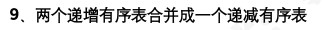

```c
void merge_to_desc(const SeqList *a, const SeqList *b, SeqList *c) {
    int temp[SIZE];
    int i = 0, j = 0, k = 0;

    while (i < a->len && j < b->len) {
        if (a->arr[i] <= b->arr[j]) {
            temp[k++] = a->arr[i++];
        } else {
            temp[k++] = b->arr[j++];
        }
    }
    while (i < a->len) temp[k++] = a->arr[i++];
    while (j < b->len) temp[k++] = b->arr[j++];

    c->len = k;
    for (int m = 0; m < k; m++) {
        c->arr[m] = temp[k - 1 - m];
    }
}
```

测试

```c
#include <stdio.h>

#define SIZE 50

typedef struct {
    int arr[SIZE];
    int len;
} SeqList;

void merge_to_desc(const SeqList *a, const SeqList *b, SeqList *c) {
    int temp[SIZE];
    int i = 0, j = 0, k = 0;

    while (i < a->len && j < b->len) {
        if (a->arr[i] <= b->arr[j]) {
            temp[k++] = a->arr[i++];
        } else {
            temp[k++] = b->arr[j++];
        }
    }
    while (i < a->len) temp[k++] = a->arr[i++];
    while (j < b->len) temp[k++] = b->arr[j++];

    c->len = k;
    for (int m = 0; m < k; m++) {
        c->arr[m] = temp[k - 1 - m];
    }
}

int main() {
    SeqList a = {{10, 30, 50, 70, 90}, 5};  // 递增
    SeqList b = {{20, 40, 60, 80}, 4};      // 递增
    SeqList c;

    merge_to_desc(&a, &b, &c);

    printf("合并后的递减有序表（从大到小）：\n");
    for (int i = 0; i < c.len; i++) {
        printf("%d ", c.arr[i]);
    }
    printf("\n");

    return 0;
}

```

## 数组强化10

**三个序列 A, B, C 长度均为 n，且均为无重复元素的递增序列，设计一个尽可能高效的算法，输出三个序列中共同存在的所有元素（三指针**

```c
int fmax(int a, int b, int c) {
    if (a >= b && a >= c)
        return a;
    else if (b >= a && b >= c)
        return b;
    else
        return c;
}

void samekey(int A[], int B[], int C[], int n) {
    int i = 0, j = 0, k = 0;
    while (i < n && j < n && k < n) {
        if (A[i] == B[j] && A[i] == C[k]) {
            printf("%d", A[i]);
            i++;
            j++;
            k++;
        } else {
            int max_num = fmax(A[i], B[j], C[k]);
            if (A[i] < max_num)
                i++;
            if (B[j] < max_num)
                j++;
            if (C[k] < max_num)
                k++;
        }
    }
} // if else 是个整体，while 循环不用加括号
// 时空复杂度分别为 O(N) 和 O(1)
```


## 数组强化11

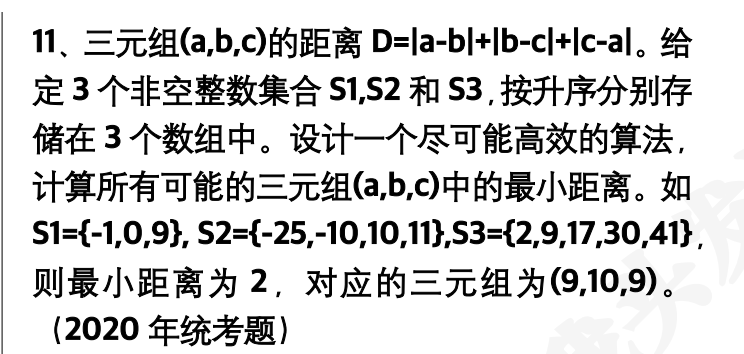

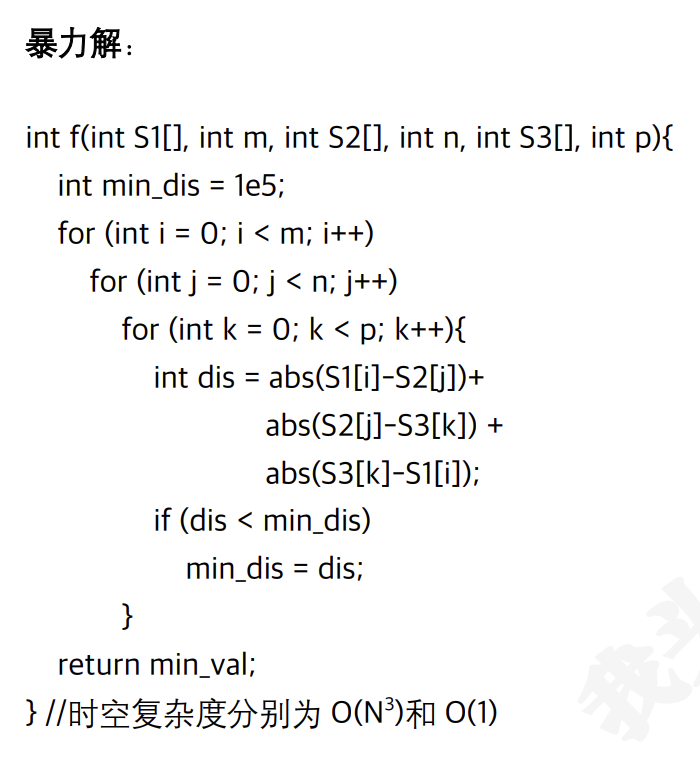

## 数组强化12-

**12、一个长度为 L 的升序序列 S，处在第 L/2（向上取整）个位置的数称为 S 的中位数。例如 S1=(11,13,15,17,19)，S1 的中位数为 15，两个序列的中位数是含他们所有元素升序序列的中位数。例如，若 S2=(2,4,6,8,20)，则 S1 和 S2 的中位数是 11。现在有两个等长的升序序列 A 和 B，试设计一个在时间和空间都尽可能高效的算法，找出两个序列 A 和 B 的中位数（2011 年统考题）**

不借助第三个数组，**用两个指针 i 和 j 遍历 A 和 B，合并查找第 len/2 个最小值**。这是一个模拟归并排序中 "取中位" 的过程，**不需要实际合并整个数组**。

```c
int findMedian(SeqList A, SeqList B) {
    int i = 0, j = 0, count = 0;
    int median = 0;
    int target = A.len;  // A 和 B 等长，总长为 2 * len，中位数在第 len 位（从 1 开始）

    while (count < target) {
        if (i < A.len && (j >= B.len || A.arr[i] < B.arr[j])) {//“如果还能从 A 中取元素，并且要么 B 已经没有元素了，要么 A 的当前元素更小”，那就从 A 取出当前元素。
            median = A.arr[i++];
        } else {
            median = B.arr[j++];
        }
        count++;
    }

    return median;
}

```

测试

```c
#include <stdio.h>

#define SIZE 50

typedef struct {
    int arr[SIZE];
    int len;
} SeqList;

int findMedian(SeqList A, SeqList B);  // 前置声明

int main() {
    SeqList A = {{11, 13, 15, 17, 19}, 5};
    SeqList B = {{2, 4, 6, 8, 20}, 5};

    int median = findMedian(A, B);
    printf("两个升序序列的中位数是：%d\n", median);

    return 0;
}

int findMedian(SeqList A, SeqList B) {
    int i = 0, j = 0, count = 0;
    int median = 0;
    int target = A.len;  // A 和 B 等长，总长为 2 * len，中位数在第 len 位（从 1 开始）

    while (count < target) {
        if (i < A.len && (j >= B.len || A.arr[i] < B.arr[j])) {
            median = A.arr[i++];
        } else {
            median = B.arr[j++];
        }
        count++;
    }

    return median;
}

//
两个升序序列的中位数是：11
```

时间 O(N)、空间 O(1）


