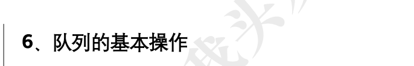

# 栈和队列

栈的结构体

```c
#define maxsize 50
typedef struct{
  char data[maxsize];
  int top;
}stack;
```

队列的结构体

```c
#define maxsize 50
typedef struct{
  char data[maxsize];
  int front, rear;
}queue;
```

## 栈基础1


```c
// 栈的初始化
void initStack(stack* s) {
    s->top = -1;
}

// 判断栈是否为空
int isEmpty(stack* s) {
    return s->top == -1;
}

// 判断栈是否已满
int isFull(stack* s) {
    return s->top == maxsize - 1;
}

// 入栈操作
void push(stack* s, char val) {
    if (isFull(s)) {
        printf("栈溢出\n");
        return;
    }
    s->data[++(s->top)] = val;
}

// 出栈操作
char pop(stack* s) {
    if (isEmpty(s)) {
        printf("栈为空\n");
        exit(1);
    }
    return s->data[(s->top)--];
}

// 获取栈顶元素
char peek(stack* s) {
    if (isEmpty(s)) {
        printf("栈为空\n");
        exit(1);
    }
    return s->data[s->top];
}
```

测试

```c
#include <stdio.h>
#include <stdlib.h>

#define maxsize 50

// 定义栈结构体
typedef struct {
    char data[maxsize];
    int top;
} stack;

// 栈的基本操作函数声明
void initStack(stack* s);
int isEmpty(stack* s);
int isFull(stack* s);
void push(stack* s, char val);
char pop(stack* s);
char peek(stack* s);

// 栈的初始化
void initStack(stack* s) {
    s->top = -1;
}

// 判断栈是否为空
int isEmpty(stack* s) {
    return s->top == -1;
}

// 判断栈是否已满
int isFull(stack* s) {
    return s->top == maxsize - 1;
}

// 入栈操作
void push(stack* s, char val) {
    if (isFull(s)) {
        printf("栈溢出\n");
        return;
    }
    s->data[++(s->top)] = val;
}

// 出栈操作
char pop(stack* s) {
    if (isEmpty(s)) {
        printf("栈为空\n");
        exit(1);
    }
    return s->data[(s->top)--];
}

// 获取栈顶元素
char peek(stack* s) {
    if (isEmpty(s)) {
        printf("栈为空\n");
        exit(1);
    }
    return s->data[s->top];
}

// 主函数测试
int main() {
    stack s;
    initStack(&s);

    // 测试入栈
    push(&s, 'a');
    push(&s, 'b');
    push(&s, 'c');

    printf("栈顶元素: %c\n", peek(&s)); // c

    // 测试出栈
    printf("pop: %c\n", pop(&s)); // c
    printf("pop: %c\n", pop(&s)); // b

    printf("栈是否为空: %s\n", isEmpty(&s) ? "是" : "否"); // 否

    return 0;
}

//栈顶元素: c
//pop: c
//pop: b
//栈是否为空: 否
```


## 栈基础2

**判断单链表中全部 n 个字符是否是回文**

```c
bool func(LinkList L) {
    stack s;
    s.top = -1;
    LinkList p = L->next;
    while (p != NULL) {
        s.data[++s.top] = p->data;
        p = p->next;
    }
    p = L->next;
    while (p != NULL) {
        if (s.data[s.top--] != p->data)
            return false;
        p = p->next;
    }
    return true;
}
// 时间复杂度分别为 O(N) 和 O(N)

```

测试：

```c
#include <stdio.h>
#include <stdlib.h>

#define maxsize 50

// 链表节点
typedef struct Node {
    char data;
    struct Node* next;
} Node;

// 栈结构体
typedef struct {
    char data[maxsize];
    int top;
} Stack;

// 初始化栈
void initStack(Stack* s) {
    s->top = -1;
}

// 入栈
void push(Stack* s, char val) {
    if (s->top < maxsize - 1)
        s->data[++(s->top)] = val;
    else {
        printf("栈满\n");
        exit(1);
    }
}

// 出栈
char pop(Stack* s) {
    if (s->top == -1) {
        printf("栈空\n");
        exit(1);
    }
    return s->data[(s->top)--];
}

// 创建新节点
Node* createNode(char val) {
    Node* n = (Node*)malloc(sizeof(Node));
    n->data = val;
    n->next = NULL;
    return n;
}

// 判断是否为回文
int isPalindrome(Node* head) {
    if (!head || !head->next) return 1;

    Stack s;
    initStack(&s);

    Node* curr = head;
    while (curr) {
        push(&s, curr->data);
        curr = curr->next;
    }

    curr = head;
    while (curr) {
        if (curr->data != pop(&s)) return 0;
        curr = curr->next;
    }
    return 1;
}

// 主函数测试
int main() {
    // 构造链表 a -> b -> a
    Node* head = createNode('a');
    head->next = createNode('b');
    head->next->next = createNode('a');

    if (isPalindrome(head))
        printf("是回文\n");
    else
        printf("不是回文\n");

    return 0;
}
```


## 栈基础3


```c
int isParenthesesMatched(const char* expr) {
    Stack s;
    initStack(&s);

    for (int i = 0; expr[i] != '\0'; ++i) {
        if (expr[i] == '(')
            push(&s, expr[i]);
        else if (expr[i] == ')') {
            if (isEmpty(&s)) return 0; // 没有匹配的左括号
            pop(&s);                   // 匹配成功，弹出栈顶
        }
    }

    return isEmpty(&s); // 栈空说明全部匹配完成
}
```

测试

```c
#include <stdio.h>
#include <stdlib.h>

#define maxsize 50

// 栈结构体
typedef struct {
    char data[maxsize];
    int top;
} Stack;

// 初始化栈
void initStack(Stack* s) {
    s->top = -1;
}

// 入栈
void push(Stack* s, char val) {
    if (s->top < maxsize - 1)
        s->data[++(s->top)] = val;
    else {
        printf("栈满\n");
        exit(1);
    }
}

// 判断栈是否为空
int isEmpty(Stack* s) {
    return s->top == -1;
}

// 出栈
char pop(Stack* s) {
    if (isEmpty(s)) {
        printf("栈空\n");
        exit(1);
    }
    return s->data[(s->top)--];
}


// 括号匹配判断函数
int isParenthesesMatched(const char* expr) {
    Stack s;
    initStack(&s);

    for (int i = 0; expr[i] != '\0'; ++i) {
        if (expr[i] == '(')
            push(&s, expr[i]);
        else if (expr[i] == ')') {
            if (isEmpty(&s)) return 0;
            pop(&s);
        }
    }

    return isEmpty(&s);
}

// 主函数测试
int main() {
    const char* expr1 = "(a + b) * (c + d)";
    const char* expr2 = "((a + b) * c + d)";
    const char* expr3 = ")(";

    printf("表达式 \"%s\" 的括号配对结果：%s\n", expr1, isParenthesesMatched(expr1) ? "匹配" : "不匹配");
    printf("表达式 \"%s\" 的括号配对结果：%s\n", expr2, isParenthesesMatched(expr2) ? "匹配" : "不匹配");
    printf("表达式 \"%s\" 的括号配对结果：%s\n", expr3, isParenthesesMatched(expr3) ? "匹配" : "不匹配");

    return 0;
}
```


## 栈基础4


```c
void func(char* str) {
    Stack sStack, hStack;
    initStack(&sStack);
    initStack(&hStack);

    for (int i = 0; str[i] != '\0'; ++i) {
        if (str[i] == 'S') push(&sStack, str[i]);
        else if (str[i] == 'H') push(&hStack, str[i]);
    }

    int idx = 0;

    while (!isEmpty(&sStack))
        str[idx++] = pop(&sStack);

    while (!isEmpty(&hStack))
        str[idx++] = pop(&hStack);

    
    str[idx] = '\0';
}
```

测试

```c
#include <stdio.h>
#include <string.h>
#include <stdlib.h>

#define maxsize 50

typedef struct {
    char data[maxsize];
    int top;
} Stack;

// 栈操作函数
void initStack(Stack* s) {
    s->top = -1;
}

int isEmpty(Stack* s) {
    return s->top == -1;
}

void push(Stack* s, char val) {
    if (s->top < maxsize - 1)
        s->data[++(s->top)] = val;
    else {
        printf("栈满\n");
        exit(1);
    }
}

char pop(Stack* s) {
    if (isEmpty(s)) {
        printf("栈空\n");
        exit(1);
    }
    return s->data[(s->top)--];
}

// 主函数测试
void moveSBeforeH(char* str) {
    Stack sStack, hStack;
    initStack(&sStack);
    initStack(&hStack);

    for (int i = 0; str[i] != '\0'; ++i) {
        if (str[i] == 'S') push(&sStack, str[i]);
        else if (str[i] == 'H') push(&hStack, str[i]);
    }

    int idx = 0;

    while (!isEmpty(&sStack))
        str[idx++] = pop(&sStack);

    while (!isEmpty(&hStack))
        str[idx++] = pop(&hStack);

    
    str[idx] = '\0';
}

int main() {
    char str[] = "HSSHHHS";
    printf("原始字符串: %s\n", str);

    moveSBeforeH(str);
    printf("处理后的字符串: %s\n", str);

    return 0;
}
```


## 栈基础5


```c
typedef struct {
    int data[maxsize];
    int top1;
    int top2;
} stack;

// 判断 s1 是否为空
int isEmpty1(stack* s) {
    return s->top1 == -1;
}

// 判断 s2 是否为空
int isEmpty2(stack* s) {
    return s->top2 == maxsize;
}

// 判断栈是否已满（共享空间是否用尽）
int isFull(stack* s) {
    return s->top1 + 1 == s->top2;
}

// s1 入栈
void push1(stack* s, int val) {
    if (isFull(s)) {
        printf("栈已满\n");
        return;
    }
    s->data[++(s->top1)] = val;
}

// s2 入栈
void push2(stack* s, int val) {
    if (isFull(s)) {
        printf("栈已满\n");
        return;
    }
    s->data[--(s->top2)] = val;
}

// s1 出栈
int pop1(stack* s) {
    if (isEmpty1(s)) {
        printf("s1 为空\n");
        exit(1);
    }
    return s->data[(s->top1)--];
}

// s2 出栈
int pop2(stack* s) {
    if (isEmpty2(s)) {
        printf("s2 为空\n");
        exit(1);
    }
    return s->data[(s->top2)++];
}
```

测试：

```c
#include <stdio.h>
#include <stdlib.h>

#define maxsize 10

typedef struct {
    int data[maxsize];
    int top1;
    int top2;
} stack;

// 初始化栈
void initStack(stack* s) {
    s->top1 = -1;
    s->top2 = maxsize;
}

// 判断 s1 是否为空
int isEmpty1(stack* s) {
    return s->top1 == -1;
}

// 判断 s2 是否为空
int isEmpty2(stack* s) {
    return s->top2 == maxsize;
}

// 判断栈是否已满
int isFull(stack* s) {
    return s->top1 + 1 == s->top2;
}

// s1 入栈
void push1(stack* s, int val) {
    if (isFull(s)) {
        printf("栈已满\n");
        return;
    }
    s->data[++(s->top1)] = val;
}

// s2 入栈
void push2(stack* s, int val) {
    if (isFull(s)) {
        printf("栈已满\n");
        return;
    }
    s->data[--(s->top2)] = val;
}

// s1 出栈
int pop1(stack* s) {
    if (isEmpty1(s)) {
        printf("s1 为空\n");
        exit(1);
    }
    return s->data[(s->top1)--];
}

// s2 出栈
int pop2(stack* s) {
    if (isEmpty2(s)) {
        printf("s2 为空\n");
        exit(1);
    }
    return s->data[(s->top2)++];
}

// 主函数测试
int main() {
    stack s;
    initStack(&s);

    // 测试入栈操作
    push1(&s, 10);
    push1(&s, 20);
    push2(&s, 30);
    push2(&s, 40);

    printf("pop from s1: %d\n", pop1(&s)); // 20
    printf("pop from s2: %d\n", pop2(&s)); // 40

    return 0;
}
//pop from s1: 20
//pop from s2: 40
```


## 队列基础1



```c
#include <stdio.h>

#define maxsize 50

typedef struct {
    char data[maxsize];
    int front, rear;
} queue;

// 初始化队列
void initQueue(queue* q) {
    q->front = -1;
    q->rear = -1;
}

// 判断队列是否为空
int isEmpty(queue* q) {
    return (q->front == -1 && q->rear == -1);
}

// 判断队列是否已满
int isFull(queue* q) {
    return (q->rear == maxsize - 1);
}

// 入队操作
int enqueue(queue* q, char val) {
    if (isFull(q)) {
        printf("队列已满\n");
        return 0;
    }
    if (isEmpty(q)) {
        q->front = 0;
    }
    q->data[++(q->rear)] = val;
    return 1;
}

// 出队操作
int dequeue(queue* q, char* val) {
    if (isEmpty(q)) {
        printf("队列为空\n");
        return 0;
    }
    *val = q->data[q->front];
    if (q->front == q->rear) {
        // 队列中只有一个元素时，重置队列
        q->front = -1;
        q->rear = -1;
    } else {
        q->front++;
    }
    return 1;
}

// 获取队首元素
int getFront(queue* q, char* val) {
    if (isEmpty(q)) {
        printf("队列为空\n");
        return 0;
    }
    *val = q->data[q->front];
    return 1;
}
```


## 队列基础2


```c
// 入队操作
void enqueue(Queue* q, char value) {
    Node* newNode = (Node*)malloc(sizeof(Node));
    if (!newNode) {
        printf("内存分配失败\n");
        exit(-1);
    }
    newNode->data = value;
    newNode->next = q->rear->next; // 插入到队头后
    q->rear->next = newNode;
    q->rear = newNode; // 更新队尾
}

// 出队操作
char dequeue(Queue* q) {
    if (q->rear->next == q->rear) { // 空队列
        printf("队列为空，无法出队\n");
        return '\0';
    }

    Node* frontNode = q->rear->next->next; // 跳过头节点
    char value = frontNode->data;
    if (frontNode == q->rear) { // 只有一个有效节点时
        free(frontNode);
        q->rear->next = q->rear; // 保持自环
    } else {
        q->rear->next->next = frontNode->next;
        free(frontNode);
    }

    return value;
}
```

测试

```c
#include <stdio.h>
#include <stdlib.h>

typedef struct Node {
    char data;
    struct Node* next;
} Node;

typedef struct {
    Node* rear; // 队尾指针
} Queue;

// 初始化队列（带头节点）
void initQueue(Queue* q) {
    q->rear = (Node*)malloc(sizeof(Node));
    if (!q->rear) {
        printf("内存分配失败\n");
        exit(-1);
    }
    q->rear->data = '\0';          // 头节点数据无意义
    q->rear->next = q->rear;      // 自环
}

// 入队操作
void enqueue(Queue* q, char value) {
    Node* newNode = (Node*)malloc(sizeof(Node));
    if (!newNode) {
        printf("内存分配失败\n");
        exit(-1);
    }
    newNode->data = value;
    newNode->next = q->rear->next; // 插入到队头后
    q->rear->next = newNode;
    q->rear = newNode; // 更新队尾
}

// 出队操作
char dequeue(Queue* q) {
    if (q->rear->next == q->rear) { // 空队列
        printf("队列为空，无法出队\n");
        return '\0';
    }

    Node* frontNode = q->rear->next->next; // 跳过头节点
    char value = frontNode->data;
    if (frontNode == q->rear) { // 只有一个有效节点时
        free(frontNode);
        q->rear->next = q->rear; // 保持自环
    } else {
        q->rear->next->next = frontNode->next;
        free(frontNode);
    }

    return value;
}

// 获取队首元素
int getFront(Queue* q, char* val) {
    if (q->rear->next == q->rear) {
        printf("队列为空\n");
        return 0; // 返回 0 表示失败
    }
    *val = q->rear->next->next->data;
    return 1; // 返回 1 表示成功
}

int main() {
    Queue q;
    initQueue(&q);

    // 测试入队
    enqueue(&q, 'a');
    enqueue(&q, 'b');
    enqueue(&q, 'c');

    char val;
    if (getFront(&q, &val)) {
        printf("队首元素: %c\n", val); // 输出: a
    } else {
        printf("队列为空\n");
    }

    // 测试出队
    val = dequeue(&q);
    if (val != '\0') {
        printf("出队元素: %c\n", val); // 输出: a
    }

    val = dequeue(&q);
    if (val != '\0') {
        printf("出队元素: %c\n", val); // 输出: b
    }

    if (getFront(&q, &val)) {
        printf("队首元素: %c\n", val); // 输出: c
    } else {
        printf("队列为空\n");
    }

    return 0;
}
//队首元素: a
//出队元素: a
//出队元素: b
//队首元素: c
```

## 队列基础3

**用两个栈 s1 和 s2 来模拟一个队列。如何利用栈的运算实现该队列的两个运算：入队和出队**

```c
bool enqueue(stack* s1, stack* s2, int x){
    if (s1->top == maxsize - 1 && s2->top != -1)
        return false;
    if (s1->top == maxsize - 1 && s2->top == -1)
        while (s1->top != -1)
            s2->data[++s2->top] = s1->data[s1->top--];
    s1->data[++s1->top] = x;
    return true;
} //时空复杂度分别为 O(N)和 O(N)
```


## 队列基础4


