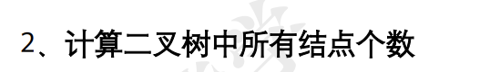
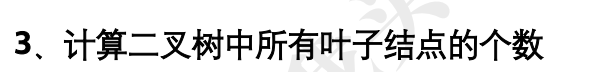
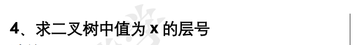
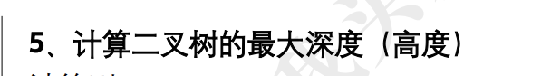
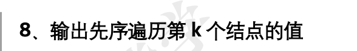
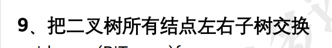
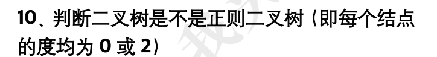
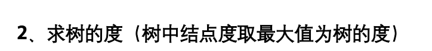

# 二叉树

## 二叉树结构体

```c
typedef struct BTNode{
  char data;
  struct BTNode *lchild, *rchild;
}BTNode, *BiTree
```

## 线索二叉树结构体

```c
typedef struct TNode{
    char data;
    struct TNode *lchild, *rchild;
    int ltag, rtag;
} TNode, *iTree; //线索二叉树结构体
```

## 基础1


```c
#include <stdio.h>

// 先序遍历
void pre(BiTree T) {
    if (T != NULL) {
        printf("%c ", T->data); // 访问根节点
        pre(T->lchild);         // 左子树
        pre(T->rchild);         // 右子树
    }
}

// 中序遍历
void in(BiTree T) {
    if (T != NULL) {
        in(T->lchild);          // 左子树
        printf("%c ", T->data); // 访问根节点
        in(T->rchild);          // 右子树
    }
}

// 后序遍历
void post(BiTree T) {
    if (T != NULL) {
        post(T->lchild);        // 左子树
        post(T->rchild);        // 右子树
        printf("%c ", T->data); // 访问根节点
    }
}
```

测试

```c
typedef struct BTNode {
    char data;
    struct BTNode *lchild, *rchild;
} BTNode, *BiTree;

#include <stdio.h>

// 先序遍历
void pre(BiTree T) {
    if (T != NULL) {
        printf("%c ", T->data); // 访问根节点
        pre(T->lchild);         // 左子树
        pre(T->rchild);         // 右子树
    }
}

// 中序遍历
void in(BiTree T) {
    if (T != NULL) {
        in(T->lchild);          // 左子树
        printf("%c ", T->data); // 访问根节点
        in(T->rchild);          // 右子树
    }
}

// 后序遍历
void post(BiTree T) {
    if (T != NULL) {
        post(T->lchild);        // 左子树
        post(T->rchild);        // 右子树
        printf("%c ", T->data); // 访问根节点
    }
}

#include <stdlib.h>

// 上述结构体与遍历函数定义...

// 创建新节点
BiTree createNode(char val) {
    BiTree node = (BiTree)malloc(sizeof(BTNode));
    node->data = val;
    node->lchild = node->rchild = NULL;
    return node;
}

int main() {
    // 构建一个简单二叉树
    //       A
    //      / \
    //     B   C
    //    / \
    //   D   E

    BiTree root = createNode('A');
    root->lchild = createNode('B');
    root->rchild = createNode('C');
    root->lchild->lchild = createNode('D');
    root->lchild->rchild = createNode('E');

    printf("先序遍历: ");
    pre(root);
    printf("\n");

    printf("中序遍历: ");
    in(root);
    printf("\n");

    printf("后序遍历: ");
    post(root);
    printf("\n");

    return 0;
}
// 先序遍历: A B D E C 
// 中序遍历: D B E A C 
// 后序遍历: D E B C A 
```


## 基础2



```c
int cnt(BiTree T) {
    if (T == NULL)
        return 0;
    else
        return 1 + cnt(T->lchild) + cnt(T->rchild);
}
```

测试

```c
#include <stdio.h>
#include <stdlib.h>

// 结构体定义和函数实现...
typedef struct BTNode {
    char data;
    struct BTNode *lchild, *rchild;
} BTNode, *BiTree;

// 简洁函数名：cnt(BiTree T)
int cnt(BiTree T) {
    if (T == NULL)
        return 0;
    else
        return 1 + cnt(T->lchild) + cnt(T->rchild);
}

// 创建新节点
BiTree newNode(char val) {
    BiTree node = (BiTree)malloc(sizeof(BTNode));
    node->data = val;
    node->lchild = node->rchild = NULL;
    return node;
}

int main() {
    // 构建测试二叉树
    //       A
    //      / \
    //     B   C
    //    /     \
    //   D       E

    BiTree root = newNode('A');
    root->lchild = newNode('B');
    root->rchild = newNode('C');
    root->lchild->lchild = newNode('D');
    root->rchild->rchild = newNode('E');

    printf("总节点个数: %d\n", cnt(root)); // 应输出 4

    return 0;
}
// 总节点个数: 5
```


## 基础3



```c
// 简洁函数名：countLeaves(BiTree tree)
int func(BiTree bt) {
    if (bt == NULL) {
        return 0;
    }
    if (!bt->lchild && !bt->rchild) {
        return 1;
    }
    return func(bt->lchild) + func(bt->rchild);
}
```

测试

```c
#include <stdio.h>
#include <stdlib.h>

typedef struct BTNode {
    char data;
    struct BTNode *lchild, *rchild;
} BTNode, *BiTree;

// 创建新节点
BTNode* createNode(char value) {
    BTNode* newNode = (BTNode*)malloc(sizeof(BTNode));
    newNode->data = value;
    newNode->lchild = NULL;
    newNode->rchild = NULL;
    return newNode;
}

// 简洁函数名：countLeaves(BiTree tree)
int countLeaves(BiTree tree) {
    if (tree == NULL) {
        return 0;
    }
    if (tree->lchild == NULL && tree->rchild == NULL) {
        return 1;
    }
    return countLeaves(tree->lchild) + countLeaves(tree->rchild);
}

void printTree(BiTree tree, int level) {
    if (tree == NULL) {
        return;
    }
    for (int i = 0; i < level; ++i) {
        printf("   ");
    }
    printf("%c\n", tree->data);
    printTree(tree->lchild, level + 1);
    printTree(tree->rchild, level + 1);
}

int main() {
    // 构建一个简单的二叉树
    BiTree root = createNode('A');
    root->lchild = createNode('B');
    root->rchild = createNode('C');
    root->lchild->lchild = createNode('D');
    root->lchild->rchild = createNode('E');
    root->rchild->rchild = createNode('F');

    printf("二叉树结构:\n");
    printTree(root, 0);

    int leafCount = countLeaves(root);
    printf("叶子节点的数量: %d\n", leafCount);

    return 0;
}

//二叉树结构:
A
   B
      D
      E
   C
      F
叶子节点的数量: 3
```

- **时间复杂度**：O(n)，其中 n 是二叉树的节点总数。每个节点都会被访问一次。
- **空间复杂度**：O(h)，其中 h 是二叉树的高度，递归调用栈的最大深度取决于树的高度


## 扩展


```c
// 简洁函数名：countDoubleBranch(BiTree tree)
int func(BiTree bt) {
    if (!bt) return 0;
    int count = 0;
    if (bt->lchild && bt->rchild)
        count = 1;
    return count + func(bt->lchild) + func(bt->rchild);
}
```

测试

```c
#include <stdio.h>
#include <stdlib.h>

typedef struct BTNode {
    char data;
    struct BTNode *lchild, *rchild;
} BTNode, *BiTree;

// 创建新节点
BTNode* createNode(char value) {
    BTNode* newNode = (BTNode*)malloc(sizeof(BTNode));
    newNode->data = value;
    newNode->lchild = NULL;
    newNode->rchild = NULL;
    return newNode;
}

// 简洁函数名：countDoubleBranch(BiTree tree)
int countDoubleBranch(BiTree tree) {
    if (tree == NULL) {
        return 0;
    }
    int count = 0;
    if (tree->lchild != NULL && tree->rchild != NULL) {
        count = 1;
    }
    return count + countDoubleBranch(tree->lchild) + countDoubleBranch(tree->rchild);
}

void printTree(BiTree tree, int level) {
    if (tree == NULL) {
        return;
    }
    for (int i = 0; i < level; ++i) {
        printf("   ");
    }
    printf("%c\n", tree->data);
    printTree(tree->lchild, level + 1);
    printTree(tree->rchild, level + 1);
}

int main() {
    // 构建一个简单的二叉树
    BiTree root = createNode('A');
    root->lchild = createNode('B');
    root->rchild = createNode('C');
    root->lchild->lchild = createNode('D');
    root->lchild->rchild = createNode('E');
    root->rchild->rchild = createNode('F');

    printf("二叉树结构:\n");
    printTree(root, 0);

    int doubleBranchCount = countDoubleBranch(root);
    printf("双分支节点的数量: %d\n", doubleBranchCount);

    return 0;
}
```

- **时间复杂度**：O(n)，其中 n 是二叉树中的节点数。每个节点都会被访问一次。
- **空间复杂度**：O(h)，其中 h 是二叉树的高度，递归调用栈的最大深度取决于树的高度


## 基础4



```c
void find(BiTree p, int x, int *L) {
    if (p != NULL) {
        ++(*L);
        if (p->data == x)
            printf("%d", *L);
        find(p->lchild, x, L);
        find(p->rchild, x, L);
        --(*L);
    }
} // 时空复杂度分别为 O(N) 和 O(N)
```

测试：

```c
#include <stdio.h>
#include <stdlib.h>

typedef struct BTNode {
    char data;
    struct BTNode *lchild, *rchild;
} BTNode, *BiTree;

// 简洁函数名：findXLevel(BiTree T, char x)
int findXLevel(BiTree T, char x);

BiTree create(char d) {
    BiTree n = (BiTree)malloc(sizeof(BTNode));
    n->data = d;
    n->lchild = n->rchild = NULL;
    return n;
}

int main() {
    // 构造示例二叉树：
    //         A
    //        / \
    //       B   C
    //      / \   \
    //     D   E   F

    BiTree root = create('A');
    root->lchild = create('B');
    root->rchild = create('C');
    root->lchild->lchild = create('D');
    root->lchild->rchild = create('E');
    root->rchild->rchild = create('F');

    printf("F 所在层数: %d\n", findXLevel(root, 'F')); // 应输出 3
    printf("Z 所在层数: %d\n", findXLevel(root, 'Z')); // 应输出 -1

    return 0;
}

int findXLevel(BiTree T, char x) {
    if (!T) return -1;
    if (T->data == x) return 1;

    int l = findXLevel(T->lchild, x);
    int r = findXLevel(T->rchild, x);

    if (l != -1) return l + 1;
    if (r != -1) return r + 1;

    return -1;
}
```

- **时间复杂度**：O(n)，其中 n 是节点总数。每个节点最多访问一次。
- **空间复杂度**：O(h)，h 为树的高度，递归调用栈最大深度

## 基础5



```c
void func(BiTree p, int *L, int *max_L) {
    if (p != NULL) {
        ++(*L);
        if (*L >= *max_L)
            *max_L = *L;
        func(p->lchild, L, max_L);
        func(p->rchild, L, max_L);
        --(*L);
    }
} // 时空复杂度分别为 O(N) 和 O(N)
```

测试

```c
#include <stdio.h>
#include <stdlib.h>

typedef struct BTNode {
    char data;
    struct BTNode *lchild, *rchild;
} BTNode, *BiTree;

// 创建新节点的辅助函数
BiTree create(char d) {
    BiTree n = (BiTree)malloc(sizeof(BTNode));
    n->data = d;
    n->lchild = n->rchild = NULL;
    return n;
}

// 计算二叉树最大深度的函数
int maxDepth(BiTree T) {
    if (!T) return 0;

    int left = maxDepth(T->lchild);
    int right = maxDepth(T->rchild);

    return (left > right ? left : right) + 1;
}

int main() {
    // 构造示例二叉树：
    //         A
    //        / \
    //       B   C
    //      / \   \
    //     D   E   F

    BiTree root = create('A');
    root->lchild = create('B');
    root->rchild = create('C');
    root->lchild->lchild = create('D');
    root->lchild->rchild = create('E');
    root->rchild->rchild = create('F');

    printf("二叉树的最大深度: %d\n", maxDepth(root)); // 应输出 3

    return 0;
}
```

- **时间复杂度**：O(n)，其中 n 是节点总数。每个节点最多访问一次。
- **空间复杂度**：O(h)，h 为树的高度，递归调用栈最大深度。

## 基础6


```c
void func(BiTree p, BiTree *m) {
    if (p != NULL) {
        if ((*m) == NULL || p->data > (*m)->data)
            *m = p;
        func(p->lchild, m);
        func(p->rchild, m);
    }
} // 时空复杂度分别为 O(N) 和 O(N)
```

测试

```c
#include <stdio.h>
#include <stdlib.h>

typedef struct BTNode {
    char data;
    struct BTNode *lchild, *rchild;
} BTNode, *BiTree;

// 查找最大值函数
BTNode* findMax(BiTree T);

// 创建新节点的辅助函数
BTNode* newNode(char d) {
    BTNode* n = (BTNode*)malloc(sizeof(BTNode));
    n->data = d;
    n->lchild = n->rchild = NULL;
    return n;
}

int main() {
    // 构建示例二叉树：
    //         A
    //        / \
    //       B   C
    //      / \   \
    //     D   E   F

    BiTree root = newNode('A');
    root->lchild = newNode('B');
    root->rchild = newNode('C');
    root->lchild->lchild = newNode('D');
    root->lchild->rchild = newNode('E');
    root->rchild->rchild = newNode('F');

    BTNode* maxNode = findMax(root);
    printf("最大节点的值是: %c\n", maxNode->data);

    return 0;
}

BTNode* findMax(BiTree T) {
    if (!T) return NULL;

    BTNode *max = T;
    BTNode *l = findMax(T->lchild);
    BTNode *r = findMax(T->rchild);

    if (l && l->data > max->data)
        max = l;
    if (r && r->data > max->data)
        max = r;

    return max;
}
```

- **时间复杂度**：O(n)，其中 n 是二叉树中的节点数。每个节点仅被访问一次。
- **空间复杂度**：O(h)，h 为二叉树的高度，递归调用栈的最大深度。


## 基础7


```c
void func(BiTree p, BiTree *q, int key) {
    if (p != NULL) {
        if (p->data == key)
            *q = p;
        func(p->lchild, q, key);
        func(p->rchild, q, key);
    }
} // 时空复杂度分别为 O(N) 和 O(N)
```

测试

```c
#include <stdio.h>
#include <stdlib.h>

typedef struct BTNode {
    char data;
    struct BTNode *lchild, *rchild;
} BTNode, *BiTree;

// 查找函数声明
void find(BiTree T, char key, BTNode **q);

// 创建新节点的辅助函数
BTNode* newNode(char d) {
    BTNode* n = (BTNode*)malloc(sizeof(BTNode));
    n->data = d;
    n->lchild = n->rchild = NULL;
    return n;
}

int main() {
    // 构建示例二叉树：
    //         A
    //        / \
    //       B   C
    //      / \   \
    //     D   E   F

    BiTree root = newNode('A');
    root->lchild = newNode('B');
    root->rchild = newNode('C');
    root->lchild->lchild = newNode('D');
    root->lchild->rchild = newNode('E');
    root->rchild->rchild = newNode('F');

    BTNode* q = NULL;
    char key = 'D';

    find(root, key, &q);

    if (q)
        printf("找到节点: %c\n", q->data);
    else
        printf("未找到节点\n");

    return 0;
}

void find(BiTree T, char key, BTNode **q) {
    if (!T) {
        *q = NULL;
        return;
    }

    if (T->data == key) {
        *q = T;
        return;
    }

    find(T->lchild, key, q);
    if (*q) return;

    find(T->rchild, key, q);
}
```

## 基础8



```c
void func(BiTree p, int k, int* n) {
    if (p != NULL) {
        ++(*n);
        if (*n == k)
            printf("%c", p->data);
        func(p->lchild, k, n);
        func(p->rchild, k, n);
    }
} // 时空复杂度分别为 O(N) 和 O(N)
```

测试

```c
#include <stdio.h>
#include <stdlib.h>

typedef struct BTNode {
    char data;
    struct BTNode *lchild, *rchild;
} BTNode, *BiTree;

void pre_kth(BiTree root, int k, int *count) {
    if (!root || *count >= k) return;

    (*count)++;
    if (*count == k) {
        printf("先序第%d个节点值为：%c\n", k, root->data);
        return;
    }

    pre_kth(root->lchild, k, count);
    pre_kth(root->rchild, k, count);
}

#include <stdlib.h>

BiTree build_sample_tree() {
    // 构造如下示例树：
    //       A
    //     /   \
    //    B     C
    //   / \     \
    //  D   E     F

    BTNode *A = (BTNode *)malloc(sizeof(BTNode));
    BTNode *B = (BTNode *)malloc(sizeof(BTNode));
    BTNode *C = (BTNode *)malloc(sizeof(BTNode));
    BTNode *D = (BTNode *)malloc(sizeof(BTNode));
    BTNode *E = (BTNode *)malloc(sizeof(BTNode));
    BTNode *F = (BTNode *)malloc(sizeof(BTNode));

    A->data = 'A'; B->data = 'B'; C->data = 'C';
    D->data = 'D'; E->data = 'E'; F->data = 'F';

    A->lchild = B; A->rchild = C;
    B->lchild = D; B->rchild = E;
    C->lchild = NULL; C->rchild = F;
    D->lchild = D->rchild = NULL;
    E->lchild = E->rchild = NULL;
    F->lchild = F->rchild = NULL;

    return A;
}

int main() {
    BiTree root = build_sample_tree();
    int k = 4; // 输出先序第4个结点
    int count = 0;

    pre_kth(root, k, &count); // 预期输出：D

    return 0;
}

```

- **时间复杂度**：O(n)，最多遍历所有节点。
- **空间复杂度**：O(h)，h 为树的高度，递归调用栈最大深度。

## 基础9



```c
void swap(BiTree T) {
    if (!T) return;

    BiTree tmp = T->lchild;
    T->lchild = T->rchild;
    T->rchild = tmp;

    swap(T->lchild);
    swap(T->rchild);
}
```

测试

```c
#include <stdio.h>
#include <stdlib.h>

typedef struct BTNode {
    char data;
    struct BTNode *lchild, *rchild;
} BTNode, *BiTree;

// 交换函数
void swap(BiTree T);

// 创建新节点
BiTree mk(char d) {
    BiTree n = (BiTree)malloc(sizeof(BTNode));
    n->data = d;
    n->lchild = n->rchild = NULL;
    return n;
}

// 先序遍历打印
void pre(BiTree T) {
    if (T) {
        printf("%c ", T->data);
        pre(T->lchild);
        pre(T->rchild);
    }
}

int main() {
    // 构建示例二叉树：
    //         A
    //        / \
    //       B   C
    //      / \   \
    //     D   E   F

    BiTree root = mk('A');
    root->lchild = mk('B');
    root->rchild = mk('C');
    root->lchild->lchild = mk('D');
    root->lchild->rchild = mk('E');
    root->rchild->rchild = mk('F');

    printf("原树先序: ");
    pre(root);
    printf("\n");

    swap(root); // 交换所有子树

    printf("交换后先序: ");
    pre(root);
    printf("\n");

    return 0;
}

void swap(BiTree T) {
    if (!T) return;

    BiTree tmp = T->lchild;
    T->lchild = T->rchild;
    T->rchild = tmp;

    swap(T->lchild);
    swap(T->rchild);
}
//原树先序: A B D E C F 
//交换后先序: A C F B E D 
```

- **时间复杂度**：O(n)，其中 n 是节点总数。每个节点访问一次。
- **空间复杂度**：O(h)，h 为树的高度，递归调用栈最大深度

## +基础10



```c
// 判断是否为正则二叉树（所有节点度为 0 或 2）
int is_full_binary(BiTree root) {
    if (root == NULL) return 1;

    if ((!root->lchild && !root->rchild ) ||(root->lchild && root->rchild)) {
        return is_full_binary(root->lchild) && is_full_binary(root->rchild);
    }

    return 0;
}
```

测试

```c
#include <stdio.h>
#include <stdlib.h>

typedef struct BTNode {
    char data;
    struct BTNode *lchild, *rchild;
} BTNode, *BiTree;

// 判断是否为正则二叉树（所有节点度为 0 或 2）
int is_full_binary(BiTree root) {
    if (root == NULL) return 1;

    if ((root->lchild == NULL && root->rchild == NULL) ||
        (root->lchild && root->rchild)) {
        return is_full_binary(root->lchild) && is_full_binary(root->rchild);
    }

    return 0;
}

// 创建测试用树节点
BTNode* create_node(char val) {
    BTNode* node = (BTNode*)malloc(sizeof(BTNode));
    node->data = val;
    node->lchild = node->rchild = NULL;
    return node;
}

int main() {
    // 构造如下正则二叉树：
    //       A
    //     /   \
    //    B     C
    //   / \   / \
    //  D  E  F   G
    BTNode *A = create_node('A');
    BTNode *B = create_node('B');
    BTNode *C = create_node('C');
    BTNode *D = create_node('D');
    BTNode *E = create_node('E');
    BTNode *F = create_node('F');
    BTNode *G = create_node('G');

    A->lchild = B; A->rchild = C;
    B->lchild = D; B->rchild = E;
    C->lchild = F; C->rchild = G;

    if (is_full_binary(A))
        printf("是正则二叉树\n");
    else
        printf("不是正则二叉树\n");

    // 修改：将 E 的一个孩子加上，变为度为 1
    E->lchild = create_node('X');

    if (is_full_binary(A))
        printf("是正则二叉树\n");
    else
        printf("不是正则二叉树\n");

    return 0;
}
//
是正则二叉树
不是正则二叉树
```

**时间复杂度**：`O(n)`
 每个节点访问一次。

**空间复杂度**：`O(h)`（递归栈）
 最坏情况下为树高 `h`，平均 `log n`。

## +基础11


```c
void Nonpre(BiTree bt){
    BiTree S[maxsize];
    int top = -1;
    while (bt || top != -1)
        if (bt != NULL){
            printf("%d", bt->data);
            S[++top] = bt;
            bt = bt->lchild;
        }
        else{
            bt = S[top--];
            bt = bt->rchild;
        }
} //时空复杂度分别为 O(N)和 O(N)
```

测试

```c
#include <stdio.h>
#include <stdlib.h>

#define SIZE 50

typedef struct BTNode {
    char data;
    struct BTNode *lchild, *rchild;
} BTNode, *BiTree;

void preorder_nonrec(BiTree root) {
    if (!root) return;
    BiTree stack[SIZE];
    int top = -1;

    stack[++top] = root;

    while (top != -1) {
        root = stack[top--];
        printf("%c ", root->data);  // 访问根节点

        // 先压右，再压左（保证左边先访问）
        if (root->rchild)
            stack[++top] = root->rchild;
        if (root->lchild)
            stack[++top] = root->lchild;
    }
}

BiTree create_sample_tree() {
    // 示例树结构：
    //       A
    //     /   \
    //    B     C
    //   / \     \
    //  D   E     F
    BTNode *A = (BTNode *)malloc(sizeof(BTNode));
    BTNode *B = (BTNode *)malloc(sizeof(BTNode));
    BTNode *C = (BTNode *)malloc(sizeof(BTNode));
    BTNode *D = (BTNode *)malloc(sizeof(BTNode));
    BTNode *E = (BTNode *)malloc(sizeof(BTNode));
    BTNode *F = (BTNode *)malloc(sizeof(BTNode));

    A->data = 'A'; B->data = 'B'; C->data = 'C';
    D->data = 'D'; E->data = 'E'; F->data = 'F';

    A->lchild = B; A->rchild = C;
    B->lchild = D; B->rchild = E;
    C->lchild = NULL; C->rchild = F;
    D->lchild = D->rchild = NULL;
    E->lchild = E->rchild = NULL;
    F->lchild = F->rchild = NULL;

    return A;
}

int main() {
    BiTree root = create_sample_tree();
    printf("先序非递归遍历结果：\n");
    preorder_nonrec(root);  // 预期输出：A B D E C F
    printf("\n");
    return 0;
}

```

**时间复杂度**：`O(n)`
 每个节点访问一次。

**空间复杂度**：`O(h)`，其中 `h` 为树的高度，栈最深为 `h`


## 基础12


```c
void Nonin(BiTree bt){
    BiTree S[maxsize];
    int top = -1;
    while (bt || top != -1)
        if (bt){
            S[++top] = bt;
            bt = bt->lchild;
        }
        else{
            bt = S[top--];
            printf("%d", bt->data);
            bt = bt->rchild;
        }
} //时空复杂度分别为 O(N)和 O(N)
```

测试

```c
#include <stdio.h>
#include <stdlib.h>

#define SIZE 50

typedef struct BTNode {
    char data;
    struct BTNode *lchild, *rchild;
} BTNode, *BiTree;

void inorder_nonrec(BiTree root) {
    BiTree stack[SIZE];
    int top = -1;

    while (root || top != -1) {
        while (root) {
            stack[++top] = root;
            root = root->lchild;
        }

        root = stack[top--];
        printf("%c ", root->data);  // 访问根节点
        root = root->rchild;
    }
}

BiTree create_sample_tree() {
    // 创建示例树：
    //       A
    //     /   \
    //    B     C
    //   / \     \
    //  D   E     F
    BTNode *A = (BTNode *)malloc(sizeof(BTNode));
    BTNode *B = (BTNode *)malloc(sizeof(BTNode));
    BTNode *C = (BTNode *)malloc(sizeof(BTNode));
    BTNode *D = (BTNode *)malloc(sizeof(BTNode));
    BTNode *E = (BTNode *)malloc(sizeof(BTNode));
    BTNode *F = (BTNode *)malloc(sizeof(BTNode));

    A->data = 'A'; B->data = 'B'; C->data = 'C';
    D->data = 'D'; E->data = 'E'; F->data = 'F';

    A->lchild = B; A->rchild = C;
    B->lchild = D; B->rchild = E;
    C->lchild = NULL; C->rchild = F;
    D->lchild = D->rchild = NULL;
    E->lchild = E->rchild = NULL;
    F->lchild = F->rchild = NULL;

    return A;
}

int main() {
    BiTree root = create_sample_tree();
    printf("中序非递归遍历结果：\n");
    inorder_nonrec(root);  // 预期输出：D B E A C F
    printf("\n");
    return 0;
}

```

**时间复杂度**：`O(n)`
 每个结点访问一次。

**空间复杂度**：`O(h)`，其中 `h` 为二叉树的高度，最坏情况栈空间为 `O(n)`

## +基础13


```c
void Nonpost(BiTree bt){
    BiTree S[maxsize], nowp, tag = NULL;
    int top = -1;
    while (bt || top != -1)
        if (bt){
            S[++top] = bt;
            bt = bt->lchild;
        }
        else{
            nowp = S[top];
            if (nowp->rchild && nowp->rchild != tag)
                bt = nowp->rchild;
            else{
                nowp = S[top--]; //或写 top--也可
                printf("%d", nowp->data);
                tag = nowp;
            }
        }
} //时空复杂度分别为 O(N)和 O(N)
```

测试

```c
#include <stdio.h>
#include <stdlib.h>

#define SIZE 50

typedef struct BTNode {
    char data;
    struct BTNode *lchild, *rchild;
} BTNode, *BiTree;

void post_order_nonrec(BiTree root) {
    BiTree stack[SIZE];
    BiTree prev = NULL;
    int top = -1;

    while (root || top != -1) {
        while (root) {
            stack[++top] = root;
            root = root->lchild;
        }

        BiTree curr = stack[top];

        if (curr->rchild == NULL || curr->rchild == prev) {
            printf("%c ", curr->data);  // 访问根节点
            top--;
            prev = curr;
        } else {
            root = curr->rchild;
        }
    }
}

BiTree create_sample_tree() {
    // 创建示例树：
    //       A
    //     /   \
    //    B     C
    //   / \     \
    //  D   E     F
    BTNode *A = (BTNode *)malloc(sizeof(BTNode));
    BTNode *B = (BTNode *)malloc(sizeof(BTNode));
    BTNode *C = (BTNode *)malloc(sizeof(BTNode));
    BTNode *D = (BTNode *)malloc(sizeof(BTNode));
    BTNode *E = (BTNode *)malloc(sizeof(BTNode));
    BTNode *F = (BTNode *)malloc(sizeof(BTNode));

    A->data = 'A'; B->data = 'B'; C->data = 'C';
    D->data = 'D'; E->data = 'E'; F->data = 'F';

    A->lchild = B; A->rchild = C;
    B->lchild = D; B->rchild = E;
    C->lchild = NULL; C->rchild = F;
    D->lchild = D->rchild = NULL;
    E->lchild = E->rchild = NULL;
    F->lchild = F->rchild = NULL;

    return A;
}

int main() {
    BiTree root = create_sample_tree();
    printf("后序非递归遍历结果：\n");
    post_order_nonrec(root);  // 预期输出：D E B F C A
    printf("\n");
    return 0;
}

```

**时间复杂度**：O(n)，每个节点访问一次；

**空间复杂度**：O(h)，最多 h 层栈，h 为树高。

## 基础14

层次遍历二叉树

```c
void level_traverse(BiTree root) {
    if (!root) return;

    BiTree queue[SIZE];
    int front = 0, rear = 0;

    queue[rear++] = root;

    while (front < rear) {
        BiTree p = queue[front++];
        printf("%c ", p->data);

        if (p->lchild)
            queue[rear++] = p->lchild;
        if (p->rchild)
            queue[rear++] = p->rchild;
    }
}
```

测试

```c
#include <stdio.h>
#include <stdlib.h>

#define SIZE 50

typedef struct BTNode {
    char data;
    struct BTNode *lchild, *rchild;
} BTNode, *BiTree;

void level_traverse(BiTree root) {
    if (!root) return;

    BiTree queue[SIZE];
    int front = 0, rear = 0;

    queue[rear++] = root;

    while (front < rear) {
        BiTree p = queue[front++];
        printf("%c ", p->data);

        if (p->lchild)
            queue[rear++] = p->lchild;
        if (p->rchild)
            queue[rear++] = p->rchild;
    }
}

BiTree create_sample_tree() {
    // 示例树结构：
    //       A
    //     /   \
    //    B     C
    //   / \     \
    //  D   E     F
    BTNode *A = (BTNode *)malloc(sizeof(BTNode));
    BTNode *B = (BTNode *)malloc(sizeof(BTNode));
    BTNode *C = (BTNode *)malloc(sizeof(BTNode));
    BTNode *D = (BTNode *)malloc(sizeof(BTNode));
    BTNode *E = (BTNode *)malloc(sizeof(BTNode));
    BTNode *F = (BTNode *)malloc(sizeof(BTNode));

    A->data = 'A'; B->data = 'B'; C->data = 'C';
    D->data = 'D'; E->data = 'E'; F->data = 'F';

    A->lchild = B; A->rchild = C;
    B->lchild = D; B->rchild = E;
    C->lchild = NULL; C->rchild = F;
    D->lchild = D->rchild = NULL;
    E->lchild = E->rchild = NULL;
    F->lchild = F->rchild = NULL;

    return A;
}

int main() {
    BiTree root = create_sample_tree();
    printf("层次遍历结果：\n");
    level_traverse(root);  // 预期输出：A B C D E F
    printf("\n");
    return 0;
}

```


## +强化1


```c
BiTree create() {
    char x;
    scanf(" %c", &x);  // 注意前面有空格，跳过前一个换行或空格
    if (x == '#') return NULL;

    BiTree t = (BiTree)malloc(sizeof(BTNode));
    t->data = x;
    t->lchild = create();
    t->rchild = create();
    return t;
}
```

测试

```c
#include <stdio.h>
#include <stdlib.h>

typedef struct BTNode {
    char data;
    struct BTNode *lchild, *rchild;
} BTNode, *BiTree;

BiTree create() {
    char x;
    scanf(" %c", &x);  // 注意前面有空格，跳过前一个换行或空格
    if (x == '#') return NULL;

    BiTree t = (BiTree)malloc(sizeof(BTNode));
    t->data = x;
    t->lchild = create();
    t->rchild = create();
    return t;
}
#include <stdio.h>
#include <stdlib.h>

#define QSIZE 50

typedef struct {
    BiTree node;
} QueueNode;

void level_traverse(BiTree root) {
    if (!root) return;

    QueueNode q[QSIZE];
    int front = 0, rear = 0;
    q[rear++].node = root;

    while (front < rear) {
        BiTree curr = q[front++].node;
        printf("%c ", curr->data);

        if (curr->lchild) q[rear++].node = curr->lchild;
        if (curr->rchild) q[rear++].node = curr->rchild;
    }
}

int main() {
    // 示例输入：ABD##E##CF##G##
    // 构造的二叉树如下：
    //        A
    //      /   \
    //     B     C
    //    / \   / \
    //   D   E F   G

    printf("请输入节点字符（#表示空结点）:\n");
    BiTree root = create();

    printf("层序遍历结果为：");
    level_traverse(root);
    printf("\n");

    return 0;
}

```

## 强化2



```c
void getDegree(BiTree p, int *max_degree) {
    if (p != NULL) {
        int degree;
        if (p->lchild && p->rchild)
            degree = 2;
        else if (p->lchild || p->rchild)
            degree = 1;
        else
            degree = 0;

        if (degree > *max_degree)
            *max_degree = degree;

        getDegree(p->lchild, max_degree);
        getDegree(p->rchild, max_degree);
    }
}
```

测试

```c
#include <stdio.h>
#include <stdlib.h>

typedef struct BTNode {
    char data;
    struct BTNode *lchild, *rchild;
} BTNode, *BiTree;

// 手动创建一个二叉树
   //      A
   //    /   \
   //   B     C
   //  / \   / \
   // D   E F   G

BiTree buildTree() {
    // 创建各个节点
    BiTree A = (BiTree)malloc(sizeof(BTNode));
    BiTree B = (BiTree)malloc(sizeof(BTNode));
    BiTree C = (BiTree)malloc(sizeof(BTNode));
    BiTree D = (BiTree)malloc(sizeof(BTNode));
    BiTree E = (BiTree)malloc(sizeof(BTNode));
    BiTree F = (BiTree)malloc(sizeof(BTNode));
    BiTree G = (BiTree)malloc(sizeof(BTNode));

    // 初始化数据
    A->data = 'A'; B->data = 'B'; C->data = 'C';
    D->data = 'D'; E->data = 'E'; F->data = 'F'; G->data = 'G';

    // 建立连接（树结构）
    A->lchild = B; A->rchild = C;
    B->lchild = D; B->rchild = E;
    C->lchild = F; C->rchild = G;
    D->lchild = D->rchild = NULL;
    E->lchild = E->rchild = NULL;
    F->lchild = F->rchild = NULL;
    G->lchild = G->rchild = NULL;

    return A; // 返回根节点
}

// 求树的度（最大节点度）
void getDegree(BiTree p, int *max_degree) {
    if (p != NULL) {
        int degree;
        if (p->lchild && p->rchild)
            degree = 2;
        else if (p->lchild || p->rchild)
            degree = 1;
        else
            degree = 0;

        if (degree > *max_degree)
            *max_degree = degree;

        getDegree(p->lchild, max_degree);
        getDegree(p->rchild, max_degree);
    }
}

int main() {
    BiTree root = buildTree(); // 静态构造树
    int max_deg = 0;
    getDegree(root, &max_deg);
    printf("该树的度为：%d\n", max_deg);
    return 0;
}

```

## +强化3

**判断两个二叉树是否相似**

```c
int func(BiTree T1, BiTree T2) {
    if (T1 == NULL && T2 == NULL)
        return 1;
    if (T1 == NULL || T2 == NULL)
        return 0;
    if (T1->data != T2->data)
        return 0; // 本语句在判断两树相等时再加
    int left = func(T1->lchild, T2->lchild);
    int right = func(T1->rchild, T2->rchild);
    return left && right;
} // 时空复杂度分别为 O(N) 和 O(N)
```


## +强化4

**将给定的二叉树转化为等价的中缀表达式**

```c
void func(BiTree p, int *deep) {
    if (p != NULL) {
        ++(*deep);
        if ((p->lchild && p->rchild) && *deep > 1)
            printf("(");
        func(p->lchild, deep);
        printf("%c", p->data);
        func(p->rchild, deep);
        if ((p->lchild && p->rchild) && *deep > 1)
            printf(")");
        --(*deep);
    }
} // 时空复杂度分别为 O(N) 和 O(N)
```

## +强化5

**a-(b+c)\*(d/e) 存储在二叉树，求四则运算后的结果**

```c
int func(BiTree p){
    if (p == NULL)
        return 0;
    if (!p->lchild && !p->rchild)
        return p->data - '0';
    if (p->lchild && p->rchild){
        int A = func(p->lchild);
        int B = func(p->rchild);
        if (p->data == '+')
            return A + B;
        else if (p->data == '-')
            return A - B;
        else if (p->data == '*')
            return A * B;
        else if (p->data == '/')
            return A / B;
    }
} //时空复杂度分别为 O(N)和O(N)
```

## 强化6

**对二叉树中元素为 x 的结点，删除以它为根的子树**

```c
void delTree(BiTree *root) {
    if (*root != NULL) {
        delTree(&((*root)->lchild));
        delTree(&((*root)->rchild));
        free(*root);
    } // 必须写成后序递归
}

void delSub(BiTree *root, char x) {
    if (*root != NULL) {
        if ((*root)->data == x) {
            delTree(root);
            return;
        }
        delSub(&((*root)->lchild), x);
        delSub(&((*root)->rchild), x);
    }
} // 时空复杂度分别为 O(N) 和 O(N)
```

## 强化7-

**将一个二叉树的叶子结点从左向右连接成一个单链表(head 指向第一个，tail指向最后一个)**

```c
void link(BiTree p, BiTree *head, BiTree *tail) {
    if (p != NULL) {
        if (!p->lchild && !p->rchild) {
            if (*head == NULL) {
                *head = p;
                *tail = p;
            } else {
                (*tail)->rchild = p;
                *tail = p;
            }
        }
        link(p->lchild, head, tail);
        link(p->rchild, head, tail);
    }
}
// 时空复杂度分别为O(N)和O(N)
-> 比 * 优先级高
```

## 强化8

**输出根节点到每个叶子的路径**

```c
void allpath(BiTree p, char st[], int* top){
    if (p != NULL){
        st[++(*top)] = p->data;
        if (!p->lchild && !p->rchild){
            for (int i = *top; i >= 0 ; i--)
                printf("%c", st[i]);
        }
        allpath(p->lchild, st, top);
        allpath(p->rchild, st, top);
        (*top)--;
    }
}
// 每个叶子到根结点的顺序
```


```c
void allpath(BiTree p, char st[], int *top) {
    if (p != NULL) {
        st[++(*top)] = p->data;
        if (!p->lchild && !p->rchild) {
            for (int i = 0; i <= *top; i++)
                printf("%c", st[i]);
        }
        allpath(p->lchild, st, top);
        allpath(p->rchild, st, top);
        --(*top);
    }
}
// 根结点到每个叶子点的顺序

```

// 时空复杂度分别为 O(N) 和 O(N)

## 强化9

**使用递归方法输出根结点到叶子结点最长的一条路径**

```c
void allpath(BiTree p, char st[], int *top, int *max, char res[]) {
    if (p != NULL) {
        st[++(*top)] = p->data;
        if (!p->lchild && !p->rchild) {
            if (*top > *max) {
                *max = *top;
                for (int i = 0; i <= *top; i++)
                    res[i] = st[i];
            }
        }
        allpath(p->lchild, st, top, max, res);
        allpath(p->rchild, st, top, max, res);
        (*top)--;
    }
} // 时空复杂度分别为 O(N) 和 O(N)
```

--优先级高于*

## +强化10

**增加一个指向双亲结点的 parent 指针，输出所有结点到根结点的路径**

```c
typedef struct BTNode {
    char data;
    struct BTNode *lchild, *rchild, *parent;
} BTNode, *BiTree;

void foo(BiTree p, BiTree q) {
    if (p != NULL) {
        p->parent = q;
        q = p;
        fun(p->lchild, q);
        fun(p->rchild, q);
    }
}

void allpath(BiTree p) {
    if (p != NULL) {
        BiTree q = p;
        while (q != NULL) {
            printf("%c ", q->data);
            q = q->parent;
        }
        allpath(p->lchild);
        allpath(p->rchild);
    }
}
// 时空复杂度分别为 O(N) 和 O(N)
```


## +强化11

**找到p和q最近公共祖先结点r**

```c
BiTree find_LCA(BiTree root, BiTree p, BiTree q) {
    if (root == NULL || root == p || root == q)
        return root;
    BiTree left = find_LCA(root->lchild, p, q);
    BiTree right = find_LCA(root->rchild, p, q);
    if (left == NULL && right == NULL)
        return NULL;
    if (left != NULL && right != NULL)
        return root;
    return left ? left : right;
} //递归思想
//时空复杂度分别为 O(N) 和 O(N)

如果二叉树顺序存储呢? （408 必会）

BiTree find_LCA(BiTree aa[], int i, int j) {
    while (i != j) {
        if (j > i)
            j = (j - 1) / 2;
        else
            i = (i - 1) / 2;
    }
    return aa[i];
} //时空复杂度分别为 O(logN) 和 O(1)
```


## +强化12

**设计算法返回二叉树 T 的先序序列中的最后一个结点的指针。要求采用非递归的方法，且不能使用栈。同理，后序序列的第一个结点？**

```c
BiTree func(BiTree T) {
    if (T == NULL)
        return NULL;
    BiTree p = T;
    while (p != NULL) {
        if (p->rchild)
            p = p->rchild;
        else if (p->lchild)
            p = p->lchild;
        else
            return p;
    }
} // 先序序列中的最后一个结点
// 时空复杂度分别为 O(logN) 和 O(1)

BiTree func(BiTree T) {
    if (T == NULL)
        return NULL;
    BiTree p = T;
    while (p != NULL) {
        if (p->lchild)
            p = p->lchild;
        else if (p->rchild)
            p = p->rchild;
        else
            return p;
    }
} // 后序序列中的第一个结点
```

## +强化13

**使用非递归方法输出根结点到 p 结点的路径**

```c
void findPath(BiTree root, BiTree p) {
    BiTree S[maxsize], nowp, tag = NULL;
    int top = -1;
    while (root || top != -1) {
        if (root != NULL) {
            S[++top] = root;
            root = root->lchild;
        } else {
            nowp = S[top];
            if (nowp->rchild && nowp->rchild != tag)
                root = nowp->rchild;
            else {
                if (nowp == p) {
                    for (int i = 0; i <= top; i++)
                        printf("%c ", S[i]->data);
                    return;
                }
                top--;
                tag = nowp;
            }
        }
    }
} // 时空复杂度分别为 O(N) 和 O(N)
```

## 强化14

**试给出自下而上从右到左的层次遍历**

```c
void level(BiTree root) {
    if (root == NULL) return;
    BiTree que[maxsize], st[maxsize];
    int front = 0, rear = 0, top = -1;

    que[++rear] = bt;
    while (front != rear) {
        bt = que[++front];
        st[++top] = bt;
        if (bt->lchild != NULL)
            que[++rear] = bt->lchild;
        if (bt->rchild != NULL)
            que[++rear] = bt->rchild;
    }
    while (top != -1)
        printf("%c", st[top--]->data);
} // 时空复杂度分别为 O(N) 和 O(N)
```

## 强化15

**层次遍历将二叉树所有结点的左右子树交换**

```c
void level(BiTree bt) {
    if (bt == NULL) return;
    BiTree que[maxsize];
    int front = 0, rear = 0;

    que[rear++] = bt;
    while (front != rear) {
        bt = que[front++];
        BiTree temp = bt->lchild;
        bt->lchild = bt->rchild;
        bt->rchild = temp;
        if (bt->lchild != NULL)
            que[rear++] = bt->lchild;
        if (bt->rchild != NULL)
            que[rear++] = bt->rchild;
    }
} // 时空复杂度分别为 O(N) 和 O(N)
```

## 强化16

**层次遍历求二叉树中叶子结点个数**

```c
void level(BiTree bt, int *n) {
    if (bt == NULL) return;
    BiTree que[maxsize];
    int front = 0, rear = 0;
    que[rear++] = bt;
    while (front != rear) {
        bt = que[front++];
        if (!bt->lchild && !bt->rchild)
            ++(*n);
        if (bt->lchild != NULL)
            que[rear++] = bt->lchild;
        if (bt->rchild != NULL)
            que[rear++] = bt->rchild;
    }
} // 时空复杂度分别为 O(N) 和 O(N)
```

## 强化17

**层次遍历求解二叉树的高度**

```c
int level(BiTree bt) {
    if (!bt) return 0;
    BiTree que[maxsize];
    int front = 0, rear = 0, last = 1, level = 0;

    que[++rear] = bt;
    while (front != rear) {
        bt = que[++front];
        if (bt->lchild != NULL)
            que[++rear] = bt->lchild;
        if (bt->rchild != NULL)
            que[++rear] = bt->rchild;
        if (front == last) {
            level++;
            last = rear;
        }
    }
    return level;
} //时空复杂度分别为 O(N) 和 O(N)
```

## +拓展17

层次遍历求值为x的高度

```c
int level_x(BiTree bt, char x) {
    if (!bt) return 0;
    BiTree que[maxsize];
    int front = 0, rear = 0, last = 1, level = 0;

    que[++rear] = bt;
    while (front != rear) {
        bt = que[++front];
        // 判断当前节点是否是值为 x 的节点
        if (bt->data == x) {
            return level + 1; // 当前层数从 0 开始，所以 +1
        }
        if (bt->lchild != NULL)
            que[++rear] = bt->lchild;
        if (bt->rchild != NULL)
            que[++rear] = bt->rchild;
        if (front == last) {
            level++;  // 层次增加
            last = rear;  // 更新下一层的结束位置
        }
    }
    
    return 0; // 未找到值为 x 的节点
}
```

- **时间复杂度：** O(N)，其中 N 是二叉树中的节点总数。每个节点最多入队一次。
- **空间复杂度：** O(N)，队列最多存储一层节点。


## +强化18

**层次遍历求第 k 层上叶子结点个数**

```c
int depth(BiTree bt, int k) {
    if (!bt)  return 0;
    BiTree que[maxsize];
    int front = 0, rear = 0, count = 0;
    int last = 1, level = 1; // 初始化注意改成 1

    que[++rear] = bt;
    while (front != rear) {
        bt = que[++front];
        if (!bt->lchild && !bt->rchild && level == k)
            count++;
        if (bt->lchild != NULL)
            que[++rear] = bt->lchild;
        if (bt->rchild != NULL)
            que[++rear] = bt->rchild;
        if (front == last) {
            level++;
            last = rear;
        }
    }
    
    return count;
} // 时空复杂度分别为 O(N) 和 O(N)
```


## 强化19

**计算二叉树的带权路径长度（叶子结点）**

```c
int func(BiTree bt) {
    if (!bt) return 0;
    BiTree que[maxsize];
    int front = 0, rear = 0, wpl = 0, last = 1, level = 0;

    que[++rear] = bt;
    while (front != rear) {
        bt = que[++front];
        if (!bt->lchild && !bt->rchild)
            wpl += level * (bt->data);
        if (bt->lchild != NULL)
            que[++rear] = bt->lchild;
        if (p->rchild != NULL)
            que[++rear] = p->rchild;
        if (front == last) {
            level++;
            last = rear;
        }
    }
    return wpl;
}
// 法一，层次遍历思想
// 时空复杂度分别为 O(N) 和 O(N)
```

```c
void func(BiTree bt, int *deep, int *wpl) {
    if (bt != NULL) {
        ++(*deep);
        if (!bt->lchild && !bt->rchild)
            wpl += (bt->data) * (*deep - 1);
        func(bt->lchild, deep, wpl);
        func(bt->rchild, deep, wpl);
        --(*deep);
    }
} // 法二，递归遍历思想
```


## 强化20

**求解二叉树的宽度**

```c
void func(BiTree bt, int A[], int *L) {
    if (bt != NULL) {
        ++(*L);
        A[(*L)]++;
        func(bt->lchild, A, L);
        func(bt->rchild, A, L);
        --(*L);
    }
}

int max_width(BiTree bt) {
    int A[maxsize] = {0};
    int L = 0;
    func(bt, A, &L);
    int width = 0;
    for (int i = 1; i < maxsize; i++) {
        if (A[i] > width)
            width = A[i];
    }
    return width;
} // 法一，递归遍历思想
```

```c
int level(BiTree bt) {
    if (bt == NULL) return 0;
    BiTree que[maxsize];
    int front = 0, rear = 0, res = 0, last = 1, width = 0;

    que[++rear] = bt;
    while (front != rear) {
        bt = que[++front];
        res++;
        if (bt->lchild != NULL)
            que[++rear] = bt->lchild;
        if (bt->rchild != NULL)
            que[++rear] = bt->rchild;
        if (front == last) {
            if (res > width)
                width = res;
            res = 0;
            last = rear;
        }
    }
    
    return width;
} // 法二，层次遍历思想
// 时空复杂度分别为 O(N) 和 O(N)
```

## 强化21

**判断二叉树是否为完全二叉树**

```c
int fun(BiTree bt) {
    if (!bt) return 1;
    BiTree que[maxsize];
    int front = 0, rear = 0;

    que[++rear] = bt;
    while (front != rear) {
        bt = que[++front];
        if (bt != NULL) {
            que[++rear] = bt->lchild;
            que[++rear] = bt->rchild;
        } else {
            while (front != rear)
                if (que[++front] != NULL)
                    return 0;
        }
    }
    
    return 1;
} // 时空复杂度分别为 O(N) 和 O(N)
```


## 拓展

**判断二叉树是否为满二叉树**

- `BiTree p`：当前节点。
- `int *n`：指向记录节点总数的指针。
- `int *L`：指向记录当前深度的指针。
- `int *max_L`：指向记录最大深度的指针。

- 如果当前节点不为空，则递归遍历其左子树和右子树，并更新节点总数、当前深度和最大深度。
- 在遍历过程中，通过 `++(*L)` 和 `--(*L)` 来维护当前深度。
- 更新最大深度 `*max_L`，确保其始终为遍历过程中的最大值。

```c
void func(BiTree p, int *n, int *L, int *max_L) {
    if (p != NULL) {
        ++(*L);
        if ((*L) >= (*max_L))
            *max_L = *L;
        ++(*n);
        func(p->lchild, n, L, max_L);
        func(p->rchild, n, L, max_L);
        --(*L);
    }
}

int Is_True(BiTree p) {
    int n = 0, L = 0, max_L = 0;
    func(p, &n, &L, &max_L);
    if (pow(2, max_L) - 1 == n)
        return 1;
    else
        return 0;
}
```


## 强化22

**二叉树以二叉链表表示，设计算法存储到一维数组中**

```c
void create(BiTree T, char a[], int i) {
    if (T != NULL) {
        a[i] = T->data;
        create(T->lchild, a, 2 * i + 1);
        create(T->rchild, a, 2 * i + 2);
    } else {
        a[i] = '#';
    }
} // 时空复杂度分别为 O(N) 和 O(N)
```


## 强化23

**满二叉树先序序列存在于数组中，设计算法将其变成后序序列**

- **参数**：
  - `char pre[]`：先序遍历序列。
  - `int L1, int R1`：先序序列的左右边界。
  - `char post[]`：后序遍历序列。
  - `int L2, int R2`：后序序列的左右边界。

```c
void preTopost(char pre[], int L1, int R1, char post[], int L2, int R2) {
    if (L1 <= R1) {
        post[R2] = pre[L1];
        preTopost(pre, L1 + 1, (L1 + R1 + 1) / 2, post, L2, (L2 + R2 - 1) / 2);
        preTopost(pre, (L1 + R1 + 1) / 2 + 1, R1, post, (L2 + R2 - 1) / 2 + 1, R2 - 1);
    }
} // 先序转后序
```

```c
void postTopre(char post[], int L1, int R1, char pre[], int L2, int R2) {
    if (L1 <= R1) {
        pre[L2] = post[R1];
        postTopre(post, L1, (L1 + R1 - 1)/2, pre, L2 + 1, (L2 + R2 + 1) / 2);
        postTopre(post, (L1 + R1 - 1) / 2 + 1, R1 - 1, pre, (L2 + R2 + 1) / 2 + 1, R2);
    }
} // 后序转先序!
```

## +强化24

**先序与中序遍历分别存在两个一维数组A, B中，试建立二叉链表**

```c
BiTree func(char pre[], char mid[], int L1, int R1, int L2, int R2) {
    BiTree root = (BiTree)malloc(sizeof(BTNode));
    root->data = pre[L1];
    int i = L2;
    for (; mid[i] != pre[L1]; i++); // 注意for循环内无内容
    if (i > L2)
        root->lchild = func(pre, mid, L1 + 1, L1 + i - L2, L2, i - 1);
    else
        root->lchild = NULL;
    if (i < R2)
        root->rchild = func(pre, mid, L1 + i - L2 + 1, R1, i + 1, R2);
    else
        root->rchild = NULL;
    return root;
}//先序和中序构建二叉链表
```

```c
BiTree func(char post[], char mid[], int L1, int R1, int L2, int R2) {
    BiTree root = (BiTree)malloc(sizeof(BTNode));
    root->data = post[R1];
    int i = L2;
    for (; mid[i] != post[R1]; i++); // 注意for循环内无内容
    if (i > L2)
        root->lchild = func(post, mid, L1, i - L2 + L1 - 1, L2, i - 1);
    else
        root->lchild = NULL;
    if (i < R2)
        root->rchild = func(post, mid, i - L2 + L1, R1 - 1, i + 1, R2);
    else
        root->rchild = NULL;
    return root;
}//后序和中序构建二叉链表 // 时空复杂度分别为O(N)和O(N)
```

## 强化25

**二叉树以顺序方式存在于数组 A 的中，设计算法以二叉链表表示**

```c
BiTree create(char A[], int i, int n) {
    if (i < n && A[i] != '#') {
        BiTree t = (BiTree)malloc(sizeof(BTNode));
        t->data = A[i];
        t->lchild = create(A, 2 * i + 1, n);
        t->rchild = create(A, 2 * i + 2, n);
        return t;
    }
    return NULL;
}
```

// 时空复杂度分别为 O(N) 和 O(N)


## +强化26

**已知二叉树采用顺序存储结构(一维数组)，编写算法统计该树中所有叶子结点个数。**

```c
int count(char A[], int i, int N) {
    if (i >= N || A[i] == '#')
        return 0;
    if ((2 * i + 1 >= N || A[2 * i + 1] == '#') &&
        (2 * i + 2 >= N || A[2 * i + 2] == '#'))
        return 1;
    int n1 = count(A, 2 * i + 1, N);
    int n2 = count(A, 2 * i + 2, N);
    return n1 + n2;
}
//时空复杂度分别为 O(N) 和 O(N)
//408 近几年爱考顺序存储的树和图，务必掌握!
```


## +强化27

**建立中序线索二叉树并中序遍历**

```c
typedef struct TNode{
    char data;
    struct TNode *lchild, *rchild;
    int ltag, rtag;
} TNode, *iTree; //线索二叉树结构体

// 27、建立中序线索二叉树并中序遍历
void InTh(iTree p, iTree* pre){
    if (p != NULL){
        InTh(p->lchild, pre);
        if (p->lchild == NULL){
            p->lchild = *pre;
            p->ltag = 1;
        }
        if (*pre && (*pre)->rchild == NULL){
            (*pre)->rchild = p;
            (*pre)->rtag = 1;
        }
        *pre = p;
        InTh(p->rchild, pre);
    }
}// 中序线索化

int main(){
    iTree T=create();
    iTree pre=NULL;
    InTh(T, &pre);
    pre->rchild=NULL; //注意别落下
    pre->rtag=1; //注意别落下
    return 0;
}// 时空复杂度分别为 O(N)和 O(N)

iTree First(iTree p){
    while (p->ltag == 0)
        p = p->lchild;
    return p;
}//寻找第一个结点

iTree Next(iTree p){
    if (p->rtag == 0)
        return First(p->rchild);
    else
        return p->rchild;
}//寻找下一个结点

void In(iTree p){
    for (iTree q=First(p); q != NULL; q = Next(q))
        printf("%c", q->data);
}//中序遍历
//时空复杂度分别为 O(N)和 O(1)
```

## 强化28

**建立先序线索二叉树并先序遍历**

```c
void preTh(iTree p, iTree* pre) {
    if (p != NULL) {
        if (p->lchild == NULL) {
            p->lchild = (*pre);
            p->ltag = 1;
        }
        if (*pre && (*pre)->rchild == NULL) {
            (*pre)->rchild = p;
            (*pre)->rtag = 1;
        }
        *pre = p;
        if (p->ltag != 1)
            preTh(p->lchild, pre);
        if (p->rtag != 1)
            preTh(p->rchild, pre);
    }
} // 先序线索化

TNode *Next(iTree p) {
    if (p->ltag != 1)
        return p->lchild;
    return p->rchild;
}

void pre_print(iTree p) {
    for (iTree q = p; q != NULL; q = Next(q))
        printf("%c", q->data);
} // 先序遍历线索二叉树
// 时空复杂度分别为 O(N) 和 O(1)
```

## +强化29

**用孩子兄弟表示法求树所有叶子结点个数**

```c
int func(BiTree p) {
    if (p == NULL)
        return 0;
    if (p->lchild == NULL)
        return func(p->rchild) + 1;
    return func(p->lchild) + func(p->rchild);
} // 叶子结点个数
```

```c
int func2(BiTree p) {
    if (p == NULL)
        return 0;
    if (p->lchild)
        return func2(p->lchild) + 1;
    return func2(p->lchild) + func2(p->rchild) + 1;
} // 非叶子结点个数
```

// 时空复杂度分别为 O(N) 和 O(N)

## +强化30

**用孩子兄弟表示法求树的高度**

```c
int func(BiTree T){
    if(!T) return 0;
    int left = func(T->lchild);
    int right = func(T->rchild);
    return left + 1 > right ? left + 1 : right;
}
//时空复杂度分别为 O(N) 和 O(N)
```


## +强化31

**构造一颗哈夫曼树**

```c
typedef struct {
    int weight;
    int parent;
    int lchild, rchild;
} HTNode;

void select(HTNode A[], int n, int *m1, int *m2) {
    int min1 = INT_MAX, min2 = INT_MAX;
    for (int i = 1; i <= n; i++) {
        if (A[i].parent == 0 && A[i].weight < min1) {
            min2 = min1;
            (*m2) = (*m1);
            min1 = A[i].weight;
            *(m1) = i;
        } else if (A[i].parent == 0 && A[i].weight < min2) {
            min2 = A[i].weight;
            (*m2) = i;
        }
    }
}

void create(HTNode A[], int n) {
    if (n <= 1)
        return;
    int m1 = -1, m2 = -1, m = 2 * n - 1;
    for (int i = 1; i <= m; i++) {
        A[i].parent = 0;
        A[i].lchild = 0;
        A[i].rchild = 0;
    }
    for (int i = 1; i <= n; i++)
        scanf("%d", &A[i].weight);
    for (int i = n + 1; i <= m; i++) {
        select(A, i - 1, &m1, &m2);
        A[i].weight = A[m1].weight + A[m2].weight;
        A[i].lchild = m1;
        A[i].rchild = m2;
        A[m1].parent = i;
        A[m2].parent = i;
    }
}
```

