# 链表

## 结构体定义

```c
#include <stdio.h>
#include <stdlib.h>

typedef struct _node{
	int value;
	struct _node *next;
}Node;

typedef struct _list{
	Node *head;
}List;

void print(List list){
	Node *p = list.head->next;
	for(;p;p=p->next){
		printf("%d\t", p->value);
	}
	printf("\n");
}

int main(){
	List a1;
	a1.head = (Node*)malloc(sizeof(Node));
	List a2;
	a2.head = (Node*)malloc(sizeof(Node));
	int A[6] = {1, 2, 5, 6, 9, 12};
	int B[5] = {2, 5, 8, 11, 12};
	init_list(&a1, A, 6);
	init_list(&a2, B, 5);
	print(a1);
	print(a2);
	## List C = func(a1, a2);
	## print(C);


	return 0;

}
```


## 链表强化1

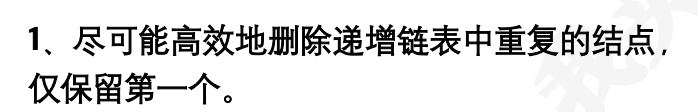

```c
void removeDuplicates(List* list) {
    if (!list->head || !list->head->next) return;

    Node* curr = list->head->next;
    while (curr && curr->next) {
        if (curr->value == curr->next->value) {
            Node* tmp = curr->next;
            curr->next = tmp->next;
            free(tmp);
        } else {
            curr = curr->next;
        }
    }
}
```

测试

```c
#include <stdio.h>
#include <stdlib.h>

typedef struct _node {
    int value;
    struct _node *next;
} Node;

typedef struct _list {
    Node *head;
} List;

// 辅助函数：创建新节点
Node* createNode(int val) {
    Node* n = (Node*)malloc(sizeof(Node));
    n->value = val;
    n->next = NULL;
    return n;
}

// 辅助函数：初始化链表
List* initList() {
    List* l = (List*)malloc(sizeof(List));
    l->head = NULL;
    return l;
}

// 辅助函数：尾插法添加节点
void append(List* l, int val) {
    Node* n = createNode(val);
    if (!l->head) {
        l->head = n;
        return;
    }
    Node* t = l->head;
    while (t->next) t = t->next;
    t->next = n;
}

// 辅助函数：打印链表
void printList(List* l) {
    Node* t = l->head;
    while (t) {
        printf("%d ", t->value);
        t = t->next;
    }
    printf("\n");
}

// 主函数测试
int main() {
    List* list = initList();

    // 构造一个递增含重复值的链表：1 -> 2 -> 2 -> 3 -> 4 -> 4 -> 5
    append(list, 1);
    append(list, 2);
    append(list, 2);
    append(list, 3);
    append(list, 4);
    append(list, 4);
    append(list, 5);

    printf("Before: ");
    printList(list);

    removeDuplicates(list);  // 删除重复项

    printf("After: ");
    printList(list);

    return 0;
}
```


## +链表强化2

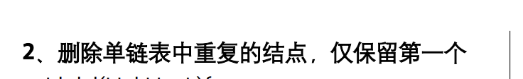

```c
// 删除链表中重复的结点（保留第一个出现的）
void removeDuplicates(List* A) {
    if (!A || !A->head || !A->head->next)
        return;

    Node* cur = list->head->next; // 当前比较的基准节点

    while (cur) {
        Node* p = cur;
        while (p->next) {
            if (p->next->value == cur->value) {
                Node* r = p->next;
                p->next = r->next;
                free(r);
            } else {
                p = p->next;
            }
        }
        cur = cur->next;
    }
}
```

测试

```c
#include <stdio.h>
#include <stdlib.h>

typedef struct _node {
    int value;
    struct _node *next;
} Node;

typedef struct _list {
    Node *head; // 带头结点
} List;

// 创建新节点
Node* createNode(int value) {
    Node* newNode = (Node*)malloc(sizeof(Node));
    newNode->value = value;
    newNode->next = NULL;
    return newNode;
}

// 初始化带头结点的链表
void initList(List* list) {
    list->head = (Node*)malloc(sizeof(Node)); // 分配头结点
    list->head->value = -1;                   // 头结点值无意义
    list->head->next = NULL;
}

// 删除链表中重复的结点（保留第一个出现的）
void removeDuplicates(List* list) {
    if (!list || !list->head || !list->head->next)
        return;

    Node* current = list->head->next; // 当前比较的基准节点

    while (current) {
        Node* runner = current;
        while (runner->next) {
            if (runner->next->value == current->value) {
                Node* delNode = runner->next;
                runner->next = delNode->next;
                free(delNode);
            } else {
                runner = runner->next;
            }
        }
        current = current->next;
    }
}

// 打印链表
void printList(List* list) {
    Node* current = list->head->next;
    while (current) {
        printf("%d ", current->value);
        current = current->next;
    }
    printf("\n");
}

// 释放链表内存
void freeList(List* list) {
    Node* current = list->head;
    while (current) {
        Node* next = current->next;
        free(current);
        current = next;
    }
    list->head = NULL;
}

int main() {
    List list;
    initList(&list);

    // 构造链表：带头结点 -> 1 -> 2 -> 3 -> 2 -> 4 -> 3 -> 5 -> NULL
    Node* tail = list.head;
    for (int i = 0; i < 8; ++i) {
        Node* newNode = createNode((int[]){1, 2, 3, 2, 4, 3, 5, 1}[i]);
        tail->next = newNode;
        tail = newNode;
    }

    printf("原始链表: ");
    printList(&list);

    removeDuplicates(&list);

    printf("去重后的链表: ");
    printList(&list);

    freeList(&list); // 释放内存
    return 0;
}
//原始链表: 1 2 3 2 4 3 5 1 
//去重后的链表: 1 2 3 4 5 
```


## 链表强化3-

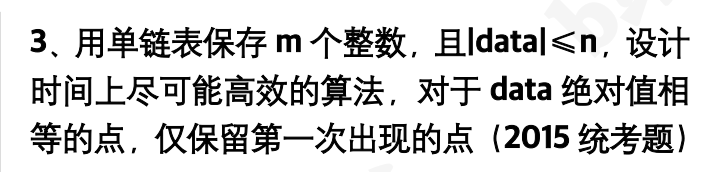

```c
void removeDuplicates(List* list) {
    int visited[10000] = {0}; // 哈希表，记录绝对值是否已出现
    Node* prev = list->head;
    Node* curr = prev->next;

    while (curr != NULL) {
        int absVal = abs(curr->value);
        if (visited[absVal]) {
            // 删除当前节点
            prev->next = curr->next;
            free(curr);
            curr = prev->next;
        } else {
            // 标记该绝对值已出现
            visited[absVal] = 1;
            prev = curr;
            curr = curr->next;
        }
    }
}
```

测试

```c
#include <stdio.h>
#include <stdlib.h>
#include <math.h>

typedef struct _node {
    int value;
    struct _node *next;
} Node;

typedef struct _list {
    Node *head; // 头结点
} List;

void removeDuplicates(List* list) {
    int visited[10000] = {0}; // 哈希表，记录绝对值是否已出现
    Node* prev = list->head;
    Node* curr = prev->next;

    while (curr != NULL) {
        int absVal = abs(curr->value);
        if (visited[absVal]) {
            // 删除当前节点
            prev->next = curr->next;
            free(curr);
            curr = prev->next;
        } else {
            // 标记该绝对值已出现
            visited[absVal] = 1;
            prev = curr;
            curr = curr->next;
        }
    }
}

// 创建新节点
Node* createNode(int val) {
    Node* node = (Node*)malloc(sizeof(Node));
    node->value = val;
    node->next = NULL;
    return node;
}

// 初始化带头结点的链表
List* initList() {
    List* list = (List*)malloc(sizeof(List));
    list->head = createNode(0); // 头结点
    return list;
}

// 尾插法插入元素
void insertTail(List* list, int val) {
    Node* node = createNode(val);
    Node* p = list->head;
    while (p->next != NULL)
        p = p->next;
    p->next = node;
}

// 打印链表
void printList(List* list) {
    Node* p = list->head->next;
    while (p != NULL) {
        printf("%d ", p->value);
        p = p->next;
    }
    printf("\n");
}

// removeDuplicates 函数定义在上面

int main() {
    List* list = initList();
    int data[] = {5, -5, 3, 4, -3};
    for (int i = 0; i < 5; i++) {
        insertTail(list, data[i]);
    }

    printf("原始链表: ");
    printList(list);

    removeDuplicates(list);

    printf("去重后链表: ");
    printList(list);

    return 0;
}
```


## 链表强化4

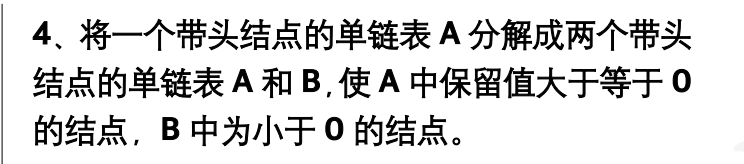

```c
List* split(List* listA) {
    List* listB = (List*)malloc(sizeof(List));
    listB->head = (Node*)malloc(sizeof(Node)); // B的头结点
    listB->head->next = NULL;

    Node *prev = listA->head;
    Node *curr = prev->next;
    Node *bTail = listB->head; // B链表的尾指针

    while (curr != NULL) {
        if (curr->value < 0) {
            // 从A中删除该节点
            prev->next = curr->next;

            // 插入到B的尾部
            bTail->next = curr;
            bTail = curr;
        } else {
            prev = curr;
        }
        curr = curr->next;
    }

    bTail->next = NULL; // 结束B链表
    return listB;
}
```

测试

```c
#include <stdio.h>
#include <stdlib.h>

typedef struct _node {
    int value;
    struct _node *next;
} Node;

typedef struct _list {
    Node *head;
} List;

// 创建新节点
Node* createNode(int value) {
    Node* node = (Node*)malloc(sizeof(Node));
    node->value = value;
    node->next = NULL;
    return node;
}

// 初始化带头结点的链表
List* initList() {
    List* list = (List*)malloc(sizeof(List));
    list->head = (Node*)malloc(sizeof(Node));
    list->head->next = NULL;
    return list;
}

// 尾插法添加元素
void append(List* list, int value) {
    Node* newNode = createNode(value);
    Node* p = list->head;
    while (p->next != NULL)
        p = p->next;
    p->next = newNode;
}

// 打印链表
void printList(List* list) {
    Node* p = list->head->next;
    while (p != NULL) {
        printf("%d ", p->value);
        p = p->next;
    }
    printf("\n");
}

List* split(List* listA) {
    List* listB = (List*)malloc(sizeof(List));
    listB->head = (Node*)malloc(sizeof(Node)); // B的头结点
    listB->head->next = NULL;

    Node *prev = listA->head;
    Node *curr = prev->next;
    Node *bTail = listB->head; // B链表的尾指针

    while (curr != NULL) {
        if (curr->value < 0) {
            // 从A中删除该节点
            prev->next = curr->next;

            // 插入到B的尾部
            bTail->next = curr;
            bTail = curr;
        } else {
            prev = curr;
        }
        curr = curr->next;
    }

    bTail->next = NULL; // 结束B链表
    return listB;
}

// 分割函数定义在上方

int main() {
    List* listA = initList();
    append(listA, 3);
    append(listA, -1);
    append(listA, 5);
    append(listA, -7);
    append(listA, 0);
    append(listA, -2);

    printf("原始链表A: ");
    printList(listA);

    List* listB = split(listA);

    printf("分割后链表A (>= 0): ");
    printList(listA);

    printf("分割后链表B (< 0): ");
    printList(listB);

    return 0;
}
```


## 链表强化5

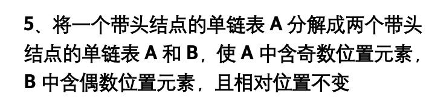

```c
List* splitOddEven(List* listA) {
    List* listB = (List*)malloc(sizeof(List));
    listB->head = (Node*)malloc(sizeof(Node)); // B的头结点
    listB->head->next = NULL;

    Node *aTail = listA->head;
    Node *bTail = listB->head;

    Node *curr = listA->head->next;
    int index = 1; // 用于记录当前节点的位置

    while (curr != NULL) {
        Node *next = curr->next; // 先保存下一个节点

        if (index % 2 == 1) { // 奇数位置
            aTail->next = curr;
            aTail = curr;
        } else { // 偶数位置
            bTail->next = curr;
            bTail = curr;
        }

        curr->next = NULL; // 断开与后续节点的连接
        curr = next;
        index++;
    }

    return listB;
}
```

测试

```c
#include <stdio.h>
#include <stdlib.h>

typedef struct _node {
    int value;
    struct _node *next;
} Node;

typedef struct _list {
    Node *head;
} List;

// 创建新节点
Node* createNode(int value) {
    Node* newNode = (Node*)malloc(sizeof(Node));
    newNode->value = value;
    newNode->next = NULL;
    return newNode;
}

// 初始化带头结点的链表
List* initList() {
    List* list = (List*)malloc(sizeof(List));
    list->head = (Node*)malloc(sizeof(Node));
    list->head->next = NULL;
    return list;
}

// 尾插法添加元素
void append(List* list, int value) {
    Node* newNode = createNode(value);
    Node* p = list->head;
    while (p->next != NULL)
        p = p->next;
    p->next = newNode;
}

// 打印链表
void printList(List* list) {
    Node* p = list->head->next;
    while (p != NULL) {
        printf("%d ", p->value);
        p = p->next;
    }
    printf("\n");
}

List* splitOddEven(List* listA) {
    List* listB = (List*)malloc(sizeof(List));
    listB->head = (Node*)malloc(sizeof(Node)); // B的头结点
    listB->head->next = NULL;

    Node *aTail = listA->head;
    Node *bTail = listB->head;

    Node *curr = listA->head->next;
    int index = 1; // 用于记录当前节点的位置

    while (curr != NULL) {
        Node *next = curr->next; // 先保存下一个节点

        if (index % 2 == 1) { // 奇数位置
            aTail->next = curr;
            aTail = curr;
        } else { // 偶数位置
            bTail->next = curr;
            bTail = curr;
        }

        curr->next = NULL; // 断开与后续节点的连接
        curr = next;
        index++;
    }

    return listB;
}

// 分割函数定义在上方

int main() {
    List* listA = initList();
    append(listA, 1);
    append(listA, 2);
    append(listA, 3);
    append(listA, 4);
    append(listA, 5);

    printf("原始链表A: ");
    printList(listA);

    List* listB = splitOddEven(listA);

    printf("分割后链表A (奇数位置): ");
    printList(listA);

    printf("分割后链表B (偶数位置): ");
    printList(listB);

    return 0;
}
//
原始链表A: 1 2 3 4 5 
分割后链表A (奇数位置): 1 3 5 
分割后链表B (偶数位置): 2 4 
```

- **时间复杂度**：O(n)，其中 n 是链表中的节点数。每个节点都会被访问一次。
- **空间复杂度**：O(1)，除了存储结果所需的额外空间外，没有使用额外的空间


## 链表强化6

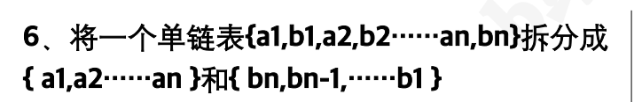

```c
Node* split(List* L) {
    Node *p = L->head->next;
    Node *hA = (Node*)malloc(sizeof(Node)), *tA = hA;
    Node *hB = (Node*)malloc(sizeof(Node));
    hB->next = NULL;

    int i = 1;

    while (p) {
        Node *n = p;
        p = p->next;
        n->next = NULL;

        if (i % 2 == 1) {
            tA->next = n;
            tA = n;
        } else {
            n->next = hB->next;
            hB->next = n;
        }

        i++;
    }

    free(L->head);
    L->head = hA;

    return hB;
}
```

测试

```c
#include <stdio.h>
#include <stdlib.h>

typedef struct _node {
    int value;
    struct _node *next;
} Node;

typedef struct _list {
    Node *head;
} List;

// 创建新节点
Node* mk(int v) {
    Node* n = (Node*)malloc(sizeof(Node));
    n->value = v;
    n->next = NULL;
    return n;
}

// 打印链表
void pr(Node* h) {
    while (h) {
        printf("%d -> ", h->value);
        h = h->next;
    }
    printf("NULL\n");
}

// 拆分函数
Node* split(List* L);

int main() {
    // 构造原始链表: H -> 1 -> 2 -> 3 -> 4 -> 5 -> 6
    List L;
    L.head = mk(0); // 头结点
    L.head->next = mk(1);
    L.head->next->next = mk(2);
    L.head->next->next->next = mk(3);
    L.head->next->next->next->next = mk(4);
    L.head->next->next->next->next->next = mk(5);
    L.head->next->next->next->next->next->next = mk(6);

    printf("原始链表: ");
    pr(L.head);

    Node* hb = split(&L);

    printf("拆分后的 A 链表: ");
    pr(L.head);

    printf("拆分后的 B 链表: ");
    pr(hb);

    return 0;
}

Node* split(List* L) {
    Node *p = L->head->next;
    Node *hA = (Node*)malloc(sizeof(Node)), *tA = hA;
    Node *hB = (Node*)malloc(sizeof(Node));
    hB->next = NULL;

    int i = 1;

    while (p) {
        Node *n = p;
        p = p->next;
        n->next = NULL;

        if (i % 2 == 1) {
            tA->next = n;
            tA = n;
        } else {
            n->next = hB->next;
            hB->next = n;
        }

        i++;
    }

    free(L->head);
    L->head = hA;

    return hB;
}
```

- **时间复杂度**：O(n)，其中 n 是节点总数。每个节点最多访问一次。
- **空间复杂度**：O(1)，除了输入和输出外，额外空间复杂度为常数级。

## 链表强化7-

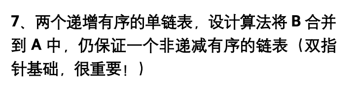

```c
void merge(List* A, List* B) {
    Node *pa = A->head->next;
    Node *pb = B->head->next;
    Node *prev = A->head;

    while (pa && pb) {
        if (pa->value <= pb->value) {
            prev->next = pa;
            prev = pa;
            pa = pa->next;
        } else {
            prev->next = pb;
            prev = pb;
            pb = pb->next;
        }
    }

    // 处理剩余部分
    prev->next = pa ? pa : pb;
}
```

测试

```c
#include <stdio.h>
#include <stdlib.h>

typedef struct _node {
    int value;
    struct _node *next;
} Node;

typedef struct _list {
    Node *head;
} List;

// 创建新节点
Node* mk(int v) {
    Node* n = (Node*)malloc(sizeof(Node));
    n->value = v;
    n->next = NULL;
    return n;
}

// 初始化带头结点的链表
List* init(int arr[], int n) {
    List* L = (List*)malloc(sizeof(List));
    L->head = mk(0); // 头结点
    Node* tail = L->head;

    for (int i = 0; i < n; ++i) {
        tail->next = mk(arr[i]);
        tail = tail->next;
    }

    return L;
}

// 打印链表
void pr(List* L) {
    Node* p = L->head->next;
    while (p) {
        printf("%d -> ", p->value);
        p = p->next;
    }
    printf("NULL\n");
}

// 合并函数
void merge(List* A, List* B);

int main() {
    int a1[] = {1, 3, 5};
    int a2[] = {2, 4, 6};

    List* A = init(a1, 3);
    List* B = init(a2, 3);

    printf("链表 A: ");
    pr(A);

    printf("链表 B: ");
    pr(B);

    merge(A, B);

    printf("合并后 A: ");
    pr(A);

    return 0;
}

void merge(List* A, List* B) {
    Node *pa = A->head->next;
    Node *pb = B->head->next;
    Node *prev = A->head;

    while (pa && pb) {
        if (pa->value <= pb->value) {
            prev->next = pa;
            prev = pa;
            pa = pa->next;
        } else {
            prev->next = pb;
            prev = pb;
            pb = pb->next;
        }
    }

    // 处理剩余部分
    prev->next = pa ? pa : pb;
}
```


## 链表强化8

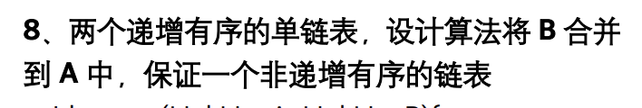

```c
void mergeDescending(List *A, List *B) {
    Node *pa = A->head->next;
    Node *pb = B->head->next;
    Node dummy;
    Node *tail = &dummy;
    dummy.next = NULL;

    // 合并升序链表，尾插
    while (pa && pb) {
        if (pa->value < pb->value) {
            tail->next = pa;
            pa = pa->next;
        } else {
            tail->next = pb;
            pb = pb->next;
        }
        tail = tail->next;
    }
    tail->next = (pa) ? pa : pb;

    // 反转合并后的链表，得到降序链表,头插
    Node *prev = NULL;
    Node *curr = dummy.next;
    while (curr) {
        Node *next = curr->next;
        curr->next = prev;
        prev = curr;
        curr = next;
    }

    A->head->next = prev;
}
```

测试

```c
#include <stdio.h>
#include <stdlib.h>

typedef struct _node {
    int value;
    struct _node *next;
} Node;

typedef struct _list {
    Node *head;
} List;

// 单函数实现：合并两个递增链表并将结果降序挂回A
void mergeDescending(List *A, List *B) {
    Node *pa = A->head->next;
    Node *pb = B->head->next;
    Node dummy;
    Node *tail = &dummy;
    dummy.next = NULL;

    // 合并升序链表
    while (pa && pb) {
        if (pa->value < pb->value) {
            tail->next = pa;
            pa = pa->next;
        } else {
            tail->next = pb;
            pb = pb->next;
        }
        tail = tail->next;
    }
    tail->next = (pa) ? pa : pb;

    // 反转合并后的链表，得到降序链表
    Node *prev = NULL;
    Node *curr = dummy.next;
    while (curr) {
        Node *next = curr->next;
        curr->next = prev;
        prev = curr;
        curr = next;
    }

    A->head->next = prev;
}

// 创建带头结点的空链表
List* createListWithHead() {
    List *list = (List*)malloc(sizeof(List));
    list->head = (Node*)malloc(sizeof(Node));
    list->head->next = NULL;
    return list;
}

// 尾插法插入数据，保证递增
void appendNode(List *list, int val) {
    Node *p = list->head;
    while (p->next) p = p->next;
    Node *node = (Node*)malloc(sizeof(Node));
    node->value = val;
    node->next = NULL;
    p->next = node;
}

// 打印链表（跳过头结点）
void printList(List *list) {
    Node *p = list->head->next;
    while (p) {
        printf("%d ", p->value);
        p = p->next;
    }
    printf("\n");
}

// 释放链表内存（包括头结点）
void freeList(List *list) {
    Node *p = list->head;
    while (p) {
        Node *next = p->next;
        free(p);
        p = next;
    }
    free(list);
}

int main() {
    List *A = createListWithHead();
    List *B = createListWithHead();

    // 插入递增数据
    appendNode(A, 1);
    appendNode(A, 3);
    appendNode(A, 5);

    appendNode(B, 2);
    appendNode(B, 4);
    appendNode(B, 6);

    printf("链表 A (升序): ");
    printList(A);
    printf("链表 B (升序): ");
    printList(B);

    // 合并并降序
    mergeDescending(A, B);

    printf("合并后 A (降序): ");
    printList(A);

    freeList(A);
    freeList(B);

    return 0;
}

```


## 链表强化9

从两个递增有序的单链表A和B中找出公共元素，并生成一个新的单链表C，同时要求在操作过程中不破坏原链表A和B的结点。

```c
List func(List A, List B){
	List C;
	C.head = (Node*)malloc(sizeof(Node));
	Node *rc = C.head;
	Node *ra = A.head->next;
	Node *rb = B.head->next;
	while(ra != NULL && rb != NULL){
		if(ra->value == rb->value){
			Node *p = (Node*)malloc(sizeof(Node));
			p->value = ra->value;
			p->next = NULL;
			rc->next = p;
			rc = p;
			ra = ra->next;
			rb = rb->next;
		} else if(ra->value > rb->value){
			rb = rb->next;

		} else {
			ra = ra->next;
		}
	}
	return C;
}
```


## 链表强化10

 A、B两个单链表递增有序，从A、B找出公共元素存放在A链表中。要利用A链表的原有节点空间。

```c
void func(List *A, List *B){
	if (A == NULL || A->head == NULL) return;
	Node *ra = A->head, *rb = B->head->next;
	while(ra->next != NULL && rb != NULL){
		if(ra->next->value == rb->value){
			ra = ra->next;
		} else if(ra->next->value < rb->value){
			Node *tmp = ra->next;
			ra->next = tmp->next;
			free(tmp);
		} else {
			rb = rb->next;
		}
	}
	while(ra->next != NULL){
		Node* tmp = ra->next;
		ra->next = tmp->next;
		free(tmp);
	}
}
```


## +链表强化11

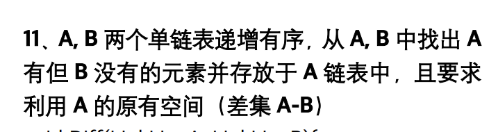

```c
void listDiff(List *A, List *B) {
    Node *p = A->head;
    Node *q = B->head->next;

    while (p->next != NULL && q != NULL) {
        if (p->next->value < q->value) {
            p = p->next;
        } else if (p->next->value > q->value) {
            q = q->next;
        } else {
            // 相等，A 中的值在 B 中也有，删除 A 中该节点
            Node *temp = p->next;
            p->next = temp->next;
            free(temp);
            q = q->next;
        }
    }
}
```

测试

```c
#include <stdio.h>
#include <stdlib.h>

// 节点结构体
typedef struct _node {
    int value;
    struct _node *next;
} Node;

// 链表结构体
typedef struct _list {
    Node *head;
} List;
void listDiff(List *A, List *B) {
    Node *p = A->head;
    Node *q = B->head->next;

    while (p->next != NULL && q != NULL) {
        if (p->next->value < q->value) {
            p = p->next;
        } else if (p->next->value > q->value) {
            q = q->next;
        } else {
            // 相等，A 中的值在 B 中也有，删除 A 中该节点
            Node *temp = p->next;
            p->next = temp->next;
            free(temp);
            q = q->next;
        }
    }
}


// 向链表尾部递增插入
void insertInc(List *lst, int val) {
    Node *p = lst->head;
    while (p->next && p->next->value < val)
        p = p->next;
    Node *node = (Node *)malloc(sizeof(Node));
    node->value = val;
    node->next = p->next;
    p->next = node;
}

// 打印链表
void printList(List *lst) {
    Node *p = lst->head->next;
    while (p) {
        printf("%d ", p->value);
        p = p->next;
    }
    printf("\n");
}


// 主函数测试
int main() {
    List A, B;
    A.head = (Node *)malloc(sizeof(Node));
    B.head = (Node *)malloc(sizeof(Node));
    A.head->next = NULL;
    B.head->next = NULL;

    // 示例数据：A = {10, 30, 50, 70, 90}, B = {30, 70}
    int a[] = {10, 30, 50, 70, 90};
    int b[] = {30, 70};

    for (int i = 0; i < 5; i++) insertInc(&A, a[i]);
    for (int i = 0; i < 2; i++) insertInc(&B, b[i]);

    printf("原始 A：");
    printList(&A);
    printf("原始 B：");
    printList(&B);

    listDiff(&A, &B);

    printf("差集 A - B：");
    printList(&A);

    return 0;
}

```

## 链表强化12

12、A，B两个单链表递增有序，从A，B中找出所有元素后再去重并存放于A链表中，且要求利用A和B的原有空间（并集） typedef struct _node{ int value; struct _node *next; }Node; typedef struct _list{ Node *head; }List;

```c
void listUnion(List *A, List *B) {
    Node *pa = A->head;
    Node *p = A->head->next;
    Node *q = B->head->next;
    A->head->next = NULL;  // 清空 A 中原数据（重新插入）

    while (p && q) {
        if (p->value < q->value) {
            pa->next = p;
            pa = p;
            p = p->next;
            pa->next = NULL;
        } else if (p->value > q->value) {
            pa->next = q;
            pa = q;
            q = q->next;
            pa->next = NULL;
        } else {
            pa->next = p;
            pa = p;
            p = p->next;
            Node *temp = q;
            q = q->next;
            free(temp);
            pa->next = NULL;
        }
    }

    while (p) {
        pa->next = p;
        pa = p;
        p = p->next;
        pa->next = NULL;
    }

    while (q) {
        pa->next = q;
        pa = q;
        q = q->next;
        pa->next = NULL;
    }

    B->head->next = NULL; // B 清空
}

```

测试

```c
#include <stdio.h>
#include <stdlib.h>

// 数据结构略（已在上方）
typedef struct _node {
    int value;
    struct _node *next;
} Node;

typedef struct _list {
    Node *head;
} List;

void listUnion(List *A, List *B) {
    Node *pa = A->head;
    Node *p = A->head->next;
    Node *q = B->head->next;
    A->head->next = NULL;  // 清空 A 中原数据（重新插入）

    while (p && q) {
        if (p->value < q->value) {
            pa->next = p;
            pa = p;
            p = p->next;
            pa->next = NULL;
        } else if (p->value > q->value) {
            pa->next = q;
            pa = q;
            q = q->next;
            pa->next = NULL;
        } else {
            pa->next = p;
            pa = p;
            p = p->next;
            Node *temp = q;
            q = q->next;
            free(temp);
            pa->next = NULL;
        }
    }

    while (p) {
        pa->next = p;
        pa = p;
        p = p->next;
        pa->next = NULL;
    }

    while (q) {
        pa->next = q;
        pa = q;
        q = q->next;
        pa->next = NULL;
    }

    B->head->next = NULL; // B 清空
}


void insertInc(List *lst, int val) {
    Node *p = lst->head;
    while (p->next && p->next->value < val)
        p = p->next;
    Node *node = (Node *)malloc(sizeof(Node));
    node->value = val;
    node->next = p->next;
    p->next = node;
}

void printList(List *lst) {
    Node *p = lst->head->next;
    while (p) {
        printf("%d ", p->value);
        p = p->next;
    }
    printf("\n");
}

int main() {
    List A, B;
    A.head = (Node *)malloc(sizeof(Node));
    B.head = (Node *)malloc(sizeof(Node));
    A.head->next = NULL;
    B.head->next = NULL;

    int a[] = {10, 30, 50, 70};
    int b[] = {20, 30, 60, 70, 80};

    for (int i = 0; i < 4; i++) insertInc(&A, a[i]);
    for (int i = 0; i < 5; i++) insertInc(&B, b[i]);

    printf("原始 A：");
    printList(&A);
    printf("原始 B：");
    printList(&B);

    listUnion(&A, &B);

    printf("合并去重后的 A ∪ B：");
    printList(&A);

    return 0;
}
//
原始 A：10 30 50 70 
原始 B：20 30 60 70 80 
合并去重后的 A ∪ B：10 20 30 50 60 70 80 
```

## +链表强化13

**假定采用带头节点的单链表保存单词，当两个单词有相同的后缀时，可共享相同的后缀存储空间。设 str1 和 str2 分别指向两个单词所在链表的头结点，请设计一个时间上尽可能高效的算法，找出这两个链表的共同后缀的起始位置**

```c
Node* func(Node *h1, Node *h2) {
    Node *p1 = h1->next, *p2 = h2->next;
    int len1 = 0, len2 = 0;

    Node *t = p1;
    while (t) { len1++; t = t->next; }
    t = p2;
    while (t) { len2++; t = t->next; }

    int diff = len1 - len2;
    if (diff > 0) while (diff--) p1 = p1->next;
    else while (diff++) p2 = p2->next;

    while (p1 && p2) {
        if (p1 == p2) return p1;
        p1 = p1->next;
        p2 = p2->next;
    }
    return NULL;
}
```

测试

```c
#include <stdio.h>
#include <stdlib.h>

typedef struct _node {
    int value;
    struct _node *next;
} Node;

typedef struct _list {
    Node *head;
} List;

// 查找共同后缀的起始位置
Node* find_suffix(Node *h1, Node *h2) {
    Node *p1 = h1->next, *p2 = h2->next;
    int len1 = 0, len2 = 0;

    Node *t = p1;
    while (t) { len1++; t = t->next; }
    t = p2;
    while (t) { len2++; t = t->next; }

    int diff = len1 - len2;
    if (diff > 0) while (diff--) p1 = p1->next;
    else while (diff++) p2 = p2->next;

    while (p1 && p2) {
        if (p1 == p2) return p1;
        p1 = p1->next;
        p2 = p2->next;
    }
    return NULL;
}

// 创建新节点
Node* new_node(int val) {
    Node* n = (Node*)malloc(sizeof(Node));
    n->value = val;
    n->next = NULL;
    return n;
}

// 打印链表（不含头结点）
void print(Node *head) {
    Node *p = head->next;
    while (p) {
        printf("%d ", p->value);
        p = p->next;
    }
    printf("\n");
}

// 主函数测试
int main() {
    // 公共后缀：5 -> 6 -> 7
    Node *common = new_node(5);
    common->next = new_node(6);
    common->next->next = new_node(7);

    // 单词1：1 -> 2 -> 3 -> 5 -> 6 -> 7
    List str1;
    str1.head = new_node(0); // 头结点
    Node *p1 = new_node(1);
    p1->next = new_node(2);
    p1->next->next = new_node(3);
    p1->next->next->next = common;
    str1.head->next = p1;

    // 单词2：3 -> 4 -> 5 -> 6 -> 7
    List str2;
    str2.head = new_node(0); // 头结点
    Node *p2 = new_node(3);
    p2->next = new_node(4);
    p2->next->next = common;
    str2.head->next = p2;

    printf("str1: "); print(str1.head);
    printf("str2: "); print(str2.head);

    Node *suffix = find_suffix(str1.head, str2.head);
    if (suffix) {
        printf("共同后缀起始值: %d\n", suffix->value);
    } else {
        printf("无共同后缀\n");
    }

    return 0;
}

```

## 链表强化14

**查找单链表中倒数第 k 个结点，若查找成功，则输出该结点的 data，并返回 1，否则返回 0（2009 年统考题）**

```c
int func(List L, int k) {
    Node *p = L.head;
    Node *q = L.head;
    int i = 0;

    while (q != NULL) {
        q = q->next;
        i++;
        if (i > k) {
            p = p->next;
        }
    }

    if (p == L.head && k > i || k <= 0)
        return 0;
    else {
        printf("%d\n", p->value);
        return 1;
    }
}
```

测试

```c
#include <stdio.h>
#include <stdlib.h>

typedef struct _node {
    int value;
    struct _node *next;
} Node;

typedef struct _list {
    Node *head;
} List;

int findKthFromEnd(List L, int k);  // 前置声明

// 辅助函数：创建新节点
Node* createNode(int val) {
    Node* newNode = (Node*)malloc(sizeof(Node));
    newNode->value = val;
    newNode->next = NULL;
    return newNode;
}

// 构建链表示例并测试
int main() {
    List L;
    L.head = createNode(10);
    L.head->next = createNode(20);
    L.head->next->next = createNode(30);
    L.head->next->next->next = createNode(40);
    L.head->next->next->next->next = createNode(50);

    int k = 2;
    int found = findKthFromEnd(L, k);
    if (!found)
        printf("查找失败\n");

    return 0;
}

int findKthFromEnd(List L, int k) {
    Node *p = L.head;
    Node *q = L.head;
    int i = 0;

    while (q != NULL) {
        q = q->next;
        i++;
        if (i > k) {
            p = p->next;
        }
    }

    if (p == L.head && k > i || k <= 0)
        return 0;
    else {
        printf("%d\n", p->value);
        return 1;
    }
}


```

**时间复杂度**：O(N)，只遍历一次链表

**空间复杂度**：O(1)，只使用了两个指针

## 链表强化15

**给定一个单链表 L(a₁, a₂, a₃,..., aₙ)，将其重新排列为 (a₁, aₙ, a₂, aₙ₋₁,...)（2019 统考题）**

```c
void reorderList(List *L) {
    if (L == NULL || L->head == NULL || L->head->next == NULL)
        return;

    Node *slow = L->head;
    Node *fast = L->head;

    // 1. 使用快慢指针找中点
    while (fast->next != NULL && fast->next->next != NULL) {
        slow = slow->next;
        fast = fast->next->next;
    }

    // 2. 将后半段链表逆置
    Node *p = slow->next;
    slow->next = NULL;  // 断开前后两段
    Node *prev = NULL, *next;

    while (p != NULL) {
        next = p->next;
        p->next = prev;
        prev = p;
        p = next;
    }

    // 3. 交叉合并两段链表
    Node *first = L->head;
    Node *second = prev;  // 逆置后的链表头

    while (second != NULL) {
        Node *tmp1 = first->next;
        Node *tmp2 = second->next;

        first->next = second;
        second->next = tmp1;

        first = tmp1;
        second = tmp2;
    }
}
```

测试

```c
#include <stdio.h>
#include <stdlib.h>

typedef struct _node {
    int value;
    struct _node *next;
} Node;

typedef struct _list {
    Node *head;
} List;

void reorderList(List *L);

// 创建节点
Node* createNode(int val) {
    Node *n = (Node*)malloc(sizeof(Node));
    n->value = val;
    n->next = NULL;
    return n;
}

// 打印链表
void printList(List L) {
    Node *p = L.head;
    while (p != NULL) {
        printf("%d ", p->value);
        p = p->next;
    }
    printf("\n");
}

int main() {
    List L;
    L.head = createNode(1);
    L.head->next = createNode(2);
    L.head->next->next = createNode(3);
    L.head->next->next->next = createNode(4);
    L.head->next->next->next->next = createNode(5);
    // 可再增加更多节点测试

    printf("原链表: ");
    printList(L);

    reorderList(&L);

    printf("重排后: ");
    printList(L);

    return 0;
}

void reorderList(List *L) {
    if (L == NULL || L->head == NULL || L->head->next == NULL)
        return;

    Node *slow = L->head;
    Node *fast = L->head;

    // 1. 使用快慢指针找中点
    while (fast->next != NULL && fast->next->next != NULL) {
        slow = slow->next;
        fast = fast->next->next;
    }

    // 2. 将后半段链表逆置
    Node *p = slow->next;
    slow->next = NULL;  // 断开前后两段
    Node *prev = NULL, *next;

    while (p != NULL) {
        next = p->next;
        p->next = prev;
        prev = p;
        p = next;
    }

    // 3. 交叉合并两段链表
    Node *first = L->head;
    Node *second = prev;  // 逆置后的链表头

    while (second != NULL) {
        Node *tmp1 = first->next;
        Node *tmp2 = second->next;

        first->next = second;
        second->next = tmp1;

        first = tmp1;
        second = tmp2;
    }
}

```

**时间复杂度**：O(N)

**空间复杂度**：O(1)（就地操作

## 链表强化16

从单链表 A 中删除自第 i 个元素起的 len 个元素，然后将其插入到单链表 B 的第 j 个元素之前。

```c
void foo(List *A, List *B, int i, int len, int j) {
    Node *p = A->head;
    Node *q = B->head;

    // 定位到 A 的第 i-1 个节点
    while (p != NULL && --i > 0)
        p = p->next;

    if (p == NULL || p->next == NULL) return;

    // 删除 A 中 len 个节点，起始于 p->next
    while (p != NULL && len-- > 0 && p->next != NULL) {
        Node *r = p->next;
        p->next = r->next;
        free(r);
    }

    // 找到 A 的最后一个节点
    while (p->next != NULL)
        p = p->next;

    // 定位到 B 的第 j-1 个节点
    while (q != NULL && --j > 0)
        q = q->next;

    if (q == NULL) return;

    // 将 A 的尾部接入到 B 的第 j 个元素之前
    p->next = q->next;
    q->next = A->head;
}
```

测试

```c
#include <stdio.h>
#include <stdlib.h>

typedef struct _node {
    int value;
    struct _node *next;
} Node;

typedef struct _list {
    Node *head;
} List;

Node* createNode(int val) {
    Node *n = (Node*)malloc(sizeof(Node));
    n->value = val;
    n->next = NULL;
    return n;
}

void moveSegment(List *A, List *B, int i, int len, int j) {
    Node *p = A->head;
    Node *q = B->head;

    // 定位到 A 的第 i-1 个节点
    while (p != NULL && --i > 0)
        p = p->next;

    if (p == NULL || p->next == NULL) return;

    // 删除 A 中 len 个节点，起始于 p->next
    while (p != NULL && len-- > 0 && p->next != NULL) {
        Node *r = p->next;
        p->next = r->next;
        free(r);
    }

    // 找到 A 的最后一个节点
    while (p->next != NULL)
        p = p->next;

    // 定位到 B 的第 j-1 个节点
    while (q != NULL && --j > 0)
        q = q->next;

    if (q == NULL) return;

    // 将 A 的尾部接入到 B 的第 j 个元素之前
    p->next = q->next;
    q->next = A->head;
}


void append(List *L, int val) {
    Node *n = createNode(val);
    if (!L->head) {
        L->head = n;
    } else {
        Node *p = L->head;
        while (p->next) p = p->next;
        p->next = n;
    }
}

void printList(List *L) {
    Node *p = L->head;
    while (p) {
        printf("%d ", p->value);
        p = p->next;
    }
    printf("\n");
}

int main() {
    List A = {NULL}, B = {NULL};
    for (int i = 1; i <= 6; ++i) append(&A, i);     // A: 1 2 3 4 5 6
    for (int i = 10; i <= 13; ++i) append(&B, i);   // B: 10 11 12 13

    printf("初始 A："); printList(&A);
    printf("初始 B："); printList(&B);

    moveSegment(&A, &B, 3, 2, 2);  // 从 A 中第3个起删除2个，剩下的 A 插入 B 的第2个前

    printf("变更后 A："); printList(&A);
    printf("变更后 B："); printList(&B);

    return 0;
}

```

## 链表强化17

**设有一个正整数序列组成的递增单链表，编写时间尽可能高效的算法实现以下功能：**

1. 将值比 x 小的结点按照递减进行排序。
2. 将值比 x 大的偶数结点全部删除。

```c
// 实现目标功能：逆置<x、删除>x的偶数
void process(List *L, int x) {
    Node *pre = L->head;
    Node *cur = pre->next;
    Node *rev = NULL; // 保存逆置链表头部（不含头节点）

    while (cur) {
        if (cur->value < x) {
            // 从原链表摘下当前节点
            Node *tmp = cur;
            pre->next = cur->next;
            cur = cur->next;

            // 头插入逆置链表
            tmp->next = rev;
            rev = tmp;
        }
        else if (cur->value > x && cur->value % 2 == 0) {
            // 删除该偶数结点
            Node *tmp = cur;
            pre->next = cur->next;
            cur = cur->next;
            free(tmp);
        } else {
            pre = cur;
            cur = cur->next;
        }
    }

    // 逆置链表插入原链表开头
    Node *tail = L->head;
    while (rev) {
        Node *tmp = rev;
        rev = rev->next;

        tmp->next = tail->next;
        tail->next = tmp;
        tail = tmp;
    }
}
```

测试

```c
#include <stdio.h>
#include <stdlib.h>

typedef struct _node {
    int value;
    struct _node *next;
} Node;

typedef struct _list {
    Node *head;
} List;

// 创建新节点
Node* new_node(int val) {
    Node* p = (Node*)malloc(sizeof(Node));
    p->value = val;
    p->next = NULL;
    return p;
}

// 打印链表（跳过头节点）
void print_list(List *L) {
    Node *p = L->head->next;
    while (p) {
        printf("%d ", p->value);
        p = p->next;
    }
    printf("\n");
}

// 实现目标功能：逆置<x、删除>x的偶数
void process(List *L, int x) {
    Node *pre = L->head;
    Node *cur = pre->next;
    Node *rev = NULL; // 保存逆置链表头部（不含头节点）

    while (cur) {
        if (cur->value < x) {
            // 从原链表摘下当前节点
            Node *tmp = cur;
            pre->next = cur->next;
            cur = cur->next;

            // 头插入逆置链表
            tmp->next = rev;
            rev = tmp;
        }
        else if (cur->value > x && cur->value % 2 == 0) {
            // 删除该偶数结点
            Node *tmp = cur;
            pre->next = cur->next;
            cur = cur->next;
            free(tmp);
        } else {
            pre = cur;
            cur = cur->next;
        }
    }

    // 逆置链表插入原链表开头
    Node *tail = L->head;
    while (rev) {
        Node *tmp = rev;
        rev = rev->next;

        tmp->next = tail->next;
        tail->next = tmp;
        tail = tmp;
    }
}

int main() {
    List L;
    L.head = new_node(0); // 头节点

    // 构建测试链表：1 -> 3 -> 5 -> 7 -> 8 -> 10 -> 11 -> 13
    int vals[] = {1, 3, 5, 7, 8, 10, 12, 13};
    Node *tail = L.head;
    for (int i = 0; i < 8; ++i) {
        tail->next = new_node(vals[i]);
        tail = tail->next;
    }

    printf("原链表: ");
    print_list(&L);

    int x = 7;
    process(&L, x);

    printf("处理后: ");
    print_list(&L);

    return 0;
}
//原链表: 1 3 5 7 8 10 12 13 
//处理后: 5 3 1 7 13 
```


## 链表强化3


```c
// 删除链表中的重复节点
void del(List* list) {
    // 替换为 node
    if (list->node == NULL) return;
    // 替换为 node
    Node* p = list->node;
    while (p != NULL) {
        Node* r = p;
        while (r->next != NULL) {
            if (r->next->value == p->value) {
                Node* q = r->next;
                r->next = q->next;
                free(q);
            } else {
                r = r->next;
            }
        }
        p = p->next;
    }
}
```


## 链表强化18


```c
#include <stdio.h>
#include <stdlib.h>

// 定义链表节点和链表结构
typedef struct _node {
    int value;
    struct _node *next;
} Node;

typedef struct _list {
    Node *head;
} List;

// 创建空链表
List* createList() {
    List* list = (List*)malloc(sizeof(List));
    list->head = NULL;
    return list;
}

// 头插法构建链表
void headInsert(List* list) {
    int val;
    printf("输入节点值（9999结束）: ");
    scanf("%d", &val);

    while (val != 9999) {
        Node* n = (Node*)malloc(sizeof(Node));
        n->value = val;
        n->next = list->head;
        list->head = n;
        scanf("%d", &val);
    }
}

// 打印链表
void printList(List* list) {
    Node* p = list->head;
    while (p) {
        printf("%d -> ", p->value);
        p = p->next;
    }
    printf("NULL\n");
}

// 示例主函数
int main() {
    List* list = createList();
    headInsert(list);
    printList(list);
    return 0;
}
```

## 链表强化19

**将不带头结点的链表就地逆置**

```c
void reverse(Node **L) {
    Node *q = *L->next;
    *L->next = NULL;
    while (q != NULL) {
        Node *r = q->next;
        q->next = *L;
        *L = q;
        q = r;
    }
}
```

测试

```c
#include <stdio.h>
#include <stdlib.h>

typedef struct _node {
    int value;
    struct _node *next;
} Node;

Node* createNode(int val) {
    Node *n = (Node*)malloc(sizeof(Node));
    n->value = val;
    n->next = NULL;
    return n;
}

void printList(Node *head) {
    while (head) {
        printf("%d ", head->value);
        head = head->next;
    }
    printf("\n");
}

void reverse(Node **L) {
    Node *q = *L;
    *L = NULL;
    while (q != NULL) {
        Node *r = q->next;
        q->next = *L;
        *L = q;
        q = r;
    }
}

int main() {
    Node *head = createNode(1);
    head->next = createNode(2);
    head->next->next = createNode(3);
    head->next->next->next = createNode(4);

    printf("原链表：");
    printList(head);

    reverse(&head);

    printf("逆置后：");
    printList(head);

    return 0;
}

```

原链表：1 2 3 4 
逆置后：4 3 2 1 

## 链表强化20

**试编写在不带头结点的单链表 L 中删除最小值点的高效算法（已知最小值唯一）**

```c
// 删除不带头结点的单链表中最小值节点
void del_min(Node **head) {
    if (*head == NULL || (*head)->next == NULL) return;

    Node *p = *head, *pos = *head;

    // 找到前驱节点 pos，使得 pos->next 是最小值节点
    while (p->next != NULL) {
        if (p->next->value < pos->next->value) {
            pos = p;
        }
        p = p->next;
    }

    // 如果最小值在头结点上
    if (pos->next->value < (*head)->value) {
        Node *r = pos->next;
        pos->next = r->next;
        free(r);
    } else {
        Node *r = *head;
        *head = (*head)->next;
        free(r);
    }
}
```

测试

```c
#include <stdio.h>
#include <stdlib.h>

typedef struct _node {
    int value;
    struct _node *next;
} Node;

// 删除不带头结点的单链表中最小值节点
void del_min(Node **head) {
    if (*head == NULL || (*head)->next == NULL) return;

    Node *p = *head, *pos = *head;

    // 找到前驱节点 pos，使得 pos->next 是最小值节点
    while (p->next != NULL) {
        if (p->next->value < pos->next->value) {
            pos = p;
        }
        p = p->next;
    }

    // 如果最小值在头结点上
    if (pos->next->value < (*head)->value) {
        Node *r = pos->next;
        pos->next = r->next;
        free(r);
    } else {
        Node *r = *head;
        *head = (*head)->next;
        free(r);
    }
}
Node* create(int val) {
    Node* node = (Node*)malloc(sizeof(Node));
    node->value = val;
    node->next = NULL;
    return node;
}

void print(Node* head) {
    while (head) {
        printf("%d ", head->value);
        head = head->next;
    }
    printf("\n");
}

int main() {
    Node *head = create(7);
    head->next = create(3);
    head->next->next = create(5);
    head->next->next->next = create(2);
    head->next->next->next->next = create(9);

    printf("原链表: ");
    print(head);

    del_min(&head);

    printf("删除最小值后: ");
    print(head);

    return 0;
}
//
原链表: 7 3 5 2 9 
删除最小值后: 7 3 5 9 
```


## +链表强化21


```c
typedef struct _node{
	int value;
	struct _node *next;
} Node;
typedef struct _list{
	Node *node;
}List;
```

```c
List merge(List *L1, List *L2) {
    Node *p1 = L1->node;
    Node *p2 = L2->node;
    Node *head = NULL, *tail = NULL;

    // 合并两个有序链表
    while (p1 && p2) {
        Node *min;
        if (p1->value < p2->value) {
            min = p1;
            p1 = p1->next;
        } else {
            min = p2;
            p2 = p2->next;
        }
        min->next = NULL;
        if (!head) {
            head = tail = min;
        } else {
            tail->next = min;
            tail = min;
        }
    }

    // 连接剩余部分
    Node *remain = p1 ? p1 : p2;
    if (!head) {
        head = remain;
    } else {
        tail->next = remain;
    }

    List result;
    result.node = head;
    return result;
}
```


## 链表强化22


```c
typedef struct _node{
	int value;
	struct _node *next;
} Node;
typedef struct _list{
	Node *node;
}List;
```


```c
List merge_desc(List *L1, List *L2) {
    Node *p1 = L1->node;
    Node *p2 = L2->node;
    Node *head = NULL; // 递减链表的头部

    while (p1 && p2) {// 头插
        Node *temp;
        if (p1->value < p2->value) {
            temp = p1;
            p1 = p1->next;
        } else {
            temp = p2;
            p2 = p2->next;
        }
        temp->next = head;
        head = temp;
    }

    // 处理剩余部分
    while (p1) {
        Node *temp = p1;
        p1 = p1->next;
        temp->next = head;
        head = temp;
    }
    while (p2) {
        Node *temp = p2;
        p2 = p2->next;
        temp->next = head;
        head = temp;
    }

    List result;
    result.node = head;
    return result;
}
```

测试

```c
#include <stdio.h>
#include <stdlib.h>

typedef struct _node {
    int value;
    struct _node *next;
} Node;

typedef struct _list {
    Node *node;
} List;

List merge_desc(List *L1, List *L2) {
    Node *p1 = L1->node;
    Node *p2 = L2->node;
    Node *head = NULL; // 递减链表的头部

    while (p1 && p2) {
        Node *temp;
        if (p1->value < p2->value) {
            temp = p1;
            p1 = p1->next;
        } else {
            temp = p2;
            p2 = p2->next;
        }
        temp->next = head;
        head = temp;
    }

    // 处理剩余部分
    while (p1) {
        Node *temp = p1;
        p1 = p1->next;
        temp->next = head;
        head = temp;
    }
    while (p2) {
        Node *temp = p2;
        p2 = p2->next;
        temp->next = head;
        head = temp;
    }

    List result;
    result.node = head;
    return result;
}

Node* create_node(int val) {
    Node *node = (Node *)malloc(sizeof(Node));
    node->value = val;
    node->next = NULL;
    return node;
}

void append(List *list, int val) {
    Node *node = create_node(val);
    if (!list->node) {
        list->node = node;
        return;
    }
    Node *p = list->node;
    while (p->next) p = p->next;
    p->next = node;
}

void print_list(List *list) {
    Node *p = list->node;
    while (p) {
        printf("%d ", p->value);
        p = p->next;
    }
    printf("\n");
}

int main() {
    List L1 = {NULL}, L2 = {NULL};

    append(&L1, 1);
    append(&L1, 3);
    append(&L1, 5);

    append(&L2, 2);
    append(&L2, 4);
    append(&L2, 6);
    append(&L2, 7);

    printf("L1: ");
    print_list(&L1);
    printf("L2: ");
    print_list(&L2);

    List merged = merge_desc(&L1, &L2);
    printf("Merged Descending: ");
    print_list(&merged);

    return 0;
}

```


## +链表强化23

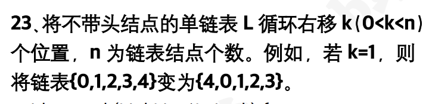

```c
void rotateRight(List* list, int k) {
    if (list == NULL || list->node == NULL || k <= 0) return;

    Node* head = list->node;
    // 计算链表长度
    int len = 0;
    while (head != NULL) {
        len++;
        head = head->next;
    }

    // 如果 k 大于等于 n，则取模处理
    k = k % len;
    if (k == 0) return; // 不需要移动
    head = list->node;

    // 找到新的头节点的位置
    Node* p = head;
    for (int i = 0; i < len - k - 1; i++) {
        p = p->next;
    }

    // 新的头节点
    Node* newHead = p->next;

    // 断开链表
    p->next = NULL;

    // 找到原链表的尾节点
    Node* t = newHead;
    while (t->next != NULL) {
        t = t->next;
    }

    // 将原链表的尾节点连接到原头节点
    t->next = head;

    // 更新链表的头节点
    list->node = newHead;
}
// 时间复杂度：O(n) 空间复杂度：O(1)
```


## 链表强化24

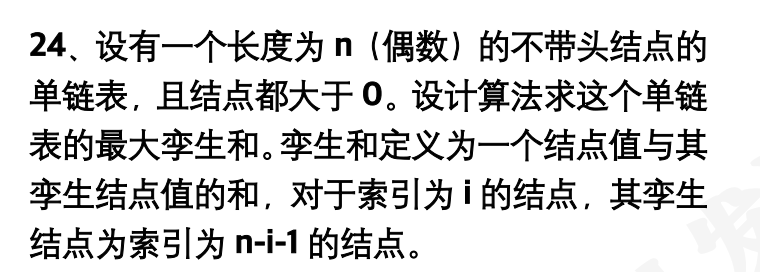

```c
#include <stdlib.h>

typedef struct _node {
    int value;
    struct _node *next;
} Node;

typedef struct _list {
    Node *node;
} List;

// 计算最大孪生和
int maxTwinSum(List* lst) {
    // 首先遍历链表获取长度
    int len = 0;
    Node* cur = lst->node;
    while (cur) {
        len++;
        cur = cur->next;
    }

    // 将链表中的值存储到数组中
    int* vals = (int*)malloc(len * sizeof(int));
    cur = lst->node;
    for (int i = 0; i < len; i++) {
        vals[i] = cur->val;
        cur = cur->next;
    }

    // 计算最大孪生和
    int max = 0;
    for (int i = 0; i < len / 2; i++) {
        int t = vals[i] + vals[len - i - 1];
        if (t > max) {
            max = t;
        }
    }

    free(vals);
    return maxSum;
}
// 时间复杂度：O(n) 空间复杂度：O(n)
```


## 链表强化25

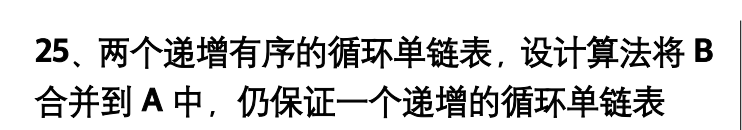

```c
typedef struct _node {
    int value;
    struct _node *next;
} Node;

typedef struct _list {
    Node *head;
} List;

// 合并两个递增有序的循环单链表
void mergeLists(List *A, List *B) {
    if (!A || !A->head || !B || !B->head) return;

    Node *pa = A->head->next;
    Node *pb = B->head->next;

    // 辅助头节点
    Node dummy;
    Node *t = &dummy;

    // 归并两个链表
    while (pa != A->head && pb != B->head) {
        if (pa->value <= pb->value) {
            t->next = pa;
            pa = pa->next;
        } else {
            t->next = pb;
            pb = pb->next;
        }
        t = t->next;
    }

    // 接上剩余部分
    if (pa != A->head) {
        t->next = pa;
        // 找到最后一个节点
        while (pa->next != A->head) {
            pa = pa->next;
        }
        t = pa; // 更新 tail 到最后
    } else {
        t->next = pb;
        // 找到最后一个节点
        while (pb->next != B->head) {
            pb = pb->next;
        }
        t = pb; // 更新 tail 到最后
    }

    // 完成闭环：最后一个节点指向 A 的头结点
    t->next = A->head;

    // 更新 A 的头指针指向新的第一个节点
    A->head->next = dummy.next;

    // 释放 B 的头节点
    free(B->head);
}
// 时间复杂度：O(n + m) 空间复杂度：O(1) 其中，n 是链表 A 的长度，m 是链表 B 的长度。
```

测试

```c
// 创建新节点
Node* createNode(int value) {
    Node *newNode = (Node*)malloc(sizeof(Node));
    newNode->value = value;
    newNode->next = NULL;
    return newNode;
}

// 初始化带头结点的循环单链表
List* createList() {
    List *list = (List*)malloc(sizeof(List));
    list->head = createNode(-1); // 头结点无实际意义
    list->head->next = list->head; // 初始指向自己
    return list;
}

// 向链表尾部添加节点（保持递增）
void addNode(List *list, int value) {
    Node *newNode = createNode(value);
    Node *current = list->head;
    while (current->next != list->head) {
        current = current->next;
    }
    newNode->next = current->next;
    current->next = newNode;
}

// 遍历链表并打印
void traverseList(List *list, const char *name) {
    Node *current = list->head->next;
    printf("List %s: ", name);
    while (current != list->head) {
        printf("%d -> ", current->value);
        current = current->next;
    }
    printf("(back to head)\n");
}

int main() {
    List *A = createList();
    List *B = createList();

    addNode(A, 2);
    addNode(A, 4);
    addNode(A, 6);
    addNode(A, 8);
    addNode(A, 19);


    addNode(B, 1);
    addNode(B, 3);
    addNode(B, 5);
    addNode(B, 7);

    traverseList(A, "A");
    traverseList(B, "B");

    mergeLists(A, B);

    traverseList(A, "Merged A");

    return 0;
}
// List A: 2 -> 4 -> 6 -> 8 -> 19 -> (back to head)
// List B: 1 -> 3 -> 5 -> 7 -> (back to head)
// List Merged A: 1 -> 2 -> 3 -> 4 -> 5 -> 6 -> 7 -> 8 -> 19 -> (back to head)
```


## 链表强化26

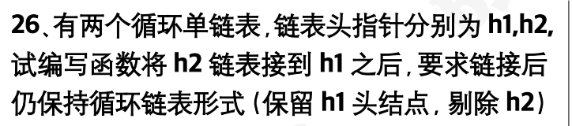

```c
typedef struct _node {
    int value;
    struct _node *next;
} Node;

typedef struct _list {
    Node *head;
} List;

void func(List *h1, List *h2) {
    if (!h1 || !h1->head || !h2 || !h2->head) return;

    // 找到 h1、h2 的尾结点
    Node *t1 = h1->head;
    Node *t2 = h2->head;
    while (t1->next != h1->head) {
        t1 = t1->next;
    }
    while (t2->next != h2->head) {
        t2 = t2->next;
    }

    // 断开 h2 的循环结构,将h1和h2连接
    t2->next = NULL;
    t1->next = h2->head->next;
    t2->next = h1->head;

    // 释放 h2 的头结点
    free(h2->head);
    h2->head = NULL;
}
// 时间复杂度：O(n + m) 空间复杂度：O(1) 其中，n 是链表 h1 的长度，m 是链表 h2 的长度。
```


## 链表强化27

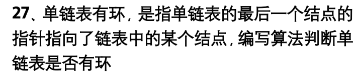

```c
int hasCycle(List *list) {
    if (list == NULL || list->head == NULL)
        return 0; // 空链表或仅有头结点，不可能有环

    Node *slow = list->head->next;  // 慢指针从第一个有效节点开始
    Node *fast = list->head->next;  // 快指针也从第一个有效节点开始

    while (fast != NULL && fast->next != NULL) {
        slow = slow->next;              // 每次走一步
        fast = fast->next->next;        // 每次走两步

        if (slow == fast) {
            return 1; // 相遇了，说明有环
        }
    }

    return 0; // 走到尾部，说明没有环
}
//时间复杂度：O(n)空间复杂度：O(1)
```


## +链表强化28


```c
typedef struct _node {
    int value;
    struct _node *next;
} Node;

typedef struct _list {
    Node *node;  // node 直接指向第一个有效节点，不带头结点
} List;
```

```c
// 约瑟夫环算法实现
int josephus(List* list, int m) {
    if (list == NULL || list->node == NULL) return -1;

    Node* head = list->node;
    Node* cur = head;
    Node* prev = NULL;

    while (cur->next != cur) { // 当链表中不止一个节点时
        // 找到第 m 个节点
        for (int i = 1; i < m; i++) {
            prev = cur;
            cur = cur->next;
        }

        // 删除当前节点
        prev->next = cur->next;
        free(cur);
        cur = prev->next;
    }

    int res = cur->value;
    free(cur); // 释放最后一个节点
    free(list);    // 释放链表结构体
    return res;
}
//时间复杂度：O(n * m) 空间复杂度：O(n)
```

```c
// 创建新节点
Node* createNode(int value) {
    Node* newNode = (Node*)malloc(sizeof(Node));
    newNode->value = value;
    newNode->next = NULL;
    return newNode;
}

// 初始化循环单链表
List* createCircularList(int n) {
    if (n <= 0) return NULL;

    List* list = (List*)malloc(sizeof(List));
    Node* head = createNode(1);
    Node* current = head;

    for (int i = 2; i <= n; i++) {
        Node* newNode = createNode(i);
        current->next = newNode;
        current = newNode;
    }
    current->next = head; // 形成循环链表
    list->node = head;    // node 指向第一个有效节点
    return list;
}

// 测试函数
void testJosephus() {
    int n = 7; // 总人数
    int m = 3; // 每隔几个人出列

    List* list = createCircularList(n);
    int lastPerson = josephus(list, m);

    printf("最后剩下的人的编号是：%d\n", lastPerson);
}

int main() {
    testJosephus();
    return 0;
}
```


## +链表强化29

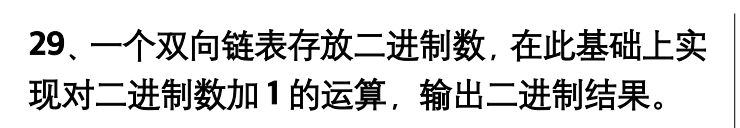

```c
typedef struct _node {
    int value;
    struct _node *next;
    struct _node *prev;
} Node;

typedef struct _list {
    Node *head; // 头结点
} List;
```

```c
// 创建新节点
Node* createNode(int value) {
    Node* newNode = (Node*)malloc(sizeof(Node));
    newNode->value = value;
    newNode->next = NULL;
    newNode->prev = NULL;
    return newNode;
}

// 对链表表示的二进制数加1
void addOne(List* list) {
    if (list == NULL || list->head == NULL || list->head->next == NULL) {
        printf("链表为空\n");
        return;
    }

    // 找到最后一个有效节点
    Node* cur = list->head;
    while (cur->next != NULL) {
        cur = cur->next;
    }

    int carry = 1;
    while (cur != list->head && carry != 0) {
        int sum = cur->value + carry;
        cur->value = sum % 2;
        carry = sum / 2;

        cur = cur->prev;
    }

    // 如果还有进位，插入新节点到链表头部之后
    if (carry != 0) {
        Node* new = create(carry);
        new->next = list->head->next;
        if (list->head->next) {
            list->head->next->prev = new;
        }
        list->head->next = new;
        new->prev = list->head;
    }
}
```

测试

```c
#include <stdio.h>
#include <stdlib.h>

typedef struct _node {
    int value;
    struct _node *next;
    struct _node *prev;
} Node;

typedef struct _list {
    Node *head;
} List;

// 创建新节点
Node* createNode(int value) {
    Node* newNode = (Node*)malloc(sizeof(Node));
    newNode->value = value;
    newNode->next = NULL;
    newNode->prev = NULL;
    return newNode;
}

// 初始化带头结点的双向链表
List* createList() {
    List* list = (List*)malloc(sizeof(List));
    list->head = createNode(-1); // 头结点，不存有效值
    return list;
}

// 在链表末尾添加数据节点
void appendNode(List* list, int value) {
    Node* newNode = createNode(value);
    if (list->head->next == NULL) {
        list->head->next = newNode;
        newNode->prev = list->head;
    } else {
        Node* current = list->head;
        while (current->next != NULL) {
            current = current->next;
        }
        current->next = newNode;
        newNode->prev = current;
    }
}

// 打印链表内容（跳过头结点）
void printList(List* list) {
    Node* current = list->head->next;
    while (current != NULL) {
        printf("%d ", current->value);
        current = current->next;
    }
    printf("\n");
}

// 对链表表示的二进制数加1
void addOne(List* list) {
    if (list == NULL || list->head == NULL || list->head->next == NULL) {
        printf("链表为空\n");
        return;
    }

    // 找到最后一个有效节点
    Node* cur = list->head;
    while (cur->next != NULL) {
        cur = cur->next;
    }

    int carry = 1;
    while (cur != list->head && carry != 0) {
        int sum = cur->value + carry;
        cur->value = sum % 2;
        carry = sum / 2;

        cur = cur->prev;
    }

    // 如果还有进位，插入新节点到链表头部之后
    if (carry != 0) {
        Node* newHeadNext = createNode(carry);
        newHeadNext->next = list->head->next;
        if (list->head->next) {
            list->head->next->prev = newHeadNext;
        }
        list->head->next = newHeadNext;
        newHeadNext->prev = list->head;
    }
}

int main() {
    List* list = createList();
    appendNode(list, 1);
    appendNode(list, 0);
    appendNode(list, 1);
    appendNode(list, 1);
    appendNode(list, 1);

    printf("原始二进制数: ");
    printList(list);

    addOne(list);

    printf("加1后的二进制数: ");
    printList(list);

    return 0;
}
```


## 链表强化30

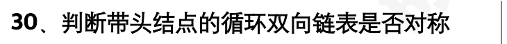

```C
typedef struct _node {
    int value;
    struct _node *next;
    struct _node *prev;
} Node;

typedef struct _list {
    Node *head; // 头结点
} List;
```

```C
// 判断循环双向链表是否对称
int isSymmetric(List* list) {
    if (list == NULL || list->head == NULL || list->head->next == list->head) {
        return 1; // 空链表或只有一个头结点的链表视为对称
    }

    Node* left = list->head->next;
    Node* right = list->head->prev;

    while (left != right && left->prev != right) {
        if (left->value != right->value) {
            return 0; // 不对称
        }
        left = left->next;
        right = right->prev;
    }

    return 1; // 对称
}
```


测试

```C
#include <stdio.h>
#include <stdlib.h>

typedef struct _node {
    int value;
    struct _node *next;
    struct _node *prev;
} Node;

typedef struct _list {
    Node *head; // 头结点
} List;

// 创建新节点
Node* createNode(int value) {
    Node* newNode = (Node*)malloc(sizeof(Node));
    newNode->value = value;
    newNode->next = NULL;
    newNode->prev = NULL;
    return newNode;
}

// 初始化带头结点的循环双向链表
List* createList() {
    List* list = (List*)malloc(sizeof(List));
    list->head = createNode(-1); // 头结点，不存有效值
    list->head->next = list->head;
    list->head->prev = list->head;
    return list;
}

// 在链表末尾添加数据节点
void appendNode(List* list, int value) {
    Node* newNode = createNode(value);
    if (list->head->next == list->head) {
        list->head->next = newNode;
        list->head->prev = newNode;
        newNode->next = list->head;
        newNode->prev = list->head;
    } else {
        Node* current = list->head->prev;
        current->next = newNode;
        newNode->prev = current;
        newNode->next = list->head;
        list->head->prev = newNode;
    }
}

// 判断循环双向链表是否对称
int isSymmetric(List* list) {
    if (list == NULL || list->head == NULL || list->head->next == list->head) {
        return 1; // 空链表或只有一个头结点的链表视为对称
    }

    Node* left = list->head->next;
    Node* right = list->head->prev;

    while (left != right && left->prev != right) {
        if (left->value != right->value) {
            return 0; // 不对称
        }
        left = left->next;
        right = right->prev;
    }

    return 1; // 对称
}

// 测试函数
int main() {
    List* list = createList();
    appendNode(list, 1);
    appendNode(list, 2);
    appendNode(list, 3);
    appendNode(list, 1);
    appendNode(list, 3);
    appendNode(list, 2);
    appendNode(list, 1);

    if (isSymmetric(list)) {
        printf("链表是对称的\n");
    } else {
        printf("链表不是对称的\n");
    }

    return 0;
}
```


## +链表强化31

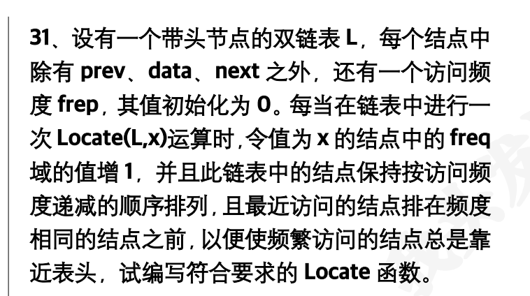

```c
// 定义节点和链表结构体
typedef struct _node {
    int value;
    int frep; // 访问频率
    struct _node *next;
    struct _node *prev;
} Node;

typedef struct _list {
    Node *head; // 头结点
} List;

// Locate 函数：查找值为 x 的节点并增加其访问频率
Node* Locate(List* list, int x) {
    if (list == NULL || list->head == NULL) return NULL;
    Node* cur = list->head->next;
    while (cur != NULL) {
        if (cur->value == x) {
            // 增加访问频率
            cur->frep++;

            // 删除当前节点
            cur->prev->next = cur->next;
            if (cur->next != NULL) cur->next->prev = cur->prev;

            // 从前往后找插入位置
            Node* p = list->head->next;
            while (p != NULL && p->frep > cur->frep) p = p->next;

            // 插入到 p 前面
            if (p == NULL) { // 插入到末尾
                Node* tail = list->head;
                while (tail->next != NULL)
                    tail = tail->next;
                tail->next = cur;
                cur->prev = tail;
            } else {
                cur->next = p;
                cur->prev = p->prev;
                p->prev->next = cur;
                p->prev = cur;
            }
            return cur;
        }
        cur = cur->next;
    }

    return NULL; // 没有找到
}
```


测试

```c
#include <stdio.h>
#include <stdlib.h>

// 定义节点和链表结构体
typedef struct _node {
    int value;
    int frep; // 访问频率
    struct _node *next;
    struct _node *prev;
} Node;

typedef struct _list {
    Node *head; // 头结点
} List;

// 创建新节点
Node* createNode(int value) {
    Node* newNode = (Node*)malloc(sizeof(Node));
    newNode->value = value;
    newNode->frep = 0;
    newNode->next = NULL;
    newNode->prev = NULL;
    return newNode;
}

// 初始化带头结点的双向链表
List* createList() {
    List* list = (List*)malloc(sizeof(List));
    list->head = createNode(-1); // 头结点，不存有效值
    return list;
}

// 在链表末尾添加数据节点
void appendNode(List* list, int value) {
    Node* newNode = createNode(value);
    if (list->head->next == NULL) { // 如果是第一个真实数据节点
        list->head->next = newNode;
        newNode->prev = list->head;
    } else {
        Node* current = list->head;
        while (current->next != NULL) {
            current = current->next;
        }
        current->next = newNode;
        newNode->prev = current;
    }
}

// 打印链表内容（跳过头结点）
void printList(List* list) {
    Node* current = list->head->next;
    while (current != NULL) {
        printf("Value: %d, Frep: %d -> ", current->value, current->frep);
        current = current->next;
    }
    printf("NULL\n");
}

Node* Locate(List* list, int x) {
    if (list == NULL || list->head == NULL) {
        return NULL;
    }

    Node* current = list->head->next;
    while (current != NULL) {
        if (current->value == x) {
            // 增加访问频率
            current->frep++;

            // 删除当前节点
            current->prev->next = current->next;
            if (current->next != NULL) {
                current->next->prev = current->prev;
            }

            // 从前往后找插入位置
            Node* p = list->head->next;
            while (p != NULL && p->frep > current->frep) {
                p = p->next;
            }

            // 插入到 p 前面
            if (p == NULL) { // 插入到末尾
                Node* tail = list->head;
                while (tail->next != NULL) {
                    tail = tail->next;
                }
                tail->next = current;
                current->prev = tail;
            } else {
                current->next = p;
                current->prev = p->prev;
                p->prev->next = current;
                p->prev = current;
            }

            return current;
        }
        current = current->next;
    }

    return NULL; // 没有找到
}

int main() {
    List* list = createList();
    appendNode(list, 1); // frep=0
    appendNode(list, 2); // frep=0
    appendNode(list, 3); // frep=0

    printf("初始链表:\n");
    printList(list);

    Node* foundNode = Locate(list, 2);
    printf("第一次访问 2 后:\n");
    printList(list);

    Node* foundNode2 = Locate(list, 2);
    printf("第二次访问 2 后:\n");
    printList(list);

    Node* foundNode3 = Locate(list, 1);
    printf("访问 1 后:\n");
    printList(list);

    Node* foundNode4 = Locate(list, 3);
    printf("访问 3 后:\n");
    printList(list);

    return 0;
}
```
