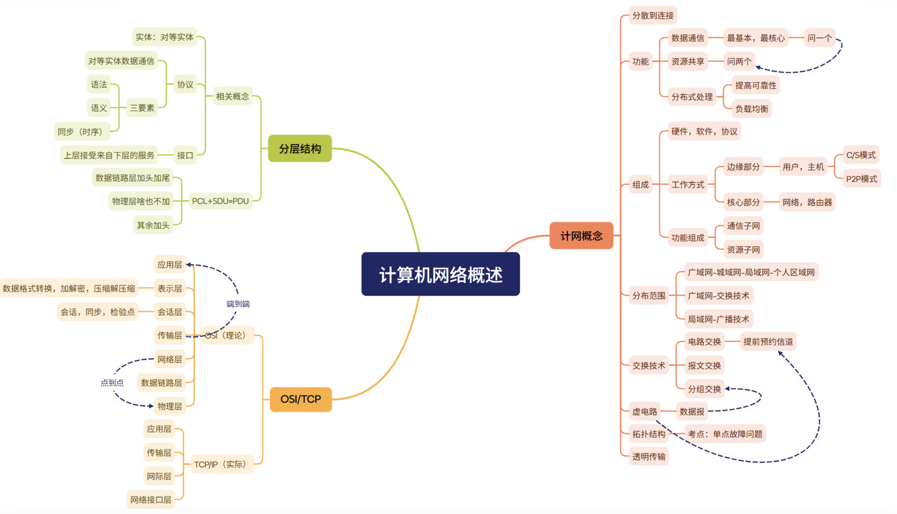

# 计网体系结构

# 物理层

***物理层任务***：透明传输比特流，确定与传输媒体的接口有关的一些特性：如机械特性、电气特性、功能特性和过程特性。

***数据通信模型***：分为三大部分，即源系统、传输系统和目的系统。

***物理层接口特性***：(熟练理解)
	机械特性：指明接口所用接线器的形状和尺寸、引脚数目和排列、固定和锁定装置等。
	电气特性：指明在接口电缆的各条线上出现的电压范围。
	功能特性：指明某条线上出现的某一电平的电压表示何种意义。
	过程特性：指明对于不同功能的各种可能事件的出现顺序。

***信道***：一般都是用来表示向某一个方向传送信息的媒体。因此，一条通信线路往往包含一条发送信道和一条接收信道。

***带宽***：用来表示网络的通信线路传送数据的能力，网络带宽表示在单位时间内从网络中的某一个点到另一点所能通过的“最高数据率”。

***码元***：码是信号元素和字符之间的事先约定好的转换。

***码元传输速率***：又称为波特率或调制速率，表示数字通信系统每秒传输的码元数，单位是波特。

***编码***：仅仅对基带信号的波形进行变换，使它能够与信道特性适应。变换后的信号仍然是基带信号。

***调制***：基带信号往往包含较多的低频分量，甚至有直流分量，而许多信道并不能传输这种低频分量或直流分量。为了解决这一问题，就必须对基带信号进行调制，调制分为两大类：第一类就是编码，第二类则需要使用载波进行调制，把基带信号的频率范围搬移到较高的频段，并转换为模拟信号，这样就能够更好地在模拟信道中传输，这一类称之为带通调制。

***奈氏准则***：在没有噪声干扰的理想情况下，为了保证不发生码间干扰，数据传输速率的上限是信道带宽的两倍。这意味着，若要不失真地传输信号，信号的最高频率分量不能超过信道带宽的一半。

***香农定理***：香农定理指出，在给定带宽和噪声水平的条件下，信道有一个理论上的最大传输速率（即信道容量），超过这个速率的信息传输将不可避免地出现错误。

***电路交换***：分为三步：建立连接（开始占用通信资源）、传输数据（一直占用通信资源）和释放连接（归还通信资源）。特点是：在数据传输过程中，这一物理通信路径始终被两个用户独占，直到通信结束时才释放。
优点：1、通信时延小；2、有序传输；3、没有冲突；4、实时性强
缺点：1、建立连接时间长；2、线路利用率低；3、灵活性差；4、难以实现差错控制

***报文交换***：数据交换的单位是报文，采用存储转发技术。用户加上源地址、目的地址等信息后，封装成报文，整个报文先传送到相邻的节点，全部存储后查找转发表，转发到下一个节点，如此重复，直到到达目的节点。每个报文都可单独选择到达目的端的路径。
优点：1、无建立连接的时延；2、灵活分配线路；3、线路利用率高；4、支持差错控制
缺点：1、转发时延高；2、缓存开销大；3、错误处理低效

***分组交换***：特点就是采用分组交换技术，解决了报文交换中报文过长的问题。源主机在发送之前，先把较长的报文划成若干较小的等长数据段，在每个数据段前面添加一些必要的信息（如源地址、目的地址和编号信息等）组成首部，构成分组。
优点：继承报文交换的优点；1、方便存储管理；2、传输效率高；3、减少了出错概率和重传代价
缺点：1、存在存储转发时延；2、需要传输额外的信息量；3、当分组交换网采用数据报服务时，可能出现失序、丢失或者重复分组的情况。

# 数据链路层

***数据链路层的功能***：让帧在一段链路上或一个网络中传输，三个主要功能：封装成帧、透明传输和差错检验

***封装成帧***：指在一段数据的前后分别添加首部和尾部，构成帧，帧是数据链路层的传送单元。组帧主要解决帧定界、帧同步、透明传输等问题

***透明传输***：指不论什么样的比特组合的数据，都能够按照原样无差错地在这个数据链路上传输

***差错检验***：因为信道噪声等原因，帧在传输的过程中可能会出现错误，这些错误分为位错和帧错，数据链路层有确认和重传机制（即向上提供可靠的服务）

- 位错：帧中某些位出现错误，通常采用CRC来发现位错
- 帧错：帧丢失、帧重复或帧失序等错误

***流量控制***：指由接收方控制发送方的发送速率，使接收方有足够的缓冲空间来接收每个帧。

***可靠传输***：发送方发送的数据都能被接收方正确的接收，通常采用确认和超时重传两种机制来实现。确认是指接收方每收到发送方发来的数据帧，都要向发送方发回一个确认帧，表示已正确地收到该数据帧。超时重传是指发送方在发送一个数据帧后就启动一个计时器，若在规定时间内没有收到所发送数据的确认帧，则重发该数据帧，直到发送成功为止。

***介质访问控制***：为使用介质的每个节点隔离来自同一信道上其他节点所传送的信号，以协调活动节点的传输

***ALOHA协议***：当总线型网络中的任何站点需要发送数据时，可以不进行任何检测就可以发送数据。若在一段时间内未收到确认，则该站点就认为传输过程中发生了冲突。发送站点需要等待一段随机的时间后再发送数据，直至发送成功

***CSMA协议***：载波监听多路访问，每个站点在发送前都先监听公用信道，发现信道空闲后再发送，则会大大降低冲突的可能性，从而提高信道的利用率。

***CSMA/CD协议***：载波监听多路访问/冲突检测协议是CSMA协议的改进方案，适用于总线型网络或半双工网络，载波监听是指每个站点在发送前和发送过程中都必须不停地检测信道，在发送前检测信道是为了获得发送权，在发送过程中检测信道是为了及时发现发送的数据是否发生冲突。站点要在发送数据前先监听信道，只有信道空闲才能发送。冲突检测就是边发送边检测，设配器边发送数据边检测信道上电压的变化情况，当检测到电压变化幅度超过一定的门限值时，表明发生了冲突，适配器要立即停止发送数据，等待一段时间后再次发送。

***CSMA/CD解决冲突的机制：***二进制指数退避算法

***时隙时间***：在 **10 Mbps 以太网**中，时隙时间为：**51.2 μs**（即 0.0512 ms）

***无线局域网使用CSMA/CA的原因***：

- 适配器接收到的信号强度往往远小于发送信号的强度，且在无线介质上信号强度的动态变化范围很大，因此若要实现冲突检测，则硬件花费会过大
- 在无线通信中，并非所有站点都能够听见对方(但能产生冲突)，即存在“隐蔽站”问题，从而使得冲突检测机制并b能检测到所有冲突。

***CSMA/CA协议的帧间间隔：***

1. SIFS：最短的IFS，用来分隔属于一次对话的各帧，使用SIFS的帧类型有ACK帧、CTS帧、分片后的数据帧，以及所有回答AP探询的帧等；
2. PIFS（点协调IFS）：中等长度的IFS，在PCF方式使用
3. DIFS（分布式协调IFS）：最长的IFS，在DCF方式下用来发送数据帧和管理帧

***CSMA/CA协议的确认机制：***使用链路层确认/重传（ARQ）方案，即站点每通过无线局域网发送完一帧，就要在收到对方的确认帧后才能继续发送下一帧。为了尽量避免冲突，802.11规定，所有站点检测到信道空闲后，还要等待一段很短的时间才能发送帧，这段时间称为帧间间隔（IFS）

***CSMA/CA和CSMA/CD主要的区别***：

1. CSMA/CD可以检测冲突，但无法避免；CSMA/CA发送数据的同时不能检测信道上有无冲突，本节点处没有冲突并不意味着在接收节点处就没有冲突，只能尽量避免
2. 传输介质不同。CSMA/CD用于总线型以太网，CSMA/CA用于无线局域网802.11a/b/g/n等
3. 检测方式不同。CSMA/CD通过电缆中的电压变化来检测；而CSMA/CA采用能量检测、载波检测和能量载波检测混合检测三种检测信道空闲的方式

******

***局域网***：☞在一个较小的地理范围内，将各种计算机、外部设备和数据库系统等通过双胶线、同轴电缆等连接介质互相连接起来，组成资源和信息共享的计算机互联网络

***局域网的特点***：主要由拓扑结构、传输介质和介质访问控制方式决定

- 为一个单位所拥有，且地理范围和站点数量均有限
- 所有站点共享较高的总带宽
- 较低的时延和较低的误码率
- 各站为平等关系而非主从关系
- 能进行广播、多播、单播
- 各站点之间以“帧”为单位进行传输

***局域网拓扑结构***：星型结构、环形结构、总线型结构、星型和总线型结合的复合型结构

***局域网的介质访问控制方法：***CSMA/CD协议、令牌总线协议和令牌环协议，其中前两种协议主要用于总线型局域网，令牌环协议主要用于环形局域网

***三种特殊的局域网拓扑实现：***

- 以太网，逻辑拓扑是总线型结构，物理拓扑是星型结构
- 令牌环(token Ring， IEEE 802.5)，逻辑拓扑是环形结构，物理拓扑是星型结构
- FDDI（光纤分布数字接口，IEEE 802.8），逻辑拓扑是环形结构，物理拓扑是双环结构

***以太网MAC协议提供的服务类型***：1. 采用无连接的工作方式，既不对发送的数据帧编号，又不要求接收方发送确认，即以太网尽最大努力交付数据，提供的是不可靠服务，对差错的矫正则由高层完成 2. 发送的数据都使用曼彻斯特编码的信号，每个码元的中间出现一次电压转换，接收方利用这种电压转换方便地将同步信号提取出来。

***交换机的特点***：

- 当交换机的接口直接与主机或其他交换机连接时，通常都工作在全双工方式。
- 交换机具有并行性，能同时连通多对接口，使每对相互通信的主机都能像独占通信介质那样，无冲突地传输数据，这样就不需要使用CSMA/CD协议
- 当交换机的接口连接集线器时，只能使用CSMA/CD协议且只能工作在半双工方式，当前的交换机和计算机中的网卡都能自动识别上述两种情况。
- 交换机是一种即插即用设备，其内部的帧转发表是通过自学习算法，基于网络中各主机间的通信，自动地逐渐建立
- 交换机因为使用专用交换结构芯片，交换速率较高

***交换机主要采用两种交换模式***：

- 直通交换模式，接收到帧的同时就立即按该帧的目的MAC地址(6B)决定转发接口。这种方式的转发时延非常小，缺点是不检查差错就直接转发，因此可能将一些无效帧转发给其他站。直通交换不适用于需要速率匹配、协议转换或者差错检测的线路
- 存储转发交换方式，首先缓存接收到的帧，然后检查帧是否正确(可能还需要进行速率匹配或协议转换)，确认无误后，根据目的MAC地址决定转发接口；若帧出错，则将其丢弃。优点是可靠性高，且支持不同速率接口间的转换，缺点是时延较大

## 设备

***中继器***：放大(数字信号)、整形并转发信号，仅作用于信号的电气部分，中继器木有存储转发功能

***放大器***：放大模拟信号，原理是放大衰减的信号

***集线器***：本质就是多端口的中继器

***交换机***：也称二层交换机，二层是指以太网交换机工作在数据链路层。以太网交换机实质上是一个多接口的网桥，它能将网络分成小的冲突域，为每个用户提供更大的带宽。

# 网络层

**网络层的功能**: 提供主机到主机的通信服务，主要任务是将分组从源主机经过多个网络和多段链路传输到目的主机。该任务可划分为分组转发和路由选择两种重要的功能

***路由与转发***：路由器主要完成两个功能：路由选择和分组转发

- 路由选择，根据路由协议构造路由表，同时经常或定期地与相邻路由器交换信息，获取最新网络拓扑，动态更新维护路由表，以决定分组到达目的地节点的最优路径
- 分组转发，指路由器根据转发表将分组从合适的端口转发出去

***拥塞控制***：因出现过量的分组引起的网络性能下降的现象称为*拥塞*。拥塞控制主要解决的问题是如何获取网络中发生拥塞的信息，从而利用这些信息进行控制。作用是确保网络能够承载所达到的流量，这是一个全局性的过程。

- 与流量控制的区别：流量控制往往是发送方和接受方之间的点对点通信量的控制，流量控制所需要做的是抑制发送方的发送数据的速率，以便接受方来得及接受

1. 开环控制：在设计网络时事先将有关发生拥塞的因素考虑周到，力求网络在工作时不产生拥塞。这是一种静态的预防方法。一旦整个系统启动，中途就不再更改。
2. 闭环控制：事先不考虑有关发送拥塞的各种因素，采用监测网络系统区间是，即时检测那里发生了拥塞，然后将拥塞信息传到合适的地方，以便调整网络系统的运行，并解决出现的问题。闭环控制是基于反馈环路的概念，是一种动态的方法。

***NAT***：网络地址转换是指通过将专用网络地址转换为公用地址，从而对外隐藏内部管理的IP地址。

***子网划分***：从网络的主机号借用若干位作为子网号，当然主机号也相应减少了相同的位数。

***子网掩码***：子网掩码可用来指明分类IP地址的主机号部分被借用了多少位作为子网号

***CIDR***：无分类域间路由选择是一种用于IP地址分配和路由聚合的技术，在变长子网掩码的基础上，提出一种消除传统A、B、C类地址及划分子网的概念。

***ARP***：IP地址到MAC地址的映射

***DHCP***：动态主机配置协议，常用于给主机动态地分配IP地址，它提供了即插即用的联网机制，这种机制允许一台计算机加入新的网络和自动获取IP地址而不用手工参与。

***ICMP***：让主机或路由器报告差错和异常情况。

- 终点不可达；
- 源点抑制；
- 时间超过；
- 参数问题；
- 改变路由；

***不发ICMP差错报文***：

- 对ICMP差错报告报文，不再发送ICMP差错报文
- 对第一个分片的数据报片的所有后续数据报片，都不发送ICMP差错报文
- 对具有多播地址的数据报，都不发送ICMP差错报文
- 对具有特殊地址的(如127.0.0.0或0.0.0.0)数据报，不发送ICMP差错报告报文

***常用的ICMP询问报文有两种类型***：

- 回送请求和回答报文。用来测试目的主机是否可达以及了解其有关状态
- 时间戳请求和回答报文。利用报文中记录的时间戳，发送方可计算出当前的返回时延

***ICMP两个常见应用***：分别是分组网间探测PING和Traceroute，其中PING使用了ICMP的回送请求和回答报文，Traceroute使用了ICMP时间超过报文

***IPV6***:

***自治系统***：是在单一技术管理下的一组路由器，这些路由器使用一种AS内部的路由选择协议和共同的度量。

***域内路由***：在一个自治系统（AS, Autonomous System）内部使用的路由。

特点：

- 路由器数量较多，但都属于同一个管理机构（比如一个 ISP 或大型企业网络）。
- 主要目标：**快速收敛、负载均衡**。
- 协议选择时一般考虑效率，而不是策略。

常见协议：

- **RIP**（Routing Information Protocol，基于距离向量）
- **OSPF**（Open Shortest Path First，基于链路状态）

***域间路由***：不同自治系统之间的路由，即 AS 与 AS 之间的互联。

特点：

- 网络规模更大，路由器属于不同组织。
- 主要目标：**策略控制、可扩展性**（而不仅仅是最短路径）。
- 不同 AS 之间可能有竞争关系，因此不一定公布全部内部信息。

常见协议：

- BGP（Border Gateway Protocol，边界网关协议）

***OSPF（网络层协议，直接使用IP数据报传送，89）***：OSPF 是一种基于链路状态的内部网关协议，利用 SPF 算法计算最短路径，适合大规模网络，收敛快且支持区域划分。
工作原理：

- 采用 **链路状态路由协议**，路由器通过 **LSA** 交换链路信息。

- 各路由器维护一致的 **链路状态数据库（LSDB）**。

- 使用 **Dijkstra SPF 算法** 计算最短路径，生成路由表。

主要特点

- **收敛快**、避免环路。
- **分区域管理**，可扩展性强。
- **以带宽为度量（Cost）**。
- 支持 **VLSM/CIDR**，节省地址空间。

***OSPF 分组类型（5类）***

1. **Hello**：建立和维持邻居关系。
2. **DD（Database Description）**：描述链路状态数据库概要。
3. **LSR（Link State Request）**：请求特定链路状态信息。
4. **LSU（Link State Update）**：发送链路状态信息（携带 LSA）。
5. **LSAck（Link State Acknowledgment）**：确认收到的 LSA。

***OSPF 区域划分的好处***:

1. 减少路由器的计算开销
2. 减小链路状态数据库规模
3. 减少路由更新的传播范围:链路变化不会影响整个自治系统，只在区域内扩散，提高稳定性。
4. 提高网络可扩展性
5. 增强管理灵活性

***BGP的作用***：

边界网关协议（BGP） 是一种 **外部网关协议（EGP）**，主要用于 **自治系统（AS）之间的路由选择**。

它通过 **路径向量机制** 交换路由信息，能实现 **跨域互联**。

作用主要是：

1. **实现不同 AS 间的互联与路由选择**。
2. **支持策略路由**，可根据业务需求选择路径（不只是最短路径）。
3. **确保互联网的可扩展性和稳定性**。

***BGP报文所采用的协议***：

​	传输层协议：BGP 报文运行在 **TCP 协议** 之上，端口号 **179**。

​	原因：TCP 提供可靠传输，确保路由信息的完整性和顺序性；避免协议本身再设计可靠机制，简化实现。

***BGP 会话类型***：1.EBGP（External BGP）定义：建立在 **不同自治系统（AS）之间** 的 BGP 会话；作用：用于跨 AS 交换路由。2.IBGP（Internal BGP）定义：建立在 **同一自治系统内部** 的 BGP 会话；作用：用于在 AS 内部传递从 EBGP 学到的路由信息。

***BGP的四种报文***

- OPEN：建立邻居关系，交换版本号、AS 号、Hold 时间等基本参数。

- UPDATE：通告新增或撤销的路由信息，是 BGP 的核心报文。

- KEEPALIVE：周期发送，维持邻居关系，防止超时。

- NOTIFICATION：通告错误或异常，并关闭会话。

***路由器***：是一种具有多个输入输出端口的的专用计算机，其任务是连接不同的网络并完成分组转发。在多个逻辑网络互连时必须使用路由器。

***路由器的功能：***：

1. 路径选择
2. 分组转发
3. 网络互联
4. 协议支持与转换
5. 流量控制与安全

***路由器的组成***：

​	从结构上来看，路由器由路由选择和分组转发两部分构成。而从模型的角度来看，路由器是网络层设备，它实现了网络模型的下三层，即物理层、数据链路层和网络层

​	路由选择部分也称之为控制部分，核心构件是路由选择处理机，其任务是根据所选定的路由选择协议构造出路由表。同时经常或定期的和相邻路由器交换路由信息而不断更新和维护路由表。

​	分组转发部分由三部分组成：交换结构、一组输入端口、一组输出端口

​	交换结构也称交换组织，起作用是根据转发表对分组进行处理，将某个输入端口进入的分组从一个合适的输出端口转发出去，交换结构本身就是一个“在路由器中的网络”

​	路由器的端口中都有物理层、数据链路层和网络层的处理模块。输入端口在物理层接收比特流，在数据链路层提取出帧，剥去帧的首部和尾部后，分组就被送入到网络层的处理模块。输出端口执行相反的操作。端口在网络层的处理模块中设有一个缓冲队列，用来暂存等待处理或已处理完毕待发送的分组，还可用来进行必要的差错检验。若分组处理的速率赶不上分组进入队列的速率，就会使后面进入队列的分组因缓冲区满而只能被丢弃。

***路由表***：是根据路由算法得出的，主要用途是路由选择。标准的路由表有四个项目：目的网络的IP地址、子网掩码、下一跳IP地址、接口。

***路由转发***：转发表是从路由表得出的，其表项和路由表项有直接的对应关系，

# 传输层

***传输层的功能***：1、为应用进程之间提供端到端的逻辑通信；2、复用和分用；3、差错检验；4、提供面向连接和无连接到传输协议

***复用和分用***：复用是指发送方不同的应用进程使用同一个传输层协议传输数据。分用是指接收方的传输层在剥去报文的首部后能够把这些数据正确交付到目的应用进程。

***差错检验***：传输层要对收到的报文（首部和数据部分）进行差错检测。对于TCP，若接收方发现报文段出错，则要求发送方重发该报文段。对于UDP，若接收方发现数据报出错，则直接丢弃。在网络层，IP数据报首部中的检验和字段只检验首部是否出错，而不检查数据部分。

***提供面向连接和无连接的传输协议***：传输层向高层用户屏蔽了底层网络核心的细节（如网络拓扑、路由协议等），它使应用进程看见的是在两个传输层实体之间好像有一条端到端的逻辑通信线路，这条逻辑通信信道对上层的表现却因传输层协议不同有很大差别。

***传输层的寻址和端口***：寻址是如何标识和定位通信端点的过程，作用是确保数据从源主机的一个特定进程正确的传送到目的主机对应进程。端口是让应用层的各种进程将其数据通过端口向下交付给传输层，以及让传输层知道应当的将其报文段中的数据向上通过端口交付给应用层相应的进程。端口标识的是主机中的应用进程。

端口号长度为16比特 熟知端口号0-1023 套接字=（IP地址：端口号）

***无连接服务***：UDP（用户数据报协议）提供无连接的不可靠服务，通信双方在传送数据之前不需要建立连接，接收方的传输层在收到UDP用户数据报后，无需给发送方发回任何确认。UDP在IP层之上仅提供两个附加服务：多路复用和对数据的错误检查。

***面向连接服务***：TCP提供面向连接的可靠服务，通信双方在传送数据之前必须先建立连接，然后基于此连接进行可靠数据传输，数据传输结束后要释放连接。TCP不提供广播或多播服务。TCP为了实现可靠数据传输，就必须增加许多措施，如确认、流量控制、计时器及连接管理等。

***UDP协议特点***：特点：

1. UDP无需建立连接
2. 无连接状态
3. UDP首部开销少
4. UDP没有拥塞控制
5. UDP支持一对一、一对多、多对一和多对多的交互通信

UDP是面向报文的，发送方UDP对应应用层交下来的报文，在添加首部后就向下交付给IP层，一次发送一个报文，既不合并，又不拆分，而是保留这些报文的边界；接收方UDP对IP层交上来的UDP数据报，在去除首部后就原封不动地交付给上层应用进程，一次交付一个完整的报文。

***UDP首部***

***UDP检验：***计算检验和时，要在UDP数据报之前增加12B的伪首部，伪首部并不是UDP的真正首部。只是在计算检验和时，临时添加在UDP数据报前面，得到一个临时的UDP数据报。伪首部既不想下传送，又不向上递交，而只是为了计算检验和。根据伪首部既检查了UDP数据报，又对IP数据报的源IP地址和目的IP地址进行了检验。另外UDP不提供纠错，若有差错出现，接收方就应丢弃这个UDP数据报。

***TCP特点：***

1、TCP是面向连接的传输层协议，TCP连接是一条逻辑连接；

2、每一条TCP连接只能有两个端点，每一条TCP连接只能是一对一的；

3、TCP提供可靠交付的服务，保证传送的数据无差错、不丢失、不重复且有序；

4、TCP提供全双工通信，允许通信双方的应用程序在任何时候都能发送数据，为此TCP连接的两端都设有发送缓存和接收缓存，用来临时存放双向通信的数据；

5、TCP是面向字节流的，虽然应用程序和TCP的交互是一次一个数据块，但是TCP把应用程序交下来的数据仅视为一连串的无结构的字节流。

***TCP报文段：***分为首部和数据，其首部前20B是固定的，首部最短是20B

1、推送位PSH：PSH=1，就尽快交付给接收应用进程，而不再等到整个缓存都填满了后再向上交付；

2、复位位RST：RST=1，表示TCP连接中出现严重差错，必须释放连接，然后重新建立传输连接。

3、同步位SYN：SYN=1，表示这是一个连接请求或连接接受报文，当SYN=1，ACK=0时，表示这是一个连接请求报文；

4、窗口：占2B，范围为0～2^16-1，窗口值告诉对方，从文报文段首部中的确认号算起，接收方目前允许对方发送的数据量（以字节为单位）。

5、检验和：占2B，检验和字段检验的范围包括首部和数据两部分，在计算检验和时，和UDP一样，要在TCP报文段的前面加上12B的伪首部。

6、紧急指针：占2B，紧急指针仅在URG=1时才有意义，它指出本报文段中的紧急数据的字节数（紧急数据在报文段数据的最前面）。

7、选项：长度可变，最长可达40B，当使用选项时，TCP首部长度是20B。

8、填充：这是为了使整个首部长度是4B的整数倍。

***TCP连接管理***：三个阶段：连接建立、数据传送和连接释放

TCP连接建立的过程中，要解决以下三个问题：

- 要使每一方能够确知对方存在；
- 要允许双方协商一些参数；
- 能够对运输实体资源进行分配

每条TCP有两个端点，TCP连接的端口为套接字，每一条TCP连接唯一的被通信的两个端点（两个套接字）所确定。注：同一个IP地址可以有多个不同的TCP连接，而同一端口号也可以出现在多个不同的TCP连接中

***TCP可靠传输：***TCP在不可靠的IP层之上建立一种可靠数据传输服务，TCP提供的可靠数据传输服务保证接收方从缓存区读出的字节流与发送方发出的字节流完全一样。TCP使用检验、序号、确认和重传等机制来达到这一目的。

1、序号：TCP首部的序号字段用来保证数据能有序提交给应用层，TCP把数据视为一个无结构但有序的字节流，序号建立在传送的字节流之上，而不建立在报文段之上。

2、确认：TCP首部的确认号是期望收到对方的下一个报文段段数据的第一个字节的序号。TCP使用累积确认，即TCP只确认数据流中至第一个丢失字节为止的字节，这样可以减小传输开销。

3、重传：有两种事件会导致TCP对报文段进行重传：超时和冗余ACK

- 超时：TCP每发送一个报文段，就对这个报文段设置一个超时计时器。计时器设置的重传时间到期但还未收到确认时，就要重传这一报文段
- 冗余ACK（冗余确认）

***TCP流量控制：***流量控制的功能就是让发送方的发送速率不要太快，以便让接收方来得及接受，TCP利用滑动窗口机制来实现流量控制。TCP要求接收方维持一个接受窗口（rwnd），接受方将其放在TCP报文段首部中的“窗口”字段，以通知发送方。发送方的发送窗口不能超过接收方给出的窗口值，以限制发送方向网络注入报文的速率。

***TCP拥塞控制：***拥塞控制是指防止过多的数据注入网络，保证网络中的路由器或链路不致过载。出现拥塞时，端点并不了解拥塞发生的细节，对通信的端点来说，拥塞往往表现为通信时延的增加。

TCP进行拥塞控制的算法有四种：慢开始、拥塞避免、快重传和快恢复

发送方在确定发送报文段段速率时，既要考虑接收方的接收能力，又要从全局考虑不要使网络发生拥塞，因此，TCP还要求发送方维持一个拥塞窗口（cwnd），其大小取决于网络的拥塞程度，并且动态地发生变化。

发送方控制拥塞窗口的原则：只要网络未出现拥塞，拥塞窗口就再增大一些，以便把更多的分组发送出去，以提高网络的利用率。但只要网络出现拥塞，拥塞窗口就减小一些，以减少注入网络的分组数，以缓解网络出现的拥塞。

***慢开始和拥塞避免***

慢开始：当发送方刚开始发送数据时，因为不清楚网络的负荷情况，若立即把大量数据注入到网络，则有可能引发网络拥塞。具体方法是：先发送少量数据探测一下，若没有发生拥塞，则适当增大拥塞窗口，即由小到大逐渐增加拥塞窗口（发送窗口）

拥塞避免：让拥塞拥塞窗口cwnd缓慢增大，具体做法是：每经过一个往返RTT就把发送方的拥塞窗口cwnd加1，而不是加倍，使拥塞窗口cwnd按线性规律缓慢生长（加法增大）

网络拥塞的处理：无论在慢开始阶段还是在拥塞避免阶段，只要发送方判断网络出现拥塞（未按时收到确认），就要首先把慢开始门限sshresh设置为出现拥塞时的发送方的cwnd的一半（但不能小于2），然后把拥塞窗口cwnd重新设置为1，执行慢开始算法。目的：迅速减少主机发送到网络中的分组数，使得发生拥塞的路由器有足够时间把队列中积压的分组处理完。

***快重传和快恢复***

快重传：使发送方尽快进行重传，而不等超时计时器超时再重传。发送方一旦连续收到3个冗余ACK（重复确认），就立即重传相应的报文段，而不是等该报文段超时计时器超时再重传

快恢复：但发送方连续收到3个冗余ACK时，把慢开始门限sshresh调整至当前cwnd的一半。与慢开始不同的是：它把cwnd值也调整至当前cwnd的一半（等于sshresh值），然后开始执行拥塞避免算法，使拥塞窗口缓慢地线形增大。

# 应用层

***应用层功能：***是OSI模型的最高层，是用户和网络的接口。应用层为特定类型的网路应用提供访问OSI参考模型环境的手段。

******

***网络应用模型：***

__C/S模型__根本特点：客户是服务请求方，服务器是服务提供方。常见的应用包括：web、文件传输协议（FTP）、远程登陆和电子邮件等。 

  主要特点：

- 网络中各计算机的地位不平等，服务器可通过对用户权限的限制来达到管理客户机的目的。整个网络的管理工作由少数服务器负责，因此网络的管理非常集中和方便
- 客户机相互之间不直接通信。
- 可扩展性不佳。受服务器硬件和网络带宽的限制，服务器支持的客户机数量有限

******

__P2P模型__：各计算机没有固定的客户和服务器的划分。任意一对计算机---称为对等方（Peer），直接相互通信。

  主要优点：

- 减轻了服务器的计算压力，消除了对某个服务器的完全依赖，可以将任务分配到各个节点上，因此大大提高了系统效率和资源利用率
- 多个客户机之间可以直接共享文档
- 可扩展性好，传统服务器有响应和带宽的限制
- 网络健壮性强，单个节点的失效不会影响其他部分的节点

  缺点：

- 在获取服务时，还要给其他节点提供服务，会占用较多的内存

******

***DNS系统***：

功能：把便于人们记忆的主机名转换为便于机器处理的IP地址。

DNS采用C/S模型，其协议运行在UDP之上，使用53端口

从概念上可讲DNS分为三部分：层次域名空间、域名服务器和解析器

***层次域名空间***：因特网采用层次树状结构的命名方法，任何一个连接到因特网的主机或路由器，都有一个唯一的层次结构名称，即__域名__。__域__是名字空间中一个可被管理的划分。域可以划分子域....

顶级域名分为三类：国家（地区）顶级域名、通用顶级域名、基础结构域名

***域名服务器***：域名到IP地址的解析是由运行在域名服务器上的程序完成的，一个服务器所负责管辖的范围称为__区__，一个区中的所有节点必须是能够连通的。

- 根域名服务器：是最高层次的域名服务器，所有的根域名服务器都知道所有的顶级域名服务器的域名和IP地址。
- 顶级域名服务器：负责管理在该顶级域名服务器注册的所有二级域名。
- 权限域名服务器：每台主机必须在权限域名服务器处登记。权限域名服务器总能将其管辖的主机名转换为主机的IP地址
- 本地域名服务器：离用户比较近，一般不超过几个路由器的距离。当一个主机发出DNS查询请求时，这个查询请求报文就发送给本地域名服务器。

***迭代查询和递归查询：***

- 递归查询是指若主机说询问的本地域名服务器不知道被查询域名的IP地址，则本地域名服务器就以DNS客户的身份，向根域名服务器继续发出查询请求报文，而不是让该主机自己进行下一步查询。
- 本地域名服务器向根域名服务器的查询通常是采用__迭代查询__。当根域名服务器收到本地域名服务器发出的迭代查询报文时，要么给出要查询到IP地址，要么告诉本地域名服务器下一次的查询目的域名服务器地址。然后让本地域名服务器进行后续的查询

***域名服务器的高速缓存的作用：***提高DNS查询效率，并减轻根域名服务器的负荷和减少互联网上的DNS查询报文，使用高速缓存是用来存放最近查询过的域名，以及从何处获得域名映射信息的记录

******

***电子邮件***

***电子邮件的组成部件：***用户代理、邮件服务器以及邮件发送协议（SMTP）和邮件读取协议（如POP3）

***用户代理UA的作用：***用户和电子邮件系统的接口，在大多数情况下它就是运行在用户PC中的一个程序。因此用户代理又称为电子邮件客户端软件。用户代理向用户提供一个很友好的接口来发送和接收邮件。

具体来讲，用户代理主要要有：1、撰写：给用户提供编辑信件的环境；2、显示：能方便地在计算机屏幕上显示出来信和去信；3、处理：包括发送邮件和接收邮件；4、通信：发信人在撰写完邮件后，要利用邮件发送协议发送到用户所使用的邮件服务器。收件人在接收邮件时，要使用邮件协议读取协议从本地邮件服务器接收邮件

***简述SMTP通信建立的三个阶段：***

1、连接建立：发件人的邮件送到发送方邮件服务器的邮件缓存后，SMTP客户就每隔一段时间对邮件缓存扫描一次。如发现有邮件，就使用SMTP的熟知端口号25与接收方邮件服务器的SMTP服务器建立连接。

2、邮件传送：邮件的传送从MAIL命令开始。MAIL命令后面有发件人的地址。下面跟着一个或多个RCPT命令，取决于把同一个邮件发送给一个或多个收件人。RCPT的命令的作用是：先弄清接收方系统是否已经做好接收邮件的准备，然后才发送邮件。这样做是为了避免浪费通信资源。不至于发送了很长的邮件以后才发现地址错误。

3、连接释放：邮件发送完毕后，SMTP客户应发送QUIT命令。SMTP服务器如同意释放TCP连接，则邮件传送的全过程即结束

***简述邮局协议POP的工作流程：***

POP是一个非常简单且功能有限的邮件读取协议，POP一个特点就是只要用户从POP服务器读取了邮件，POP服务器就把该邮件删除。

***POP和IMAP的区别：***在用户未发出删除命令之前，IMAP服务器的邮件一直保存着，IMAP最大的好处就是用户可以在不同的地方使用不同的计算机，随时上网阅读和处理自己的邮件。缺点是，如果用户没有将邮件复制到自己的PC上，则邮件会一直存放在IMAP服务器上。因此，用户需要经常与IMAP服务器建立连接。

***互联网邮件扩充MIME：***SMTP有以下缺点：1、不能传送可执行文件或其他的二进制对象；2、限于传送7位的ASCII码；3、SMTP服务器会拒绝超过一定长度的邮件等等

MIME并没有改动或取代SMTP，意图是继续使用目前的RFC 822格式，但增加了邮件主体的结构，并定义了传送非ASCII码的编码规则。

主要包括：1、5个新的邮件首部字段；2、定义了许多邮件内容的格式；3、定义了传送编码，可对任何内容格式进行转换

******

***WWW***

***WWW的概念和组成***：万维网（www）是一个分布式、联机式的信息储存空间，在这个空间中：一样有用的事物称为一样的资源，并由一个全域统一资源定位符（URL）标识。这些资源通过超文本传输协议（http）传送给使用者，而后者通过单击链接来获取资源。

万维网以客户/服务器模式工作，浏览器是在用户主机上的万维网客户程序，而万维网文档所驻留的主机则运行服务器程序，这台主机称为万维网服务器。

流程如下：1、Web用户使用浏览器与Web服务器建立连接，并发送浏览请求；2、Web服务器把URL转换为文件路径，并返回给Web浏览器；3、通信完成，关闭连接

***HTTP在传输层所使用的协议：***万维网的内核部分是由三个标准组成的：1、统一资源定位符（URL）：负责标识万维网上的各种文档，并使每个文档在整个万维网的范围具有唯一的标识符URL；2、超文本传输协议（HTTP）：一个应用层协议，它使用TCP连接进行可靠的传输，HTTP是万维网客户程序和服务器程序之间交互所必须严格遵守的协议。3、超文本标记协议（HTML）：一种文档结构的标记语言，它使用一些约定的标记对页面上的各种信息、格式进行描述。

***超文本传输协议（HTTP）***：定义了浏览器怎样向万维网服务器请求万维网文档，以及服务器怎么样吧文档传送给浏览器。HTTP是面向事务的应用层协议，它规定了在浏览器和服务器之间的请求和响应的格式与规则，是万维网上能够可靠地传送文件的重要基础

特点：使用TCP作为传输层协议，保证了数据的可靠性，HTTP本身是无连接的；HTTP是无状态的，同一个客户第二次访问同一个服务器上的页面时，服务器的响应与第一次访问时的相同。

***持续连接和非持续连接***：

对于持续连接，每个网页元素对象的传输都需要单独建立一个TCP连接。

对于非持续连接，指万维网服务器在发送响应后仍然保持这条连接。

***流水线方式***：用户可以连续发出对各个对象的请求，服务器就可以连续响应这些请求。

***HTTP报文结构***：HTTP是面向文本的，因此报文中的每个字段都是一些ASCII码串

有两类HTTP报文：1、请求报文；2、响应报文

两种报文都由如下三部分组成：1、开始行：在请求报文中的开始行称为请求行，而在响应报文中的开始行称之为状态行、2、首部行：用来说明浏览器、服务器或报文主体的一些信息、3、实体主体

******

***DHCP***

***连接到互联网的计算机的协议软件需要配置的项目：***

- IP地址
- 子网掩码；
- 默认路由器的IP地址
- 域名服务器的IP地址

***机制：***即插即用连网，使用客户服务器模式

***端口***：客户端使用的UDP端口是68，服务器使用的UDP端口是67

***DHCP报文：***是UDP用户数据报的数据，它还要加上UDP首部、IP数据报首部，以及以太网的MAC帧的首部和尾部

***DHCP发现报文（DHCPDISCOVER）：***客户端到服务器端；将目的主机置为全1，即255.255.255.255，源IP地址为全0；广播寻找服务器

***DHCP提供报文：***服务器端到客户端；源IP地址为DHCP服务器IP，目的IP地址为255.255.255.255；服务器还不知道客户端 MAC 是否能接收单播，通常**广播回复**（也可单播，但默认广播）

***DHCP发送请求报文：***客户端到服务器端；源IP为0.0.0.0，目的IP地址为255.255.255.255；客户端尚未正式使用分配的 IP，仍用 0.0.0.0 广播确认选择哪个 Offer

***DHCP确认报文：***服务器到客户端；源IP为服务器端IP，目的IP为255.255.255.255或单播到客户端IP；大多数实现仍用**广播**，但 RFC 允许单播（若客户端支持）

