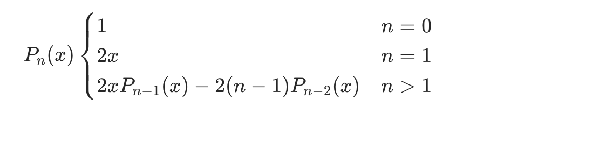
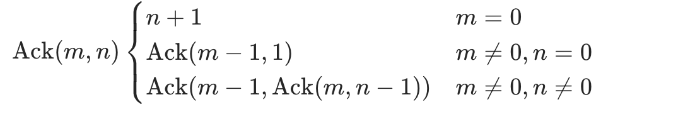

# 递归

## 1.写出斐波那契函数 F(m) 的递归和非递归算法

```
F(m)
├── 0                     m=0
├── 1                     m=1
└── F(m-1)+F(m-2)         m>0
```

```c
int recur(int m){
    if (m == 0 || m == 1)
        return m;
    else
        return recur(m-1) + recur(m-2);
} //时空复杂度分别为 O(2^N) 和 O(N)


int nonrecur(int m){
    if (m == 0 || m == 1)
        return 1;
    int dp[m+1];
    dp[0] = 1;
    dp[1] = 1;
    for (int i = 2; i <= m; i++)
        dp[i] = dp[i-1] + dp[i-2];
    return dp[m];
} //时空复杂度分别为 O(N) 和 O(N)
//可以输入 m=60 比较一下两者的速度
```

## 2. 写出递归函数 F (m) 的递归和非递归算法

```
F (m)
├── 1    m=0
└── m*F (m//2)  m>0
```

```c
int recur(int m){
  if (m == 0)
    return 1;
  else
    return m * recur(m/2);
}//时空复杂度分别为 O(logN)和 O(logN)


int nonrecur(int m){
  if (m == 0)
    return 1;
  int dp[m+1];
  dp[0] = 1;
  for(int i = 1; i <= m; i++){
    dp[i] = dp[i/2] * i;
  }
  return dp[m];
} //时空复杂度分别为 O(N)和 O(N)
```

## 3.实现递归函数 *P**n*(*x*) 的非递归计算



```c
int func(int n, int x){
    int dp[n + 1];
    dp[0] = 1;
    dp[1] = 2 * x;
    for(int i = 2; i <= n; i++)
        dp[i] = 2 * x * dp[i - 1] - 2 * (n - 1) * dp[i - 2];
    return dp[n];
} //时空复杂度分别为 O(N)和 O(N)
```

## 4. 写出递归函数 Ack (m,n) 的非递归算法



```c
int func(int m, int n){
    int dp[m + 1][n + 1];
    for (int i = 0; i <= n; i++)
        dp[0][i] = i + 1;
    for (int i = 1; i <= m; i++)
        for (int j = 0; j <= n; j++){
            if (j == 0)
                dp[i][j] = dp[i - 1][1];
            else
                dp[i][j] = dp[i - 1][dp[i][j - 1]];
        }
    return dp[m][n];
} //时空复杂度分别为 O(M*N)和 O(M*N)
```

